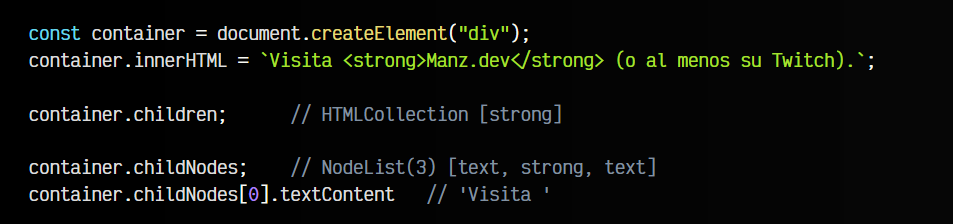
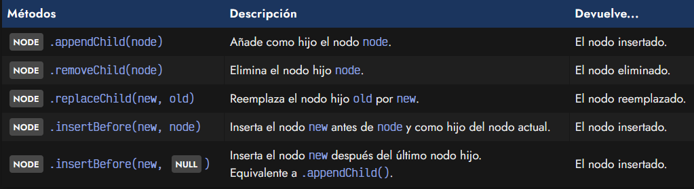
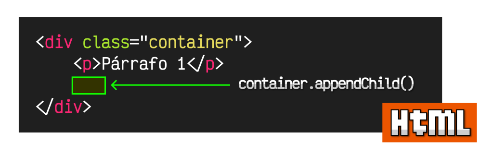
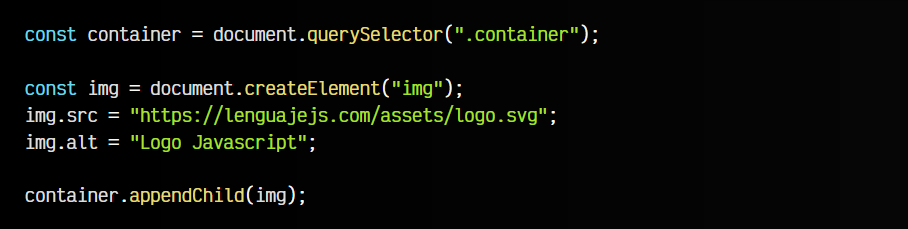
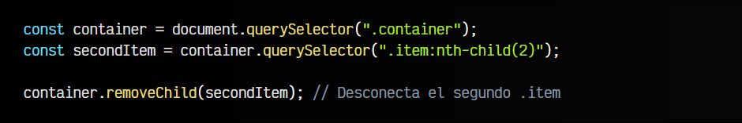
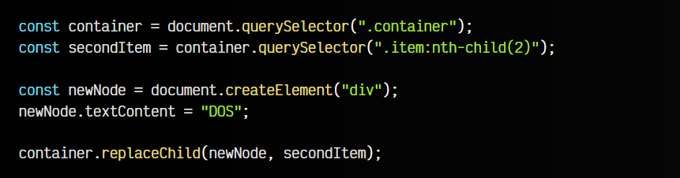
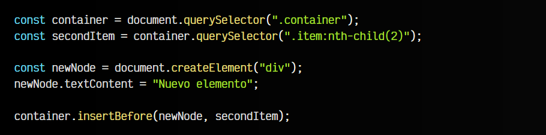

# 
La API de Nodos HTML

En capítulos anteriores hemos visto formas de [crear elementos con createElement](https://lenguajejs.com/dom/crear/createelement/) e incluso [modificar el contenido con innerHTML](https://lenguajejs.com/dom/contenido/innerhtml/). Aunque son opciones, a veces necesitamos un mayor control, y utilizar .innerHTML no es suficiente.

## ¿Qué son los Nodos?.
La API de Nodos de Javascript es la más antigua y la que trabaja a más bajo nivel (a nivel de detalle muy profundo). Se basa en trabajar con ítems llamados nodos, que son una unidad aún más básica que los elementos HTML.

Un nodo en el contexto del DOM, es una unidad básica del HTML, donde podría ser un elemento HTML o unidades que no lo son, como por ejemplo un nodo de texto (que no está dentro de una etiqueta).

Observa el siguiente ejemplo:

Mediante .children obtenemos una lista de elementos ELEMENT, y sólo obtenemos el < strong >. Sin embargo, mediante .childNodes que nos devuelve en NODE en lugar de ELEMENT, nos devuelve 3 nodos:

   - Un nodo de texto, correspondiente a Visita .
   - Un elemento < strong >, con el contenido Manz.dev.
   - Un nodo de texto, correspondiente a (o al menos su Twitch)..

Como puedes ver, la API de nodos tiene un nivel de granularidad más detallada, lo que lo hace más potente y flexible, pero muchas veces también demasiado tediosa.

## API de Nodos.
La API de nodos de Javascript es la más tradicional y antigua, y por esta razón suele ser la que más nos encontramos. Sin embargo, es importante tener en cuenta que no es la única, y muchas veces, tampoco es la mejor elección.

Los métodos que incorpora son los siguientes:

De ellos, probablemente el método más extendido y conocido es .appendChild(). Vamos a analizar cada uno de ellos y ver como podemos utilizarlos.

## El método .appendChild().
El método .appendChild()

Uno de los métodos más comunes para añadir un elemento HTML creado con Javascript es .appendChild(). Como su propio nombre indica, este método añade o inserta un nuevo elemento, como si fuera un hijo al final de todos los hijos del elemento sobre el que se realiza.

Es importante tener claro donde se inserta, porque aunque es bastante común, no siempre querremos insertar el elemento en esa posición particular.

Observa el siguiente fragmento de código:

En este ejemplo, creamos un elemento < img > que aún no está conectado al DOM de la página. Existe sólo en la constante < img >. Posteriormente, añadimos los atributos src y alt y lo conectamos al DOM el elemento usando el método .appendChild().

Se insertará como último hijo del elemento < body >, ya que es su comportamiento predefinido.

## El método .removeChild().
En algunos casos, nos puede interesar eliminar un nodo hijo de un elemento. Para esas situaciones, podemos utilizar el método .removeChild(node) donde node es el nodo hijo que queremos eliminar:

## El método .removeChild().
De la misma forma, el método replaceChild(new, old) nos permite cambiar un nodo hijo old por un nuevo nodo hijo new. En ambos casos, el método nos devuelve el nodo reemplazado:

## El método .insertBefore().
Por último, el método insertBefore(newnode, node) es un método más específico y menos utilizado en el que se puede especificar exactamente el lugar a insertar un nodo. El primer parámetro es el nodo a insertar, mientras que el segundo parámetro puede ser:

   - ► NULL inserta newnode después del último nodo hijo. Equivale a .appendChild().
   - ► ELEMENT inserta newnode antes de dicho node de referencia.

En este caso, el nuevo elemento aparecería justo antes del segundo item.
