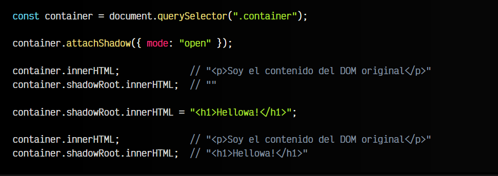
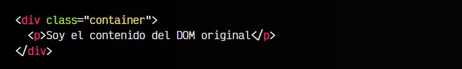
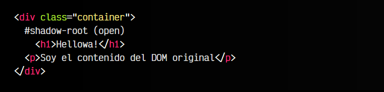
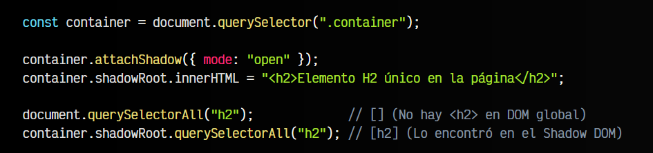
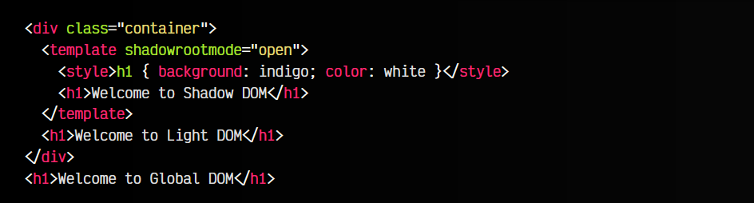

# 
Crear un elemento encapsulado

Hasta ahora, hemos aprendido a crear elementos simples en el DOM tradicional. Sin embargo, existe un concepto relativamente moderno que no mucha gente conoce: El Shadow DOM. Se trata de una capa adicional adjuntada a nuestro elemento HTML, donde podemos insertar elementos del DOM que "sobreescriben" (realmente, tapan, como una sombra) a los elementos del DOM original.

Observa que el elemento HTML representado en azul es el elemento del DOM original, y en este caso, el elemento en gris es el «DOM particular» que se ha añadido en ese elemento y está «tapando» el DOM original.

En el artículo [Tipos de DOM](https://lenguajejs.com/dom/introduccion/tipos-dom/) tienes una explicación más detallada sobre el Shadow DOM y otras modalidades del DOM.

## Crear un Shadow DOM.
Para crear un Shadow DOM, necesitamos llamar al método .attachShadow() en nuestro elemento HTML. Se le debe pasar un objeto por parámetro indicando el modo del Shadow DOM, que puede ser open o closed. Generalmente, utilizaremos open (la modalidad closed sólo evita el acceso a algunas propiedades):

js:

html:

vista:

Observa que el elemento pasa a tener una propiedad shadowRoot donde tiene su DOM local particular. Sin embargo, el DOM original lo sigue conservando. Podemos trabajar con ambos, sólo que una vez un elemento tiene un Shadow DOM, el DOM original de ese elemento pasa a estar oculto («oscurecido» por el Shadow DOM). Es la parte del DOM que se suele denominar Light DOM.

Si observas la demo del ejemplo anterior y miras el código con el inspector de elementos del navegador, observarás que se suele representar así:

Dentro del Shadow DOM está nuestro < h1 > y luego, fuera de él pero dentro del .container está nuestro contenido < p > original. Tenlo en cuenta porque es algo muy importante.

## Encapsulación del DOM.
Cuando hablamos de encapsulación del DOM, nos referimos a que ahora, un elemento HTML puede tener un DOM particular en su propio elemento que no es alcanzable de forma global, sino que es particular del elemento:

Una de las grandes ventajas es que el CSS global no afecta al Shadow DOM, ni el CSS del Shadow DOM afecta al DOM global. Más información en [Encapsulación CSS con Shadow DOM](https://lenguajejs.com/webcomponents/shadow-dom/que-es-shadow-dom/#encapsulaci%C3%B3n-con-shadow-dom).

## Elementos compatibles.
Se puede crear un Shadow DOM en casi todos los elementos HTML, pero no en todos. En principio, recuerda que se puede insertar en las etiquetas mayormente contenedoras:

   - Contenedores tradicionales como < div > o < span >.
   - Contenedores semánticos como < article >, < aside >, < header >, < footer >, < main >, < nav >, < section >.
   - Encabezados como < h1 >, < h2 >, < h3 >, < h4 >, < h5 > y < h6 >
   - Contenedor de página < body >
   - Contenedores de citas como < blockquote >
   - Contenedores de textos como < p >
   - En cualquier custom element (webcomponent)

## Crear un Shadow DOM declarativo.
Habrás observado que en algunos casos, el inconveniente del Shadow DOM es que se debe generar con Javascript. Esto puede ser un problema en entornos del lado del servidor (backend) o en contextos donde tenemos que trabajar la accesibilidad.

Actualmente, hay formas de crear un Shadow DOM sin Javascript:

html:

vista:

Aquí han pasado varias cosas:

   - 1️⃣ La etiqueta < template > ha creado el Shadow DOM sin Javascript
   - 2️⃣ El Shadow DOM oculta el DOM de la etiqueta (Light DOM)
   - 3️⃣ El CSS definido en el Shadow DOM, se queda en el Shadow DOM.
   - 4️⃣ El < h1 > del DOM global no tiene estilos.
   - 5️⃣ Si añadieramos CSS al DOM global, no afectaría al < h1 > del Shadow DOM.

Si vas a trabajar con Shadow DOM declarativo, echa un vistazo al método [setHTMLUnsafe()](https://lenguajejs.com/dom/contenido/innerhtml/#el-m%C3%A9todo-sethtmlunsafe), una alternativa nativa moderna a .innerHTML con mejor soporte para estas características.

