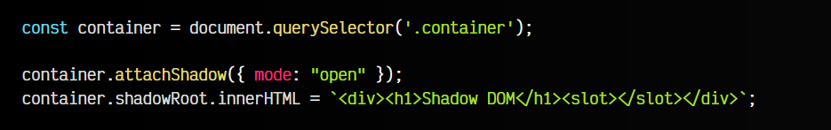
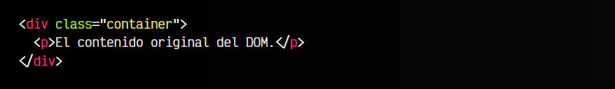
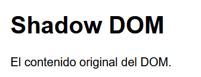
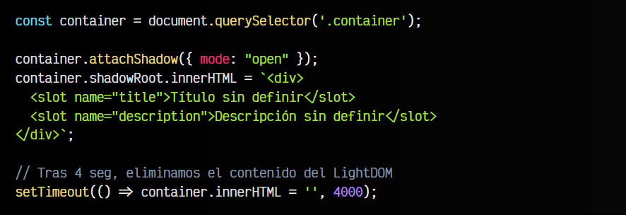
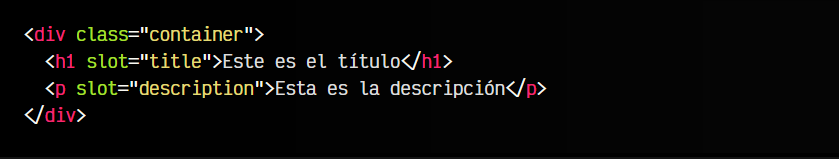
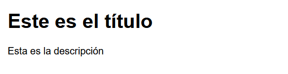
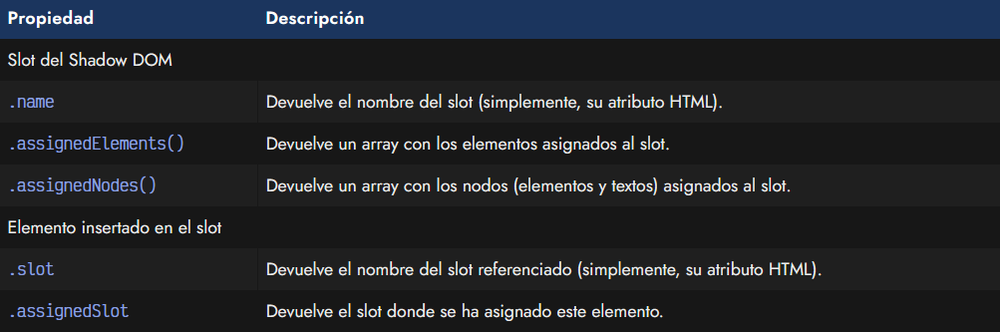
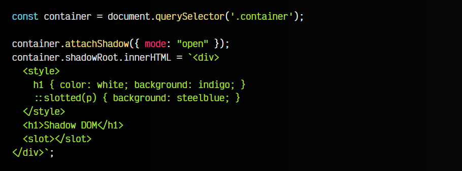
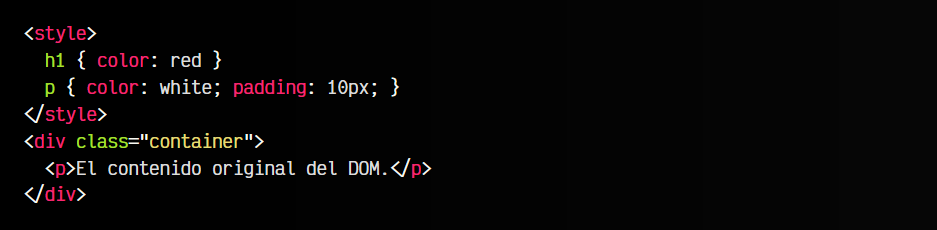

# 
Crear un elemento encapsulado

En el artículo anterior vimos como crear un Shadow DOM para crear DOM particulares o locales en elementos HTML específicos. Si recordamos, vimos que el DOM que teníamos en el elemento (Light DOM), era oscurecido por el Shadow DOM, y en el navegador pasaban a ser renderizados sólo los elementos del Shadow DOM.

## ¿Qué son los slots?.
Los slots o ranuras son una característica del DOM mediante la cuál podemos insertar fragmentos del Light DOM en nuestro Shadow DOM. Se puede ver como «pequeños huecos» en el Shadow DOM por donde se pueden ver partes de luz que realmente están en el Light DOM.

Veamos un ejemplo sencillo:

js:

css:

vista:

Como podemos ver, en este caso, el elemento <slot> deja pasar todo el contenido original de la etiqueta .container al Shadow DOM.

## Slots múltiples.
Para casos básicos, nos basta con utilizar un sólo < slot > que obtiene el contenido íntegro del Light DOM. Sin embargo, podemos utilizar múltiples < slot > para insertar fragmentos específicos:

js:

html:

vista:

Observa que en este caso, hemos utilizado las etiquetas <slot> añadiéndole un atributo name para darles un nombre. Luego, en el Light DOM, hemos definido la etiqueta que nos interesa, añadiéndole un atributo slot que coincida con el name del slot del Shadow DOM.

Además, fíjate en el setTimeout() que hemos definido para eliminar el contenido del Light DOM a los 4 segundos. De esta forma se ve claramente, que si no hay una etiqueta con atributo slot, el Shadow DOM utiliza el contenido del slot como contenido a utilizar por defecto.

Si quieres aprender más sobre los slots, puedes consultar el artículo [Slots en WebComponents](https://lenguajejs.com/webcomponents/shadow-dom/slots/).

## Acceso a los slots desde Javascript.
Si queremos hacer alguna acción concreta, mediante Javascript podemos acceder a los slots o a los elementos insertados en los slots, a través de varias propiedades o métodos:

Como puedes ver, los < slot > pueden tener varios elementos asignados, simplemente referenciandolo por el nombre. La diferencia entre .assignedElements() y .assignedNodes() es que el primero se basa en ELEMENT y el segundo en NODE (que incluye elementos y nodos de texto).

## Dando estilo a los slots.
El contenido que está dentro de un < slot > no se puede estilar desde el Shadow DOM, ya que pertenece al DOM global. Sólo podemos estilarlo desde el DOM global, o desde el Shadow DOM utilizando el pseudoelemento ::slotted() para dar estilo a los elementos insertados en el slot:

js:

html:

vista:

Observa que en el caso del < h1 > el CSS global no afecta al < h1 > del Shadow DOM (está encapsulado). Sin embargo, las ranuras slot si que afectan ambos. El CSS global afecta a la etiqueta < p > porque está en el DOM global, pero también podemos afectarla mediante ::slotted() en el Shadow DOM.

Mediante ::slotted() sólo se pueden estilar los elementos de primer nivel. Si quisieramos darle estilo a los elementos hijos anidados, no podríamos hacerlo. En esos casos, mi recomendación es investigar como funciona [CSS Parts](https://lenguajejs.com/webcomponents/shadow-dom/css-parts/) y su pseudoelemento ::part().

## Los slots en el SEO.
Los < slot > son un mecanismo muy interesante en el SEO (Optimización en motores de búsqueda), sobre todo cuando utilizamos Javascript para crear el DOM.

Utilizando < slot >, podemos añadir todo el contenido sensible a ser indexado en el Light DOM, mientras que en el Shadow DOM con Javascript, añadimos sólo la parte que no sea interesante de cara a buscadores.