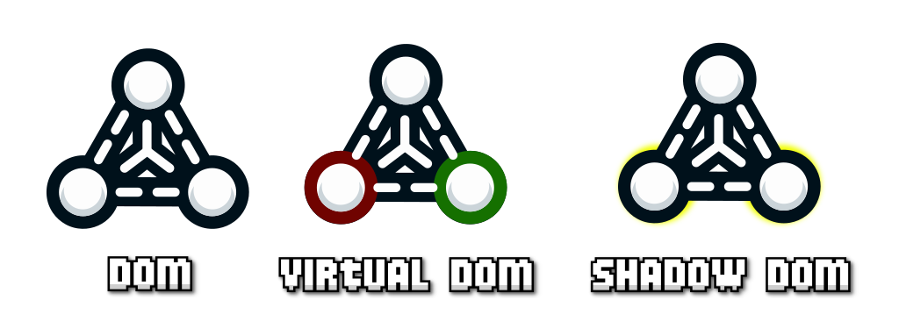
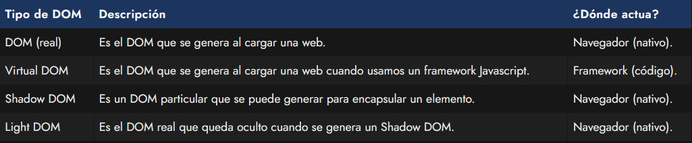
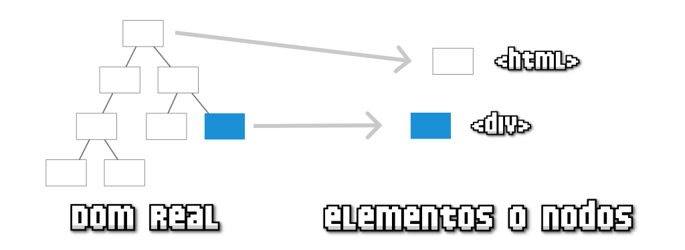
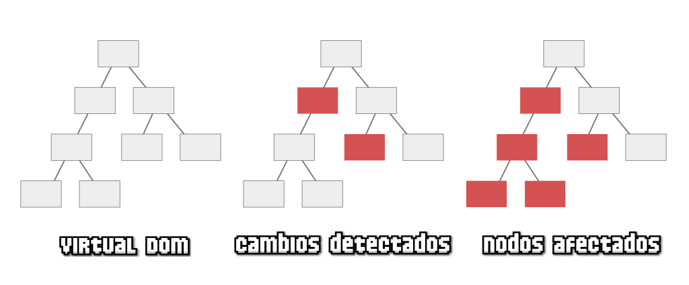
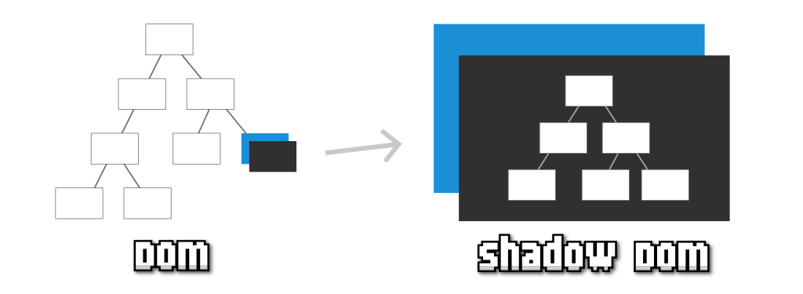
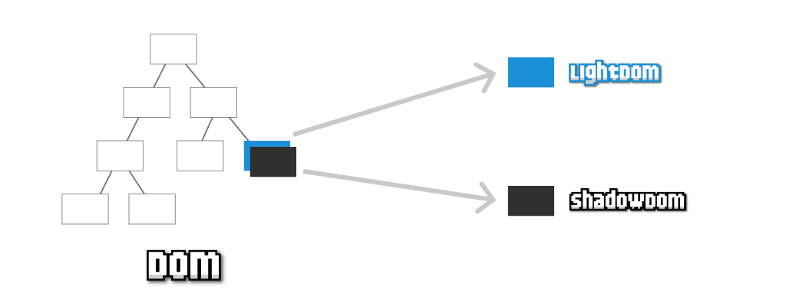

# 
Tipos de DOM

Como vimos en el artículo anterior, el DOM es la forma que tenemos de llamar a la estructura del documento HTML. Una estructura organizada por orden de aparición, en forma de árbol, que nos permite acceder a los elementos HTML de una página web y modificarlos.

Sin embargo, hoy en día, dependiendo de las herramientas con las que estemos trabajando, podemos estar utilizando un tipo de DOM o alguna de sus variaciones:

Vamos a explicarlos detenidamente y a explicar sus características principales.

## ¿Qué es el DOM real?.
El DOM real es la forma en la que se denomina a la estructura HTML original de una página. Puedes verla desde un navegador, simplemente pulsando con botón derecho, seleccionando Inspeccionar y abriendo la pestaña Elementos.

Javascript proporciona una serie de funciones y mecanismos para acceder a estos elementos, modificarlos o eliminarlos de forma potente y flexible, como iremos viendo en los siguientes artículos.

El DOM real siempre existe, aunque a veces trabajamos directamente con él, y otras veces utilizaremos herramientas que trabajan con él de forma transparente, sin que el desarrollador sea consciente.

## ¿Qué es el Virtual DOM?.
Un Virtual DOM (o VDOM) es una representación ligera y artificial del DOM real.

Durante la aparición de los diferentes frameworks del ecosistema Javascript, estos idearon un concepto denominado Virtual DOM, que no es más que una copia en memoria del DOM de la página, donde se gestionarían directamente las actualizaciones y cambios del mismo, para traducirlos posteriormente al DOM real del documento, con el objetivo de acelerar y optimizar los cambios del DOM en la página sin que el programador tenga que preocuparse por ello.

Por ejemplo, la popular librería React introducía el concepto de Virtual DOM para detectar los cambios (diferencias entre árboles), actualizar los nodos afectados (cambios y descendientes a quienes pueden afectar) y posteriormente, actualizarlos en el DOM real:

Virtual DOM

El surgimiento del concepto de Virtual DOM y su definición, ayudó a promover (quizás por cuestiones de marketing) el falso concepto «el DOM es lento», cuando en realidad, lo que puede hacerlo lento es una incorrecta gestión del mismo.

Es importante tener en cuenta que el Virtual DOM es una ventaja para los programadores porque les abstrae de tener que preocuparse por la manipulación del DOM, pero también conlleva desventajas: peor rendimiento, más coste de memoria y mayor complejidad en determinados casos.

Recuerda que el Virtual DOM es un proceso que se implementa y ejecuta «fuera» del navegador, es decir, no es nativo, sino que forma parte del código de las librerías o frameworks Javascript. Si utilizas un framework o librería de Javascript, probablemente estés trabajando con un Virtual DOM. React y Vue tienen Virtual DOM, pero por ejemplo, Svelte, no.

## ¿Qué es el Shadow DOM?.
El concepto de Shadow DOM, o «sombra del DOM», es un concepto relativamente moderno para crear elementos HTML en el DOM, teniendo su propio DOM particular, y por lo tanto, siendo independientes del resto del documento, facilitando así su encapsulación.

Por ejemplo, imaginemos un elemento HTML (en azul) en un árbol DOM tradicional. Si le añadimos un Shadow DOM a ese elemento HTML, pasaríamos a tener un elemento HTML con su propio DOM encapsulado, por lo que podemos hacer cambios sólo en ese DOM, aplicar CSS sólo a ese DOM sin que afecte al resto, etc.

El concepto de Shadow DOM es especialmente interesante en la creación de componentes reutilizables de forma nativa, por lo que es común encontrarlo junto a temas de Web Components. Sin embargo, es una característica independiente que puede utilizarse en Javascript vanilla, sin necesidad de usar WebComponents.

En el artículo [¿Qué es el Shadow DOM?](https://lenguajejs.com/webcomponents/shadow-dom/que-es-shadow-dom/) del tema WebComponents puedes aprender más sobre él.

## ¿Qué es el Light DOM?.
El concepto de Light DOM tiene sentido sólo en el contexto de un elemento que posea un Shadow DOM. Igual que decimos que un Shadow DOM es la sombra de un elemento del DOM, el Light DOM es su contrapartida.

Cuando creamos un Shadow DOM para un elemento del DOM, este, al igual que una sombra, oculta el contenido que ya tenía el elemento, mostrando sólo el de su Shadow DOM (el DOM particular). El contenido oculto es el que se denomina informalmente Light DOM, el contenido real del DOM que ha sido ocultado.

En el artículo [¿Qué es el Light DOM?](https://lenguajejs.com/webcomponents/shadow-dom/light-dom-shadow-dom/) del tema WebComponents puedes aprender más sobre él.