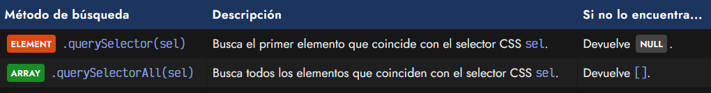
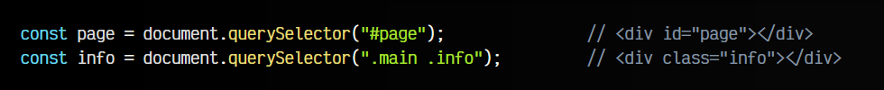
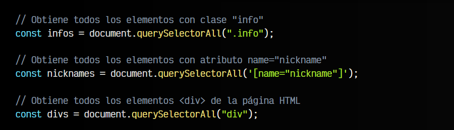
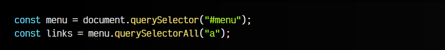
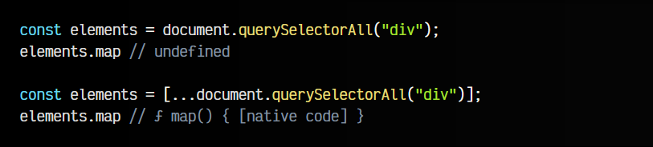

# 
querySelector: Buscar en el DOM

En el artículo anterior explicamos como funcionaban los métodos tradicionales de búsqueda en el DOM como getElementById() o getElementsByClassName(). Aunque estos métodos tradicionales pueden ser más que suficientes para buscar elementos en el DOM, tenemos a nuestra disposición dos nuevos métodos de búsqueda mucho más flexibles y prácticos si conocemos y dominamos los selectores CSS.

## Métodos modernos de búsqueda.
En este nuevo grupo, tenemos sólo dos métodos que son equivalentes a todos los métodos tradicionales, y aún más potentes, ya que permiten hacer cosas que no se podían realizar con los anteriores.

Los métodos son los siguientes:

Con estos dos métodos podemos realizar todo lo que hacíamos con los métodos tradicionales mencionados anteriormente e incluso muchas más cosas (en menos código) gracias a CSS.

## El método querySelector().
El método .querySelector() devuelve el primer elemento que encuentra que encaja con el selector CSS indicado por parámetro:

Lo realmente interesante de este método, es que al permitir suministrarle un selector CSS básico o incluso un selector CSS avanzado, se vuelve un sistema mucho más potente que los tradicionales.

   - El primer ejemplo sería equivalente a utilizar un .getElementById(), sólo que en la versión de .querySelector() indicamos por parámetro un , y en el primero le pasamos un simple . Observa que estamos indicando un # porque se trata de un id.

   - En el segundo ejemplo, estamos recuperando el primer elemento con clase info que esté dentro de otro con clase main. En los métodos tradicionales, sería menos directo ya que tendríamos que realizar varias llamadas. Con .querySelector() se hace directamente sólo con una.

El método querySelector() siempre devuelve un solo elemento: el primero que encuentra. En el caso de no coincidir con ninguno, devuelve NULL.

## El método querySelectorAll().
Por otro lado, el método .querySelectorAll() realiza una búsqueda de elementos en el DOM, sólo que como podremos intuir por ese All(), devuelve un ARRAY con todos los elementos que coinciden con el Selector CSS:

El método .querySelectorAll() siempre nos devolverá un ARRAY de elementos. En el caso de no encontrar ninguna coincidencia, nos devolverá un array de 0 elementos.

## Búsquedas acotadas.
Al realizar una búsqueda de un elemento particular y guardarlo en una variable o constante, podemos volver a realizar una nueva búsqueda posteriormente sobre este elemento, en lugar del DOM íntegro document:

Sin embargo, si controlamos un poco de CSS, y nos interesa únicamente el elemento final, puede ser mucho más sencillo realizar lo siguiente:

## El tipo NodeList vs HTMLCollection.
Ten en cuenta que, aunque he mencionado que el método querySelectorAll() devuelve siempre un , realmente devuelve un  ARRAY tipo de dato NodeList, que es muy similar a un ARRAY, pero no es exactamente lo mismo.

Como puedes ver, en el primer caso, la estructura devuelva (es un NodeList) no tiene el método .map(), que utilizamos para transformar elementos de un array. Sin embargo, en el segundo caso hemos hecho una [desestructuración de arrays](https://lenguajejs.com/javascript/arrays/desestructuracion-arrays/) para sacar todos los elementos de la estructura y reestructurarla en un, ahora sí, nuevo ARRAY. Por esta razón en el primer caso no podemos usar .map() y en el segundo caso, sí.

Si no vas a realizar tareas donde necesites estas estructuras de datos, se recomienda no convertirlo en un array, pero si necesitas trabajar con métodos como .map() o .filter(), por ejemplo, puedes destructurarlo o convertirlo mediante un Array.from().