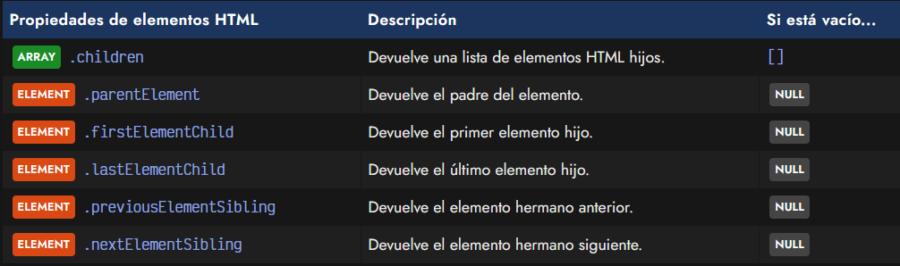
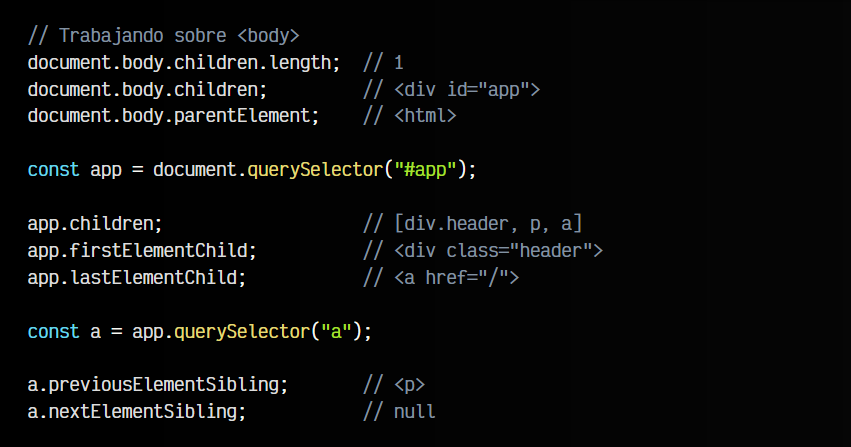
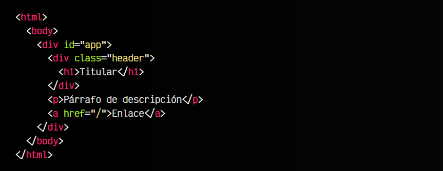
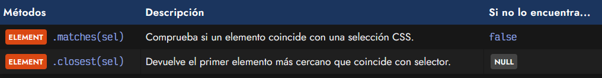
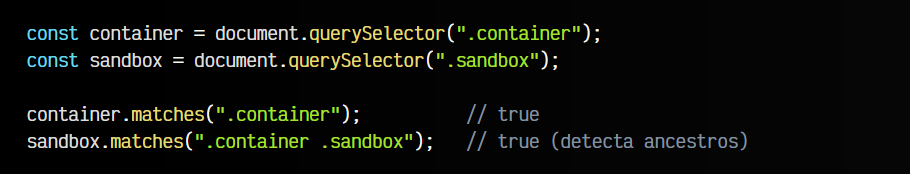
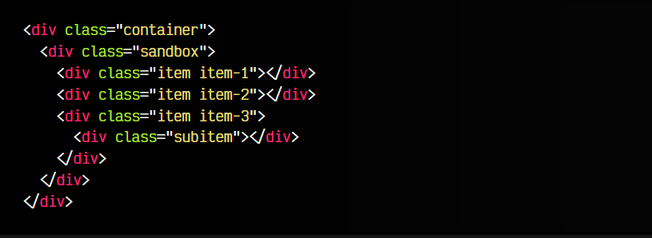
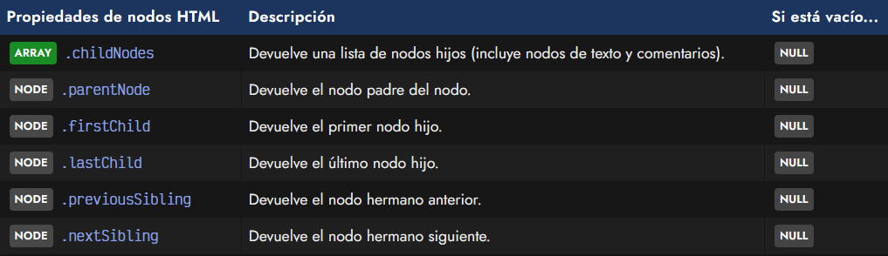
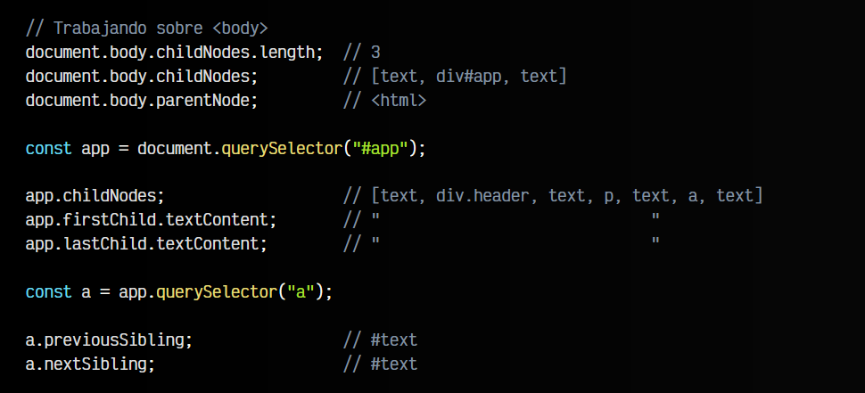
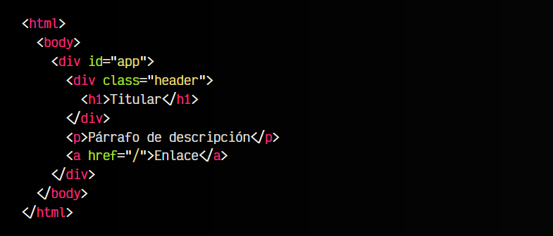

# 
Navegar por elementos del DOM

En algunas ocasiones en las que conocemos y controlamos perfectamente la estructura del código HTML de la página, nos puede resultar más cómodo o interesante utilizar una forma de navegar por la jerarquía de elementos HTML.

Por ejemplo, acceder al elemento que está a continuación de otro elemento del DOM, o acceder al último elemento de una estructura contenedora.

¡Alto! Mucho cuidado con esta estrategia de moverse de forma jerárquica. En general, suele ser una mala opción porque si la estructura DOM cambia, nuestro código dejaría de funcionar correctamente. Úsalo sólo si tu DOM es una estructura sólida que no cambia y conoces perfectamente.

## Navegar a través de elementos.
Las propiedades que veremos a continuación devuelven información de otros elementos relacionados con el elemento en cuestión. En este caso estamos trabajando con el tipo ELEMENT:

En primer lugar, tenemos la propiedad children que nos ofrece un ARRAY con una lista de elementos HTML hijos. Podríamos acceder a cualquier hijo utilizando los corchetes de array y seguir utilizando otras propiedades en el hijo seleccionado.

   - La propiedad firstElementChild sería un acceso rápido a children[0]
   - La propiedad lastElementChild sería un acceso rápido al último elemento hijo.

Por último, tenemos las propiedades previousElementSibling y nextElementSibling que nos devuelven los elementos hermanos anteriores o posteriores, respectivamente. La propiedad parentElement nos devolvería el padre del elemento en cuestión. En el caso de no existir alguno de estos elementos, nos devolvería NULL.

Observa el siguiente código HTML. Si trabajamos bajo este documento HTML, y utilizamos el siguiente código Javascript, podremos «navegar» por la jerarquía de elementos, moviéndonos entre elementos padre, hijo o hermanos:

js:

html:

Estas son las propiedades más habituales para navegar entre elementos HTML, sin embargo, tenemos otra modalidad un poco más detallada.

En esta modalidad, cuando hablamos de ARRAY trabajamos a nivel de HTLMCOLECTION.

## Buscar elementos desde otros.
Existen algunos métodos interesantes para encontrar elementos desde otros elementos. Los métodos que mencionamos son los siguientes:

## El método matches().
El método matches() nos permite comprobar si un elemento coincide con un selector CSS indicado por parámetro. El método devuelve true si el elemento coincide con el selector indicado. Si no lo encuentra, devuelve false.

js:

html:

## El método closest().
El método closest() nos permite encontrar el primer elemento más cercano que coincide con un selector CSS indicado por parámetro. Si no lo encuentra devuelve NULL.

js:

html:

Observa que el método closest() busca elementos en dirección hacia el padre, devolviendo el más cercano, pero nunca hacia los elementos hijos.

## Navegar a través de nodos.
Si queremos hilar más fino, podemos trabajar a nivel de elementos de tipo NODE, utilizando las siguientes propiedades, que son equivalentes a las anteriores, pero trabajando con la unidad más básica: nodos.

Estas propiedades suelen ser más interesantes cuando queremos trabajar sobre nodos de texto, ya que incluso los espacios en blanco entre elementos HTML influyen. Volvamos a trabajar sobre el documento HTML anterior, pero ahora utilizando este grupo de propiedades basadas en NODE:

js:

html:

Con todo esto, ya tenemos suficientes herramientas para trabajar a bajo nivel con las etiquetas y nodos HTML de un documento HTML desde Javascript.

