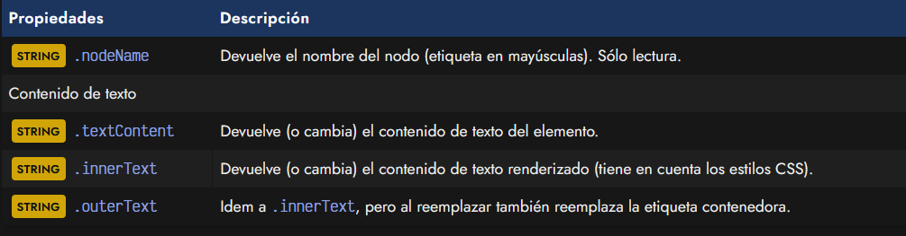
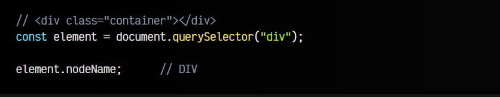
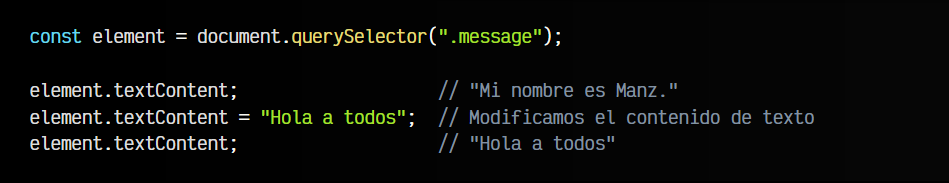
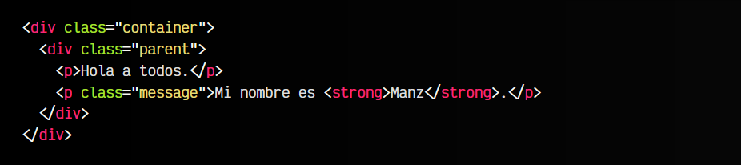
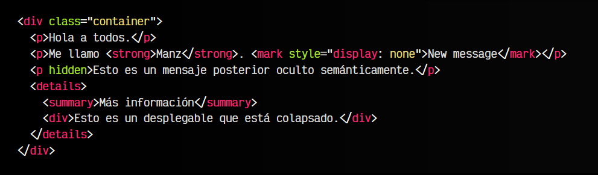
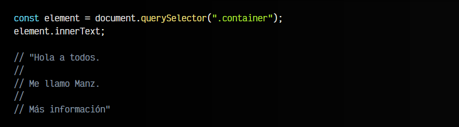
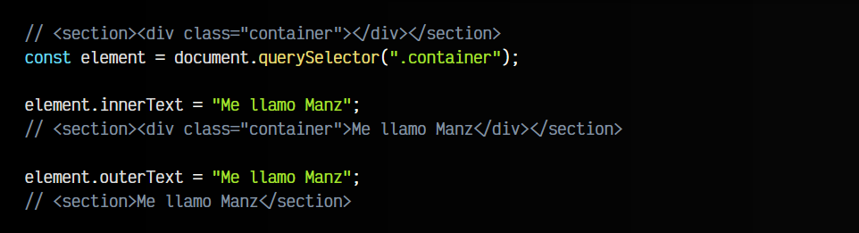

# 
Texto: textContent vs innerText

Nuestra página está repleta de elementos HTML y es posible que queramos modificar uno de dichos elementos para cambiar su contenido de texto por otro. Ya sabemos localizar elementos del DOM, ahora lo que necesitamos es aprender una serie de propiedades para acceder al contenido de los elementos HTML.

## Acceder al contenido del DOM.
Antes de empezar, echemos un vistazo a las propiedades relacionadas que tenemos para esto:

Vamos a ir viéndolas detalladamente para comprender su funcionamiento y características.

## La propiedad .nodeName.
Aunque no está directamente relacionada, es bueno conocer que hay una propiedad llamada .nodeName con la que podemos obtener el nombre de la etiqueta en cuestión.

Veamos un ejemplo para entenderlo mejor:

Esta propiedad nodeName nos devuelve el nombre del nodo, que en elementos HTML es interesante puesto que nos devuelve el nombre de la etiqueta (en mayúsculas). Se trata de una propiedad de sólo lectura, por lo cuál no podemos modificar la etiqueta, sólo acceder a ella.

Si no tenemos una etiqueta, sino un nodo de texto o un comentario, devolvería #text o #comment.

## La propiedad .textContent.
La propiedad recomendada para hacer modificaciones de texto es .textContent, que nos devuelve el contenido de texto de un elemento HTML concreto. Es muy útil para obtener (o modificar) sólo el texto de un elemento, obviando el marcado o etiquetado HTML.

Observa el siguiente ejemplo, donde vamos a seleccionar el elemento < p > con clase .message desde Javascript y a trabajar con él accediendo a varias de sus propiedades:

js:

html:

Como puedes ver, no sólo podemos utilizar la propiedad .textContent para acceder a la información de texto que contiene, sino también para reemplazar su contenido, simplemente asignándolo como si fuera una variable o constante.

Observa que en el HTML tenemos una etiqueta < strong >. En el caso de que el elemento tenga anidadas varias etiquetas HTML una dentro de otra, la propiedad .textContent se quedará sólo con el contenido textual.

## La propiedad .innerText.
La propiedad .innerText es muy similar a .textContent, pero tiene una diferencia clave: accede al texto renderizado visualmente por el navegador.

Observa el siguiente fragmento de código:

Observa que:

   - El contenido de la etiqueta < mark > está oculto mediante CSS.
   - El contenido de la tercera etiqueta < p > está oculto semánticamente mediante el atributo hidden.
   - El contenido de la etiqueta < div > dentro del < details > está oculto porque el acordeón está colapsado.

Si consultamos el contenido de texto del .container mediante la propiedad .textContent nos devolvería todo el contenido de texto de todas las etiquetas del interior del .container. Sin embargo, si lo hacemos mediante la propiedad .innerText nos devolvería sólo lo renderizado visualmente:

## La propiedad .outerText.
En el caso de la propiedad .outerText, funciona exactamente igual que .innerText para obtener información. Sin embargo, tiene una pequeña diferencia si la utilizamos para modificar texto:

   - En el caso de utilizar .innerText, modificamos el contenido de la etiqueta.
   - En el caso de utilizar .outerText, hacemos lo mismo, pero incluyendo la etiqueta en sí.

Observa que en el primer caso, ha añadido el texto en el interior de la etiqueta < div >. En el segundo caso, está reemplazando la propia etiqueta < div >, quedándose sólo con el texto.

## Insertando contenido HTML.
Un aspecto muy importante a tener en cuenta es que las propiedades que hemos visto sirven sólo para contenido de texto. Si intentamos insertar contenido HTML de esta forma:

Obtendremos que lo que ocurre es que se inserta literalmente el texto < h1 >Hola< /h1 >, en lugar de renderizarse una etiqueta  < h1 > como encabezado, con el texto Hola. Si lo que queremos es renderizar contenido, lo veremos en el siguiente artículo.

