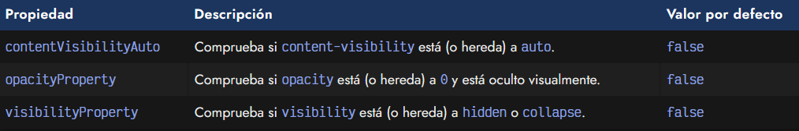

# 
La propiedad className

En CSS es muy común trabajar con los elementos mediante sus clases HTML. Se utiliza sobre todo para asignar estilos CSS, pero incluso también para buscar elementos mediante Javascript (influenciado por el clásico jQuery). En este artículo vamos a ver las bases para manipular y gestionar estas clases.

## Las clases de un elemento HTML.
Antes de continuar, debe quedarnos clara la estructura de las clases HTML de un elemento o etiqueta. Recuerda que un elemento HTML pueden tener múltiples clases CSS. Observa el siguiente ejemplo, donde tenemos una etiqueta < div > que tiene las siguientes clases:

   - 1️⃣ La clase element sería la clase general que representa el elemento, y que tiene estilos fijos.
   - 2️⃣ La clase shine podría tener una animación CSS para aplicar un efecto de brillo.
   - 3️⃣ La clase dark-theme podría tener los estilos de un elemento en un tema oscuro.

Este enfoque se denomina enfoque semántico y todo esto se puede escribir de forma directa y estática. Sin embargo, cuando comenzamos a programar en Javascript buscamos una forma dinámica, práctica y cómoda de hacerlo mediante programación, para poder automatizarlo y hacerlo más sencillo de utilizar para el desarrollador.

## Acceso a las clases o estilos CSS.
Las formas principales de modificar las clases o los estilos CSS mediante el DOM son las siguientes:

Veamos detalladamente cada uno de ellos, pero ahora vamos a centrarnos en el primero.

## La propiedad .className.
Javascript tiene a nuestra disposición una propiedad .className en todos los elementos HTML. Con dicha propiedad podemos acceder al valor del atributo HTML class como un , tanto para obtenerlo como para cambiarlo o reemplazarlo.

La propiedad .className viene a ser la modalidad directa, rápida y equivalente a utilizar:

   - El getter .getAttribute("class") que devolvería el valor del atributo HTML class.
   - El setter .setAttribute("class", value) que cambiaría el valor del atributo HTML class.

Ten muy en cuenta que la propiedad se denomina className cuando estamos escribiendo código Javascript, mientras que se denomina class cuando escribimos código HTML. Esto es así porque la palabra class en Javascript ya está reservada (se utiliza para crear clases de OOP).

Veamos un ejemplo de uso utilizando el fragmento de código HTML que mostramos al principio del artículo. De esta forma podremos ver como funciona la propiedad className:

Trabajar con .className es sencillo, simple y rápido, pero tiene una limitación cuando trabajamos con elementos HTML con múltiples clases CSS, que es la mayoría de los casos. Si queremos realizar una manipulación sólo en una clase CSS concreta, dejando las demás intactas, se puede hacer, pero .className se vuelve poco práctico ya que hay que escribir más código.

Observa este ejemplo donde vamos a cambiar la clase dark-theme por light-theme:

Como ves, no es ningún drama (y puede hacerse de forma más directa incluso), pero resulta un poco incómodo. Probablemente, la forma más interesante de manipular clases CSS desde Javascript es mediante la propiedad .classList, que tiene un conjunto de métodos muy útiles y prácticos. Es la que veremos en el siguiente artículo.

## El método checkVisibility().
Existe un nuevo método muy interesante, denominado checkVisibility(). Con él, podemos comprobar si el elemento en cuestión es potencialmente visible al usuario en la página o no. Una comprobación que, sin duda, es muy útil para los desarrolladores.

Como puedes ver, tiene comprobaciones adicionales para detectar si está siendo visible:

   - Es capaz de comprobar si tiene asociado un display a none.
   - Es capaz de comprobar si se usa content-visibility a hidden.
   - Es capaz de comprobar si tiene una propiedad opacity a 0.
   - Es capaz de comprobar si tiene una propiedad visibility a hidden.
   - Es capaz de comprobar si está desconectado del DOM o aún no se ha añadido.

Es posible añadir un objeto de opciones para determinar como funcionará el método checkVisibility(), este objeto puede tener varias propiedades:

Las propiedades checkOpacity y checkVisibility están disponibles porque eran los nombres anteriores de las dos últimas, pero de usarlas, deberían usarse las de la tabla.

