# 
FUNCIONES

## ¿Qué es una función?
Las funciones nos permiten agrupar líneas de código en tareas con un nombre, para que, posteriormente, podamos hacer referencia a ese nombre para realizar todo lo que se agrupe en dicha tarea. Para usar funciones hay que hacer 2 cosas:

  -  Declarar la función: Preparar la función, darle un nombre y        decirle las tareas que realizará.
  -  Ejecutar la función: «Llamar» a la función para que realice las tareas de su contenido.

## Declaración
En el siguiente ejemplo veremos la declaración de una función llamada saludar:

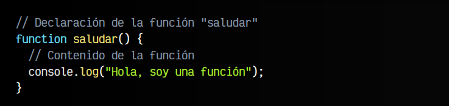

El contenido de la función es una línea que mostrará por consola un saludo. Sin embargo, si escribimos estas 4-5 líneas de código en nuestro programa, no mostrará nada por pantalla. Esto ocurre así porque solo hemos declarado la función (le hemos dicho que existe), pero aún nos falta el segundo paso, ejecutarla, que es realmente cuando se realizan las tareas de su contenido.

## Ejecución
Veamos, ahora sí, el ejemplo completo con declaración y ejecución:

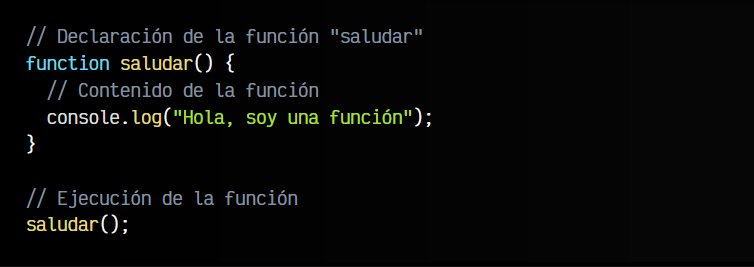

En este ejemplo hemos declarado la función y además, hemos ejecutado la función (en la última línea) llamándola por su nombre y seguida de ambos paréntesis, que nos indican que es una función. En este ejemplo, si se nos mostraría en la consola Javascript el mensaje de saludo.

### Ejemplo:

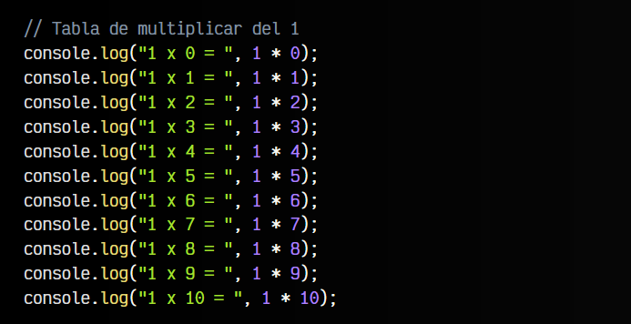

Este primer ejemplo funciona perfectamente, sin embargo, no estamos aprovechando las ventajas de la programación, sino que hemos hecho todo el trabajo escribiendo 10 líneas de código.

Vamos a utilizar un bucle for para ahorrarnos tantas líneas de código:

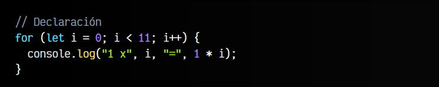

Esto está mucho mejor. Hemos resumido 11 líneas de código en prácticamente 2 líneas utilizando un bucle for que va de 0 a 10 incrementando de 1 en 1. Incluso, recuerda que cuando las llaves sólo contienen una línea, se pueden omitir.

Pero aún no hemos utilizado funciones, así que vamos a modificar nuestro ejemplo para usar una. Imaginemos que ahora nuestro objetivo es mostrar la tabla de multiplicar del 1 varias veces (3 veces para ser exactos).

La primera aproximación para hacer eso que se nos ocurriría sería hacer lo siguiente:

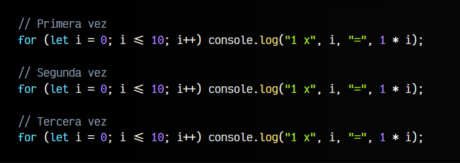

Pero volvemos a tener el mismo problema del primer ejemplo. Estamos repitiendo el mismo código varias veces, complicándolo y volviéndolo más «feo». Además, si tuvieramos que hacer modificaciones en uno de los bucles habría también que repetir el trabajo 2 veces más, por cada uno de los otros bucles.

Veamos ahora como obtener el mismo resultado pero utilizando bucles y funciones, sin repetir varias veces las mismas tareas:

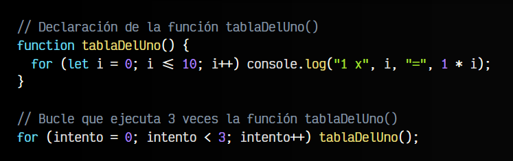

En este ejemplo se declara la función, que mostrará la tabla de multiplicar del uno. Posteriormente, realizamos un bucle con la variable intento de 0 a 2 (3 repeticiones) para llamar la función 3 veces, y mostrar así la tabla de multiplicar cada vez.

Pero... ¿No sería más interesante mostrar las 3 primeras tablas de multiplicar (Tabla del uno, del dos y del tres)? Para hacer eso, primero tenemos que conocer los parámetros en funciones, que veremos en el siguiente artículo.

## ¿Qué son los parámetros?
Las funciones son mucho más flexibles y potentes de lo que hemos visto hasta ahora. A las funciones se les pueden pasar parámetros, que no son más que variables que les pasamos desde fuera hacia dentro de la función. Además, también podemos hacer que la función realice sus tareas y nos devuelva un resultado hacia el exterior de la función.

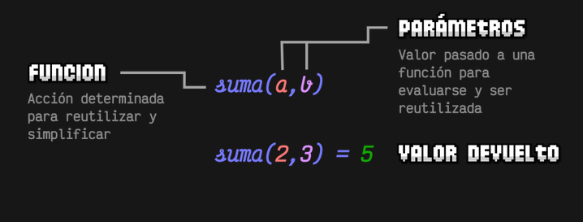

Veamos el siguiente ejemplo, donde utilizamos el parámetro hasta para indicar hasta donde debe llegar:

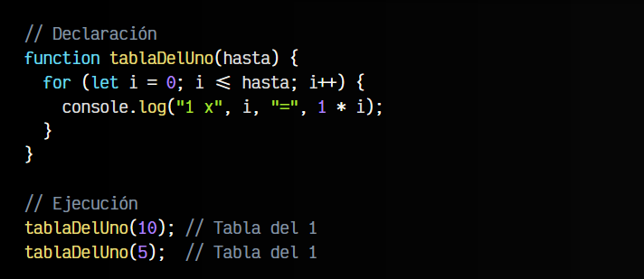

Como podemos ver, en el interior de los paréntesis de la función se ha indicado una variable llamada hasta. Esa variable contiene el valor que se le da a la hora de ejecutar la función, que en este ejemplo, si nos fijamos bien, se ejecuta dos veces: una con valor 10 y otra con valor 5.

Analicemos este código:

   - Ejecutamos la función tablaDelUno(10).
   - En la función tablaDelUno, el parámetro hasta valdrá 10.
   - Por lo tanto, haremos un bucle for desde 0 hasta 10, incrementando de 1 en 1.
   - Se mostrará la tabla de multiplicar del uno, desde el 0 hasta el 10.

Al terminar ejecutaremos la segunda función:

   - Ejecutamos la función tablaDelUno(5).
   - En la función tablaDelUno, el parámetro hasta valdrá 5.
   - Por lo tanto, haremos un bucle for desde 0 hasta 5, incrementando de 1 en 1.
   - Se mostrará la tabla de multiplicar del uno, desde el 0 hasta el 5.

## Parámetros múltiples
Hasta ahora sólo hemos creado una función con 1 parámetro, pero una función de Javascript puede tener muchos más parámetros. Vamos a crear otro ejemplo, mucho más útil donde convertimos nuestra función en algo más práctico y útil:

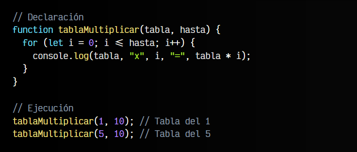

En este ejemplo, hemos modificado nuestra función tablaDelUno() por esta nueva versión que hemos cambiado de nombre a tablaMultiplicar(). Esta función necesita que le pasemos dos parámetros: tabla (la tabla de multiplicar en cuestión) y hasta (el número hasta donde llegará la tabla de multiplicar).

De esta forma, las dos llamadas para ejecutar la función mostrarán por la consola la tabla de multiplicar del 1 y del 5.

## Parámetros por defecto 
Es posible que en algunos casos queramos que ciertos parámetros tengan un valor sin necesidad de escribirlos en la ejecución. Es lo que se llama un valor por defecto.

En nuestro ejemplo anterior, nos podría interesar que la tabla de multiplicar llegue siempre hasta el 10, ya que es el comportamiento por defecto. Si queremos que llegue hasta otro número, lo indicamos explicitamente, pero si lo omitimos, queremos que llegue hasta 10. Esto se haría de la siguiente forma:

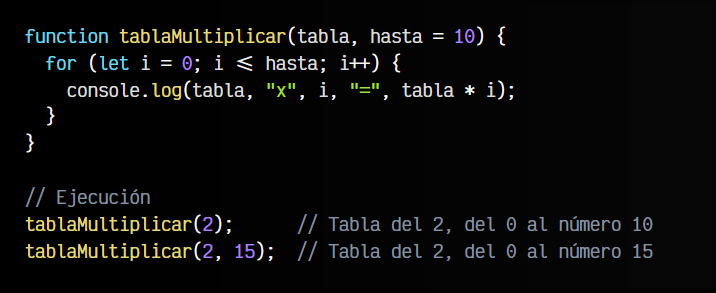

De esta forma nos ahorramos tener que escribir los valores en la ejecución de la función, si en la mayoría de los casos va a tomar ese valor.

## Devolución de valores
Hasta ahora hemos utilizado funciones simples que realizan acciones o tareas (en nuestro caso, mostrar por consola), pero habitualmente, lo que buscamos es que esa función realice una tarea y nos devuelva la información al exterior de la función, para así utilizarla o guardarla en una variable, que utilizaremos posteriormente para nuestros objetivos.

Para ello, se utiliza la palabra clave return, que suele colocarse al final de la función, ya que con dicha devolución terminamos la ejecución de la función (si existe código después, nunca será ejecutado).

Veamos un ejemplo con una operación muy sencilla, para verlo claramente:

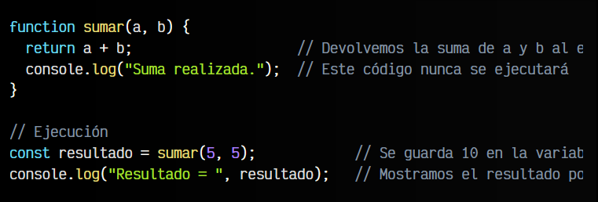

Como podemos ver, esto nos permite crear funciones más modulares y reutilizables que podremos utilizar en multitud de casos, ya que la información se puede enviar al exterior de la función y utilizarla junto a otras funciones o para otros objetivos.

## Formas de crear funciones
Hay varias formas principales de crear funciones en Javascript, aunque probablemente sólo conozcas alguna de ellas:

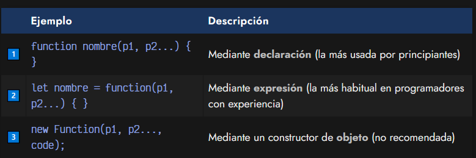

Vamos a explicar cada una de estas formas a continuación, para saber cómo utilizarlas y cuando es interesante utilizarlas.

## Funciones por declaración
Probablemente, la forma más popular de estas tres, y a la que estaremos acostumbrados si venimos de otros lenguajes de programación, es la primera, a la creación de funciones por declaración. Esta forma permite declarar una función que existirá a lo largo de todo el código:

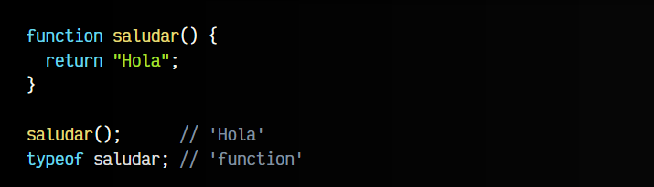

De hecho, podríamos ejecutar la función saludar() incluso antes de haberla creado y funcionaría correctamente, ya que Javascript primero busca las declaraciones de funciones y luego procesa el resto del código.

## Funciones por expresión
Sin embargo, en Javascript es muy habitual encontrarse códigos donde los programadores «guardan funciones» dentro de variables, para posteriormente «ejecutar dichas variables». Se trata de un enfoque diferente, creación de funciones por expresión, que fundamentalmente, hacen exactamente lo mismo (con algunos matices diferentes):

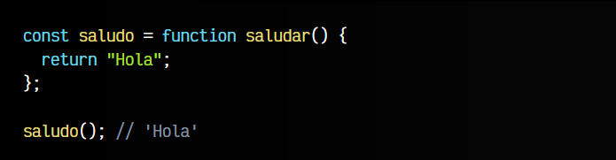

Con este nuevo enfoque, estamos creando una función en el interior de una variable, lo que nos permitirá posteriormente ejecutar la variable (como si fuera una función, que de hecho lo es, porque es lo que contiene).

Observa también que el nombre de la función (saludar) pasa a ser inútil, ya que si intentamos ejecutar saludar() nos dirá que no existe y si intentamos ejecutar saludo() funciona correctamente. ¿Qué ha pasado? Ahora el nombre de la variable pasa a ser el «nombre de la función», mientras que el anterior nombre de la función desaparece y se omite, creando un concepto llamado funciones anónimas (o funciones lambda), que retomaremos más adelante.

