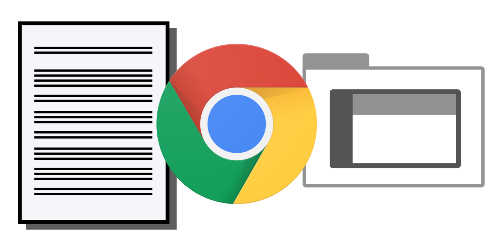
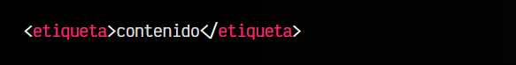
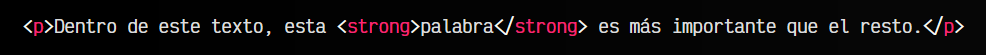

# 
¿Qué es HTML?

Cuando accedemos a una página web, debemos tener en cuenta que lo que realmente está ocurriendo es que nuestro navegador web está pidiendo un documento de texto al sistema (máquina) donde está almacenada esa página web.

En cualquier navegador, existe una opción para ver el código fuente de la página web, la cuál nos mostrará exactamente el texto de dicho documento. El navegador normalmente no nos muestra esa información literalmente, sino que la interpreta y va dibujando los elementos de una página web.

El documento que lee el navegador está escrito en un lenguaje de marcado llamado HTML, que son las siglas de HyperText Markup Language (Lenguaje de marcas de hipertexto), o lo que es lo mismo, un lenguaje de etiquetas que permite incluir o hacer referencia a todo tipo de información.

## ¿Qué es una etiqueta HTML?.
En los navegadores, tienes varias formas de acceder al código HTML de la página:

Pulsando la combinación de teclas ctrl +. u, Te aparecerá el código fuente tal cuál lo recibe el navegador.

Pulsando CTRL+SHIFT+I y accediendo a la pestaña Elements, o simplemente haciendo click con botón derecho y seleccionando la opción Inspeccionar. Aquí tienes un panel más avanzado e interactivo.

Dicho documento esta formado por etiquetas, que son la base del lenguaje HTML. Existen muchas etiquetas y cada una se utiliza para contener información y darle un cierto significado a dicha información, dependiendo de la etiqueta que se trate. Las etiquetas HTML tienen la siguiente estructura:

## Ejemplo de código HTML.
A continuación, utilicemos la etiqueta <strong>STRONG</strong> (etiqueta utilizada para darle importancia a una palabra sobre el resto) en el siguiente ejemplo:

Obsérvese que en el ejemplo estamos utilizando dos etiquetas diferentes. La etiqueta 
, que contiene toda la frase, y la etiqueta <strong>strong</strong>, que contiene sólo la palabra palabra. La primera etiqueta, 
, se utiliza para contener párrafos, mientras que la segunda etiqueta, <strong>strong</strong>, indica la palabra que tiene mayor importancia del texto.

También se habrá observado que se pueden anidar etiquetas, esto es, incluir etiquetas dentro de otras. Es algo que se hace continuamente en HTML y que a medida que avancemos se tornará en algo habitual.

## ¿Qué es la semántica?.
Uno de los principales objetivos de HTML5 es introducir información en un documento HTML5 de forma que sea semántico y no visual. Con esto queremos decir que todos los aspectos visuales deben dejarse para el apartado de presentación, que se gestiona desde el [lenguaje CSS](https://lenguajecss.com/css/).

En el documento HTML debe aparecer información correctamente individualizada, de modo que al leer una página HTML comprendamos su significado, y si queremos cambiar la apariencia, lo hagamos en el documento CSS. Esto es lo que comunmente se conoce como separación de la presentación del contenido.

## Ejemplo de semántica HTML.
Un ejemplo donde se ve claramente este concepto es con la etiqueta <b> de HTML4</b> y anteriores. Dicha etiqueta se utilizaba para poner en negrita (bold) un texto específico:

En este caso, se está utilizando una propiedad de presentación (visual) en el HTML, algo que no se debe hacer en HTML5. La misión de HTML5 es mantener sólo contenido e información semántica en HTML5. Por dicha razón, la forma de hacerlo en HTML5 es la siguiente:

En este nuevo ejemplo, se reemplaza la etiqueta <b> (negrita</b>, característica de presentación) por <strong>strong</strong>, una etiqueta que indica información semántica (importante, característica semántica). De esta forma, en el HTML5 sólo se está añadiendo información particular sobre fragmentos de texto, y si queremos dotar de presentación visual, lo haremos desde CSS.

Así podríamos cambiar el estilo (negrita, colores, tipo de letra, etc...) independientemente de la información y contenido que existe en el HTML. Incluso podríamos establecer el mismo estilo que en el texto, para que visualmente se vea todo de forma uniforme, pero sin embargo, al leer la página HTML, el navegador sabrá siempre que fragmentos de texto son más importantes, aunque tenga el mismo estilo visual.

El objetivo de crear documentos HTML semánticos es que, aunque estamos acostumbrados a crear páginas para usuarios (o más concretamente, para navegadores), cada vez tendemos más a una Internet capaz de procesar información de forma autónoma. Muestra de ello son, por ejemplo, los robots o crawlers de buscadores como Googlebot (el robot de búsqueda de Google) que es capaz de acceder a páginas web para analizar la información de la misma, entenderla e indexarla en su buscador.