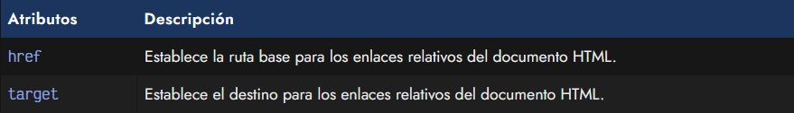
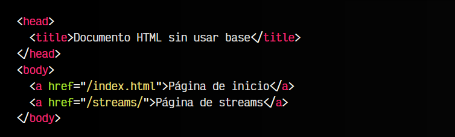
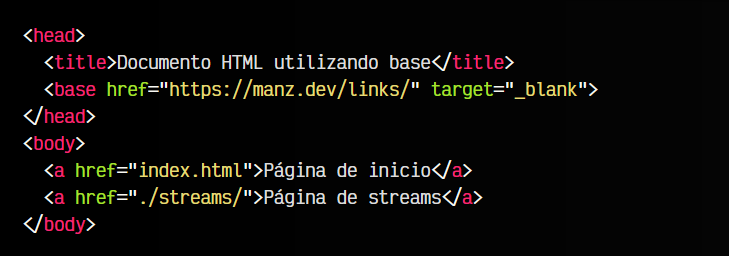
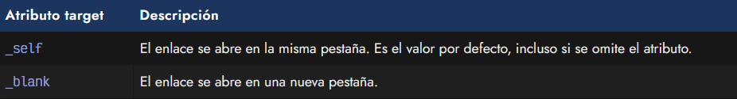

# 
La etiqueta < base >

Existe una etiqueta llamada < base > que puede utilizarse en la cabecera < head > del documento HTML. Esta etiqueta sirve para establecer una ruta base de los enlaces relativos utilizados en nuestro documento. Probablemente, esto se entienda mejor después de ver el apartado de [enlaces o hipervínculos](https://lenguajehtml.com/html/texto/enlaces-o-hipervinculos/).

## La etiqueta < base >.
La etiqueta < base > se utiliza indicando al menos uno de los dos atributos siguientes:

En este caso, los enlaces nos llevarían a las siguientes URL:

   - 1️⃣ El primer enlace nos lleva a https://manz.dev/index.html
   - 2️⃣ El segundo enlace nos lleva a https://manz.dev/streams/

Al indicar una etiqueta < base >, simplemente, en los enlaces relativos de nuestra página se añade la URL indicada.

## El atributo href.
Veamos ahora un ejemplo donde utilizamos la etiqueta < base > con el atributo href:

Ahora, aunque nos encontremos en la página https://manz.dev/, hemos establecido la URL base https://manz.dev/links para los enlaces, por lo que:

   - 1️⃣ El primer enlace nos lleva a https://manz.dev/links/index.html
   - 2️⃣ El segundo enlace nos lleva a https://manz.dev/links/streams/

Como se puede ver, la ruta establecida en la etiqueta < base > (debe ser ruta relativa) se utiliza como base de las URLs utilizadas. En el caso de utilizar en nuestros enlaces < a > una ruta absoluta o una ruta relativa que comience por /, no se tendrá en cuenta la ruta indicada en < base >.

## El atributo target.
Además, también hemos establecido el atributo target a _blank, por lo que los enlaces se abrirán en una pestaña nueva. El atributo target nos permite realizar ciertas tareas dependiendo de su valor:

Otros valores menos comunes como _parent o _top permiten abrir el enlace en un contexto superior al actual, si existe. En caso contrario, se actua como si se hubiera indicado un valor _self.

