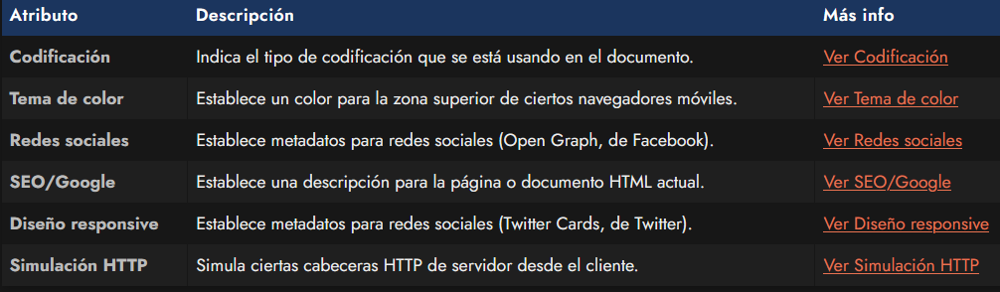
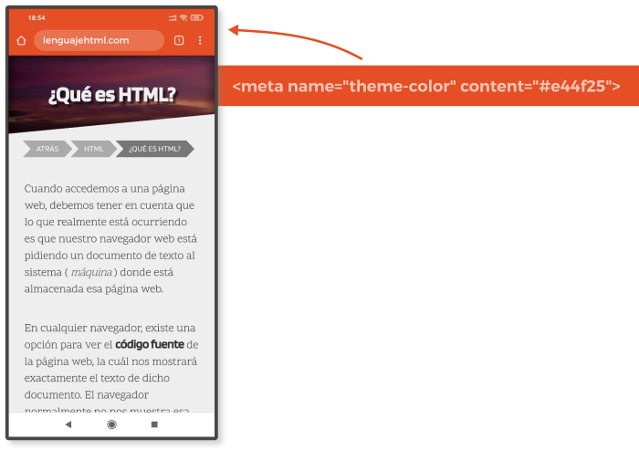
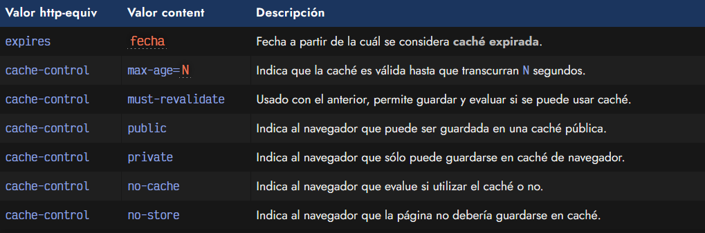
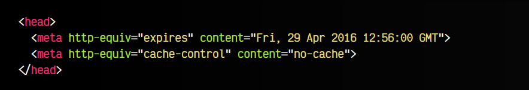

# 
La etiqueta HTML < meta >

Quizás, una de las etiquetas HTML más populares que se colocan en el < head > de un documento HTML es la etiqueta < meta >. Se trata de una etiqueta que nos permite indicar metadatos o información interna del documento HTML. Estos datos no se suelen mostrar visualmente en la página, sino que el navegador los lee para conocer información relevante y utilizarlos en situaciones específicas.

## La etiqueta < meta >.
Por norma general, la etiqueta < meta > tiene los atributos name y content. Dependiendo del valor que le demos a name, tendremos que indicar un valor content correspondiente. Estas etiquetas se colocan en el interior de la etiqueta < head > de nuestro documento:

Sin embargo, también existen algunas excepciones donde la etiqueta < meta >, en lugar de tener los atributos name y content, tiene otros diferentes.

Veamos una lista de etiquetas < meta > interesantes de las que hablaremos:

## Codificación del documento.
La etiqueta < meta > más popular probablemente sea < meta charset="utf-8" >: una etiqueta que permite indicar el tipo de codificación de nuestro documento HTML. ¿Qué es el tipo de codificación? Pues a grandes rasgos, la forma en la que se muestran los carácteres de texto de una página.

Si en alguna ocasión has visto textos como código o también es porque probablemente tenga una codificación incorrecta o no se le haya establecido esta etiqueta:

En el valor del atributo charset realmente se puede indicar cualquier tipo de codificación, pero la más utilizada y recomendada es utf-8, la cuál permite tener un buen sistema de codificación, muy extendido y que soporta una gran variedad de carácteres, suficiente para la mayoría de idiomas y textos.

## Tema de color del navegador.
En los navegadores que lo soporten, una etiqueta  < meta > muy curiosa es la que proporciona la posibilidad de establecer un tema de color para personalizar los colores de la interfaz del navegador que estemos utilizando. Para ello, tenemos que utilizar el atributo name="theme-color" y asociarle un color en hexadecimal:

Al establecer este atributo en una etiqueta < meta >, el navegador coloreará la barra de direcciones con el color hexadecimal indicado en el atributo content de nuestro fragmento de código:

Así pues, con esto conseguiremos que por ejemplo, un dispositivo móvil con Android y Google Chrome, muestre la barra de navegación de la siguiente forma:

Sin embargo, actualmente, el soporte para esta característica es muy irregular, y muchos navegadores aún no lo soportan. Por ejemplo, en Chrome, sólo funciona en dispositivos móviles donde el sistema tenga el modo claro activado.

## Metadatos de simulación HTTP.
Existe una serie de etiquetas de metadatos especiales que indican a los robots del buscador o al navegador, que deben modificar las cabeceras HTTP para realizar acciones que suelen hacerse habitualmente desde el lado del servidor. Estas operaciones, en la mayoría de los casos, es mejor hacerlas directamente desde el servidor, sin embargo, proporcionan una alternativa en el caso que no sea posible.

Para diferenciarlas, en lugar de utilizar el atributo name, se utiliza el atributo http-equiv. Sin embargo, recuerda que estas etiquetas pueden ser ignoradas por algunos navegadores o robots de búsqueda, o incluso ser contraproducentes o afectar negativamente al rendimiento. Muchas de ellas existen sólo por motivos históricos.

## Tema de color del navegador.
La etiqueta < meta http-equiv="refresh" > nos permite establecer redirecciones desde el lado del cliente. Hay que tener mucho cuidado, ya que las redirecciones que queremos hacer por motivos SEO o similares, deben hacerse desde servidor y establecer un código de error concreto, como 301 o 302. Además, desde cliente la web se carga y luego hace redirección, al contrario que en servidor, donde no se carga, sino que hace primero la redirección.

La sintaxis es la siguiente:

Veamos esta etiqueta en acción por si no se entiende bien:

En este caso, estamos estableciendo que al cargarse la web y transcurrir 30 segundos, el navegador debería realizar una redirección y moverse desde la página actual a la página https://manz.dev/.

## Etiquetas de caché.
Otros ejemplos clásicos de etiquetas < meta http-equiv > son las que tienen que ver con el caché de la página. Nuevamente, mencionar que estos detalles hoy en día suelen definirse en el lado del servidor, en lugar de mediante estas etiquetas. Algunos ejemplos de los atributos que se pueden utilizar son los siguientes:

Y finalmente, un ejemplo aplicando cada una de estas etiquetas:

Antiguamente también existían algunas etiquetas como < meta http-equiv="pragma" > que actualmente se encuentran marcadas como obsoletas y que deben evitar utilizarse.

