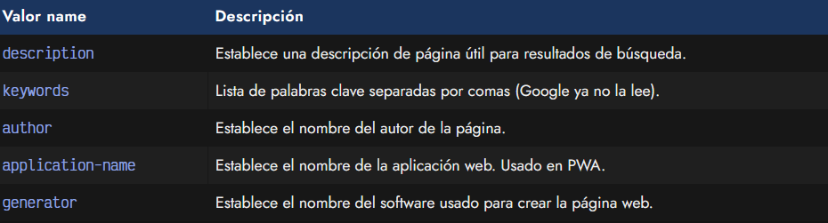
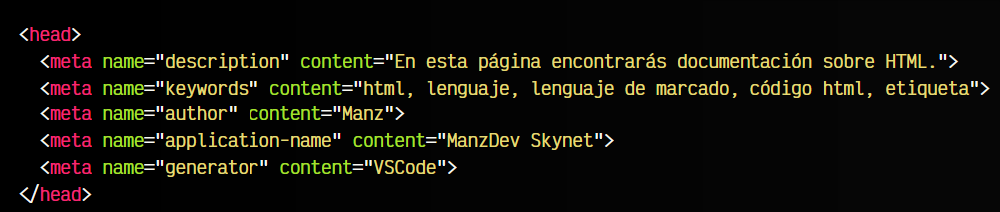
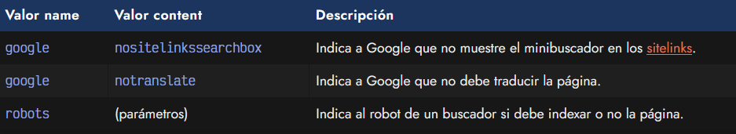
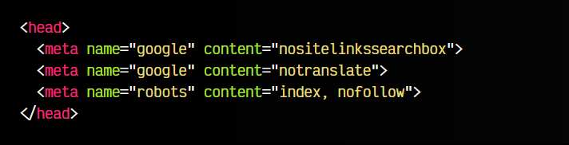
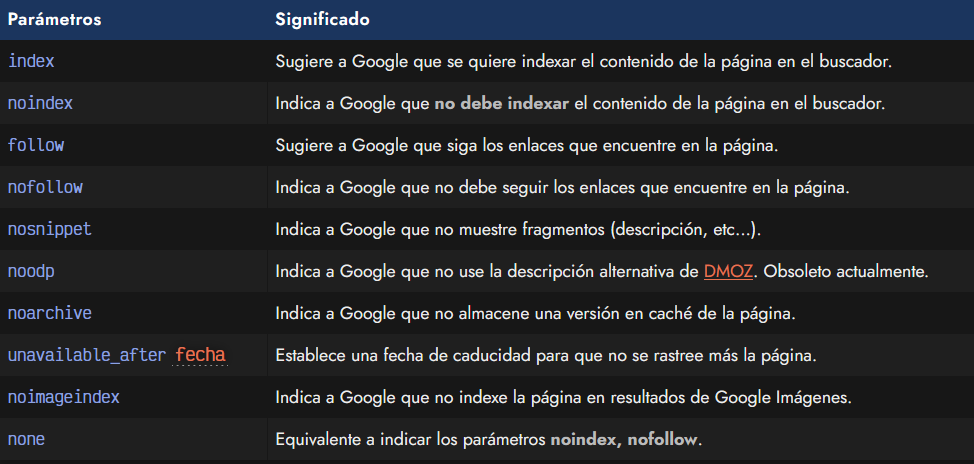

# 
Etiquetas para SEO/Google

Existen etiquetas < meta > donde a través de los atributos name y content se puede indicar ciertos metadatos que son muy útiles de cara al SEO. Si no las conoces, las siglas SEO significan Search Engine Optimization, es decir, optimización para motores de búsqueda, lo que hoy en día significa «Google».

## Metadatos para SEO.
Veamos algunos de los atributos más conocidos que podemos utilizar en etiquetas < meta >, relacionados con Google o con el posicionamiento o SEO:

La etiqueta < meta name="description" > sirve para indicar unas breves frases donde se explique el contenido de la página actual. Entre otras cosas, sirve para las descripciones que salen bajo los enlaces de los resultados de búsqueda en Google, cuando la página es indexada. En general, suele ser un texto entre 50-160 carácteres.

Por su parte, la etiqueta < meta name="keywords" > solicita una lista de palabras clave separadas por comas que tengan relación con el sitio web. Actualmente, Google no las considera (antiguamente, se abusaba de ellas para hacer spam), sin embargo, otros buscadores o sistemas sí que podrían leerla.

Veamos ahora un ejemplo con dichas etiquetas aplicadas:

Otras etiquetas meta como author, application-name o generator se utilizan para aportar información que podría ser de utilidad para definir datos del desarrollo.

## Metadatos de indexación en Google.
Algunas de las etiquetas < meta > son bien conocidas como etiquetas que pueden aportar información útil para el SEO de nuestra página en buscadores como Google. Al margen de etiquetas como < meta name="description" > o < title >, que son las principales en temas de SEO, Google recomeinda una serie de etiquetas < meta > para indicarle como realizar la indexación de nuestro sitio:

Un pequeño ejemplo de esta etiqueta con los citados atributos:

## La etiqueta <meta> robots.
Observa que la etiqueta < meta name="robots" > establecida en el ejemplo anterior, puede tener varios parámetros (separados por comas) para indicarle a Google diferentes detalles. Veamos que valores podemos establecer:

De esta lista, el desarrollador puede elegir los valores correspondientes que más le interesen e indicarlos mediante la etiqueta < meta name="robots" >. Mucho cuidado con indicar valores que tengan significados opuestos.