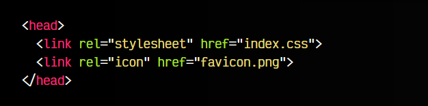
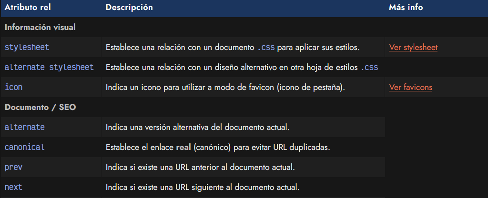
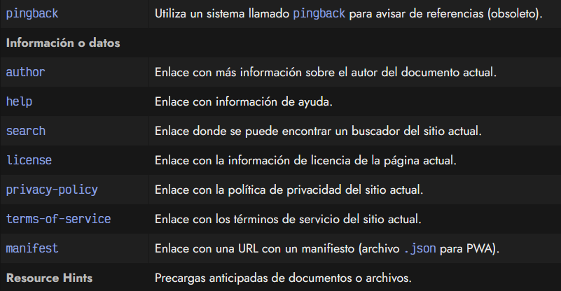
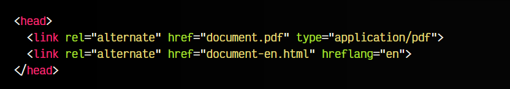
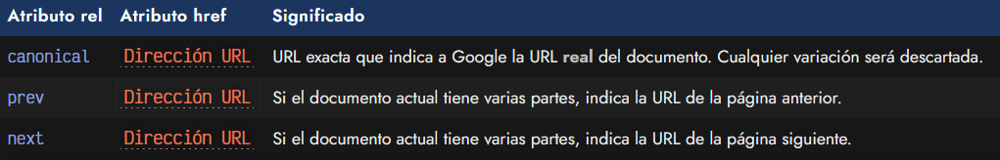
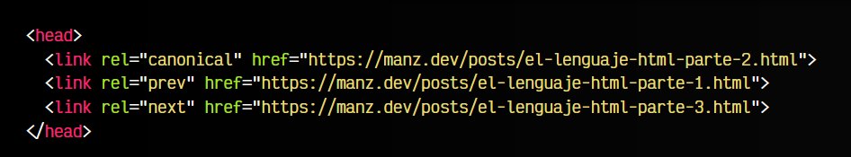
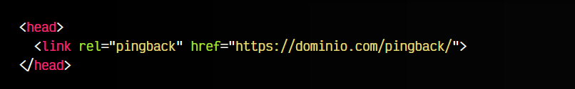
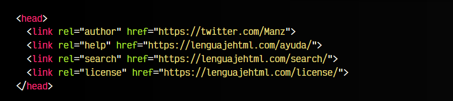
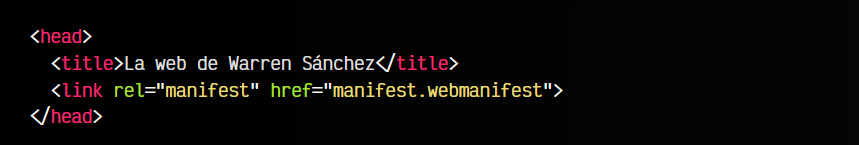
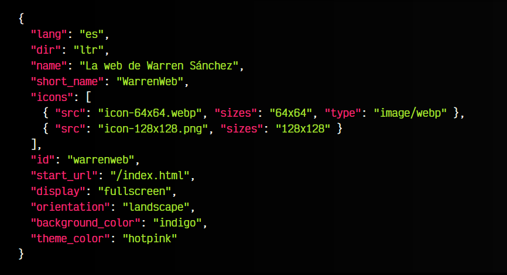

# 
La etiqueta HTML < link >

Uno de los pilares de un documento HTML es poder establecer una relación con otros documentos. Si ya sabemos algo de HTML y pensamos de esa forma, lo más común es que nos venga a la cabeza los enlaces < a >, es decir, las etiquetas que nos permiten que el usuario haga clic y acceda a otra página diferente. Si no las conoces, no te preocupes, las veremos más adelante.

Sin embargo, antes de profundizar en los enlaces, existen otras formas de establecer relaciones entre documentos, como por ejemplo, cuando relacionamos un documento HTML con un archivo .css para que aplique los estilos CSS en nuestro documento. Este tipo de relaciones se hacen con la etiqueta < link >.

## Relación: La etiqueta < link >.
La etiqueta < link > sirve para establecer relaciones con otros documentos, enlaces o archivos. De esta forma, el navegador o cualquier sistema capaz de leer código HTML puede saber que un documento está relacionado con otro (independientemente del formato que tenga) y así pueden establecerse ciertas relaciones.

Veamos un fragmento de código con algún ejemplo:

Como se puede ver, el atributo rel generalmente establece el tipo de relación que estamos determinando. Por otro lado, mediante el atributo href establecemos la dirección del documento en cuestión relacionado.

Existen muchos tipos de relaciones, veamos las más conocidas:

Ver [etiquetas de precarga](https://lenguajehtml.com/html/cabecera/etiquetas-precarga-html/)

Vamos a profundizar en ellas para aprender un poco más.

## Versiones alternativas.
Con la etiqueta < link rel="alternate" > podemos indicar que el documento actual tiene versiones alternativas en otros formatos o idiomas. El siguiente ejemplo se indica que el documento HTML que estamos leyendo tiene una versión en PDF, y además, una versión HTML en inglés:

Observa que en la primera etiqueta, indicamos el atributo type="application/pdf", donde el valor application/pdf es el denominado [MIME](https://es.wikipedia.org/wiki/Multipurpose_Internet_Mail_Extensions) para identificar los archivos PDF. Un valor MIME es simplemente una cadena de texto que identifica un tipo de formato de fichero.

Por otro lado, en la segunda etiqueta, indicamos el atributo hreflang, mediante el cuál indicamos el idioma en el que se encuentra el documento referenciado por el atributo href. En este caso, indicamos el valor en, que se refiere a que se encuentra en idioma inglés.

## Posicionamiento SEO (Google).
La etiqueta < link > también nos permite indicar algunos datos interesantes de cara al buscador para evitar ser marcado como contenido duplicado. De esta forma le indicamos al buscador exactamente las URLs que debe tener en cuenta, algo muy interesante de cara al posicionamiento SEO en buscadores.

Para ello, podemos utilizar los siguientes atributos:

Veamos esto en un ejemplo de código. Imaginemos que estamos en la página https://manz.dev/posts/el-lenguaje-html-parte-2.html. De trata de un artículo en 3 partes y nos encontramos en la parte 2. El fragmento de código en cuestión sería el siguiente:

Mientras que las etiquetas con rel prev y next indican el enlace a dichas partes, la etiqueta < link rel="canonical" > establece la URL canónica, es decir, aunque tuvieramos varias formas de acceder a esta página (y las 3 carguen la página correctamente):

   - https://manz.dev/posts/el-lenguaje-html-parte-2.html
   - https://manz.dev/posts/el-lenguaje-html-parte-2/
   - https://manz.dev/posts/el-lenguaje-html-parte-2

En la etiqueta anterior hemos definido que la URL canónica es la que termina en .html, por lo que Google entenderá que las demás son formas alternativas pero que debe utilizar la primera.

## Referencias mediante pingback.
Aunque no es muy utilizado hoy en día debido a que fue un sistema altamente sensible al spam, los pingbacks son un mecanismo mediante el cuál, cuando un usuario escribe un artículo en una web y menciona o hace referencia a otro documento, puede «avisar a su autor» de que ha hecho mención de su artículo.

En nuestro documento HTML existiría algo así:

Esto significa que en la URL https://dominio.com/pingback/ existe un servidor de pingbacks que van a estar continuamente leyendo las peticiones, para que, si se realiza alguna, se lea la información asociada y se registre que alguien ha hecho una mención del artículo. Sistemas como Wordpress u otros CMS famosos, tienen plugins o sistemas para soportarlo.

## Información adicional o datos.
Existen varios tipos de etiquetas < link > donde podemos hacer referencia a información o datos relevantes sobre nuestro documento. Mediante el atributo rel podemos indicar valores como author, help, search o license para indicar información que puede ser útil para el navegador, buscador o usuario.

A continuación indicamos una referencia al autor del documento, a la zona de ayuda, la zona de búsqueda y la licencia que cubre el contenido de la página:

Observa que en cada uno de los casos hemos hecho referencia a detalles e información relacionada:

   - URL del autor de la página
   - URL de ayuda o más información
   - URL donde puedes encontrar un buscador de la página
   - URL donde puedes encontrar la licencia de los contenidos de la página

## Manifiesto de aplicación.
En algunos casos, también podemos encontrar lo que se denomina un manifiesto de aplicación. Suele ser más frecuente encontrarlo en aplicaciones web que en páginas web, pero no es más que una etiqueta que hace referencia a un archivo .json donde se encuentran varios datos sobre la página.

Para indicarlos, sólo se tiene que hacer referencia a la etiqueta < link rel="manifest" >:

En el documento manifest.webmanifest referenciado, que no es más que un archivo JSON, podemos encontrar algunos de los datos de nuestra aplicación web:

JSON:

No obstante, insistir en que los manifiestos suelen ser elementos incluidos en una aplicación web, en lugar de incluirlo en un documento de una página web.