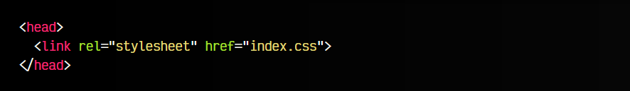
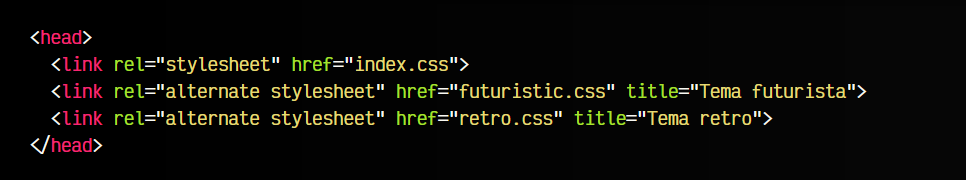
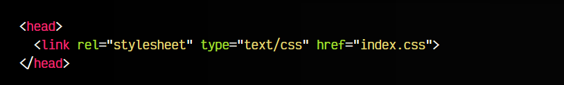

# 
Stylesheet: Hojas de estilo externas

Probablemente, todo el que conozca la etiqueta HTML < link >, probablemente conocerá su uso más extendido: el de utilizarla para incluir una hoja de estilos CSS, es decir, relacionar un documento HTML con un documento CSS.

## La etiqueta < link rel="stylesheet" >.

Esta forma de incluir código CSS es la forma preferida en la mayoría de los escenarios, ya que se indica al navegador que se debe importar un fichero .css externo, referenciado en el atributo href de la etiqueta HTML < link rel="stylesheet" >.

Veamos un ejemplo:

En el atributo rel de la etiqueta < link > se indica que se trata de una relación de tipo stylesheet, es decir, que cargue una hoja de estilo CSS. La ruta indica donde se encuentra el fichero CSS, que si no tiene ruta absoluta, la buscará en el mismo lugar donde se encuentra el documento HTML.

También es posible incluir múltiples hojas de estilo en etiquetas < link > diferentes. En general, lo habitual es subir todo tu código .css en un sólo archivo, pero es posible añadir varias etiquetas < link > y añadir otras hojas de estilos de CSS de frameworks o librerías de terceros.

Utilizar < link rel="stylesheet" > es muy útil, ya que al tener el código CSS en un fichero externo, es fácil de reutilizarlo para otros documentos HTML, sin necesidad de repetir código. Es más sencillo de modificar y que los cambios afecten a todas las páginas. Eso sí, hay que ser organizado.

## La etiqueta < link rel="alternate stylesheet" >.

Existe una característica, que aunque es muy antigua no ha llegado aún a los navegadores de forma general, llamada alternate stylesheet. Con esta característica, podemos indicar hojas de estilo alternativas, donde el propio usuario, a través de su navegador, pueda seleccionar la hoja de estilo deseada, y ver la página con un estilo diferente dependiendo de la selección.

En este ejemplo, tenemos definida una hoja de estilo principal (index.css), y dos hojas de estilo alternativas (futuristic.css y retro.css). Además, en el atributo title definimos el nombre del tema alternativo.

## Legacy: Atributo type="text/css".
En algunos casos, es posible que leamos código que utiliza un atributo type="text/css". Este atributo era obligatorio en versiones antiguas de HTML:

En la actualidad se puede omitir, ya que la etiqueta < link rel="stylesheet" > ya son de tipo text/css por defecto.

