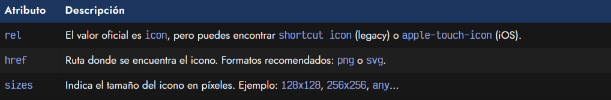
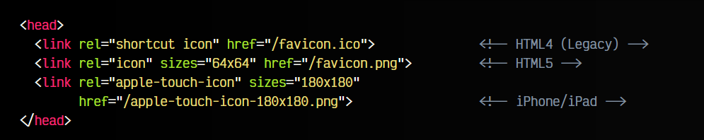

# 
Favicon: El icono de las pestañas

Cuando tenemos varias pestañas en nuestro navegador, para una búsqueda más fácil e intuitiva entre pestañas, el navegador suele colocarnos unos iconos a la izquierda del título de las pestañas.

Estos iconos son conocidos como favicons (favorite icon) ya que originalmente fue un invento de Internet Explorer para colocar un icono cuando el usuario añadía una página a favoritos. Actualmente se utiliza para identificar rápidamente las pestañas de un navegador.

## La etiqueta < link rel="icon" >.
Esta característica está definida pero algunos navegadores (o sistemas) la implementan a su propia manera, por lo que puede resultar complejo conseguir compatibilidad completa en los múltiples dispositivos que existen.

En principio, la etiqueta < link > debería definirse con los siguientes atributos:

En general, la etiqueta recomendada es < link rel="icon" >, ya que es la más genérica. Sin embargo, es posible que encontremos < link rel="shortcut icon" >, una etiqueta que se utiliza en tiempos de HTML4 y que no debería definirse ya, o < link rel="apple-touch-icon" > que suele utilizarse para el formato de iconos que se utiliza en dispositivos de Apple como iPhone o iPad.

Aunque es posible que algunos navegadores soporten más formatos, los que suelen tener un soporte muy extendido son los .png y los .svg.

Veamos un fragmento de código con varios ejemplos:

Además, observa que es posible indicar un atributo sizes donde colocar las dimensiones del icono en píxels, pudiendo así incluir varias etiquetas < link > con diferentes resoluciones. En el caso de utilizar el formato .svg, que es escalable, puedes utilizar any como valor en sizes.

Por estas y otras razones, la generación de código para un favicon es una tarea tediosa. Si quieres generar los favicon de una forma más cómoda, aconsejo usar la herramienta [Real Favicon Generator](https://realfavicongenerator.net/).

A esta herramienta le pasamos un logo a alta resolución, y ella nos generará un fichero .zip con el código HTML y diferentes versiones de nuestro logo. De esta forma solo tendremos que revisar el código y adaptarlo un poco para tenerlo a nuestro gusto.