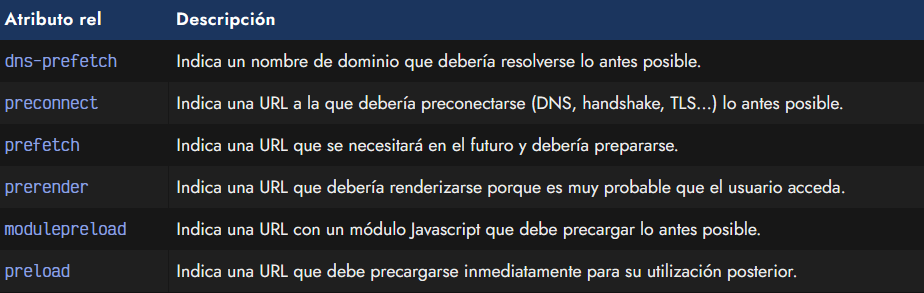
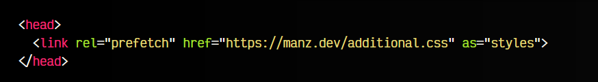
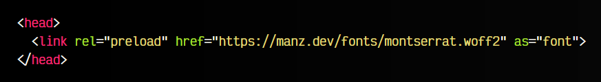
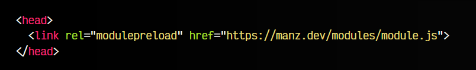
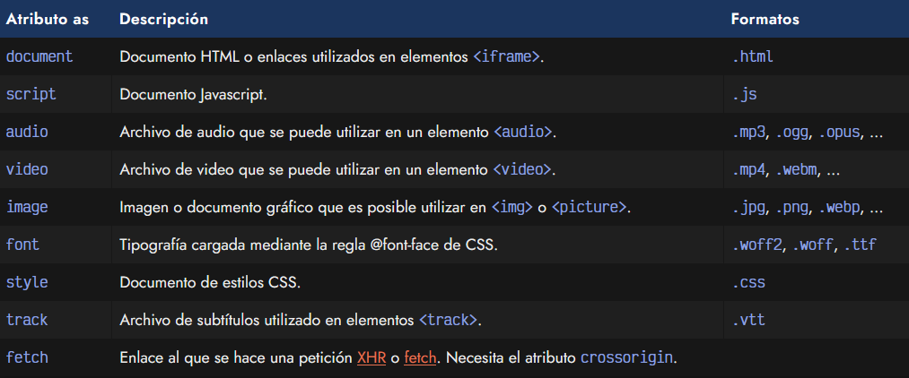

# 
Etiquetas HTML de precarga

Las etiquetas HTML de precarga (resource hints) son una serie de etiquetas < link > que permiten dar al navegador algo de información adicional para saber a que recursos debe darles mayor prioridad, cargar de forma anticipada, posponer o incluso prerenderizar.

Por norma general, el navegador establece una prioridad concreta a cada recurso de una web, ya sea al propio fichero .html inicial, a los archivos .css o .js relacionados con el documento HTML, a las imágenes, tipografías, etc. Esta prioridad depende de una gran variedad de factores y casuísticas complejas, pero se dividen en las siguientes:

   - HIGHEST (Altísima prioridad)
   - HIGH
   - MEDIUM
   - LOW
   - LOWEST (bajísima prioridad)

## Etiquetas de precarga.
Estos valores se pueden modificar de muchas formas, pero uno de los métodos para modificarlos es utilizar las etiquetas < link > que comentaremos a continuación.

Veamos como funciona cada uno de ellos en las siguientes secciones.

Recuerda que la optimización es un proceso delicado y complejo. No se trata de añadir una etiqueta de precarga por cada fichero, sino elegir cuales son los que producen cuellos de botella y anticiparlos. Añadir muchas etiquetas de precarga produciría justo el efecto contrario: relentizar la carga.

## Por dominio.
En primer lugar, veamos las etiquetas que podemos utilizar para precargar los dominios de una URL y conseguir reducir el tiempo de carga del navegador.

## Precarga de resolución DNS.
Antes de cargar un enlace con un recurso, ya sea una imagen, un fichero css, html o de cualquier otro tipo, el navegador debe resolver las DNS. Básicamente es un proceso que debe hacer al principio de cada recurso que esté alojado en un dominio desconocido, para conocer la IP que está detrás de ese dominio y por lo tanto poderse comunicar de forma más rápida y efectiva.

En muchas ocasiones, esta carga del dominio DNS se realiza muy tarde y se puede perder algún tiempo precioso en ello. Con esta etiqueta, podremos aprovechar «tiempos muertos» iniciales en realizar esa tarea, de modo que cuando descubra esos recursos ya pueda acceder a ellos sin perder el tiempo en resolver el DNS. Es decir, anticipamos esa tarea de resolver DNS.

El código a incluir sería el siguiente:

Como se puede ver, en este caso estamos indicando que resuelva las DNS de la página https://fonts.google.com, donde en muchas ocasiones se enlazan tipografías desde nuestro sitio. Ten muy en cuenta que en muchos casos, dentro de estas páginas, se cargan más recursos con nuevos dominios o CDN diferentes que también habría que incluir para que sea 100% efectiva esta tarea.

## Preconexión a un dominio.
Cada vez que el navegador tiene que realizar la carga de un recurso, por cada dominio debe realizar varias tareas:

   - Búsqueda y resolución de DNS
   - Negociación TCP (Handshake)
   - Negociación TLS (Opcional)

Estas tareas se pueden realizar de forma anticipada para ganar algún tiempo y aprovecharlo en otras tareas.

Observa que mientras que la etiqueta anterior sólo realiza el proceso de resolución DNS, esta etiqueta incorpora más etapas, realizando una preconexión al dominio en cuestión.

# Por URL.
A continuación, veamos algunos ejemplos de etiquetas diseñadas para optimizar la carga de URL o direcciones web específicas.

## Prerender.
En algunas situaciones, el usuario se encuentra navegando por una página donde, posteriormente, tiene un enlace para acceder a una página donde la probabilidad de acceder es bastante alta. Ejemplos de este caso suelen ser landing page o páginas similares, donde la intención directa es enviar al usuario a una sección específica.

Con la siguiente etiqueta podemos indicar al navegador que esa probabilidad es tan alta, que queremos que la página se vaya no sólo precargando sino prerenderizando de forma transparente en el navegador. Esto hará que cuando el usuario haga click en el enlace, la página esté instantáneamente precargada y predibujada en el navegador.

Ten en cuenta que esta etiqueta debe usarse sólo en casos muy específicos donde el usuario es muy probable que acceda, ya que el navegador va a precargar todo su contenido y dibujarlo en el navegador, por lo que si finalmente no entra, habrá desperdiciado tiempo y recursos.

# Por recurso.

Por último, observa algunas de las etiquetas diseñadas para optimizar la precarga o descarga de ciertos archivos o recursos.

## Espera de recurso.
La etiqueta < link rel="expect" > se puede utilizar para bloquear el renderizado (dibujado en el navegador) de una página hasta que el elemento indicado en el atributo href esté completamente descargado, parseado y conectado a nuestro documento.

Esto puede ser bastante útil en situaciones donde necesitamos que estén listos ciertos recursos antes de renderizar la página, como un componente o un script específico, evitando que se nos de un error o problema en caso contrario.

Este mecanismo es mucho más interesante en comparación a esperar que cargue toda la página.

## Descarga anticipada.
Mediante la etiqueta < link rel="prefetch" > podemos indicar al navegador que queremos que un recurso de la página se proponga para ser descargado desde que el navegador tenga tiempo libre en su proceso de carga inicial.

Observa que es necesario indicar en el atributo as la naturaleza del recurso especificado, ya que de lo contrario el navegador no tiene forma de saber de que tipo de recursos se trata (y muchas veces no se debe confiar en la extensión del fichero). En tipos de recursos puedes ver más información de los valores a utilizar.

Mucho cuidado con confundir prefetch con preload, que aunque tienen un objetivo parecido, hay ciertos matices que los diferencian.

## Precarga de archivo.
Si lo que necesitamos es realizar la precarga de un archivo por anticipado, la etiqueta < link rel="preload" > es la opción correcta. Esta etiqueta permite precargar recursos inmediatamente, con altísima prioridad. Suele ser una buena práctica para tipografías que utilizas en el primer impacto visual de la página o de imágenes que tienes de cabecera o que producen un parpadeo a la hora de cargarlas.

Observa que esta etiqueta requiere el uso del atributo as, donde deberás indicar el tipo de recurso.

## Precarga de módulo.
Aunque la etiqueta anterior puede utilizarse para precargar archivos javascript .js, existe una especialización de esta etiqueta denominada < link rel="modulepreload" >. Funciona exactamente igual a la etiqueta anterior, sin embargo tiene una pequeña diferencia: además de precargar el recurso, lo añade a la lista de módulos por cargar del navegador, y revisa las dependencias que tiene para precargarlas también, lo que lo hace muy adecuado para módulos Javascript.

En este caso, el atributo as tiene por defecto el valor script, por lo que se puede omitir.

## Tipos de recursos.
En algunas de las etiquetas anteriores habrás comprobado que existe un atributo as donde hay que indicar el tipo de fichero a referenciar. A continuación muestro una tabla con los valores posibles a indicar en este campo:

Recuerda indicar el valor apropiado en el atributo as, ya que de lo contrario no se sabrá de forma anticipada que tipo de recurso es, y no podrá precargarse el recurso indicado correctamente.
