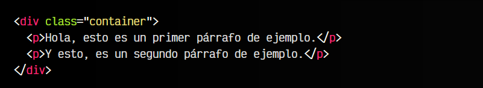
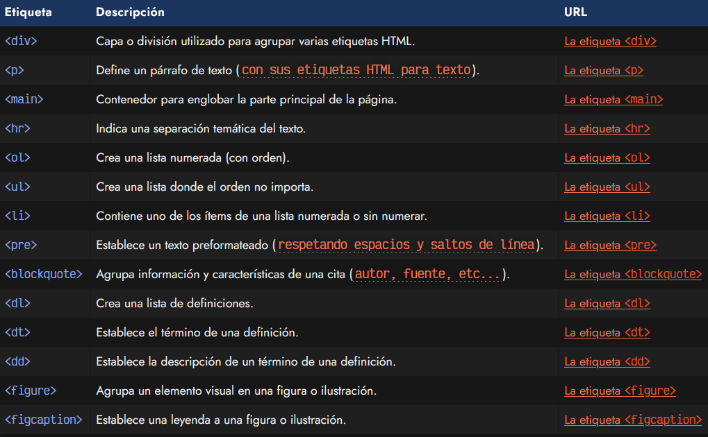
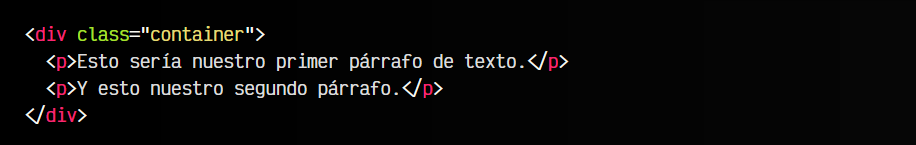
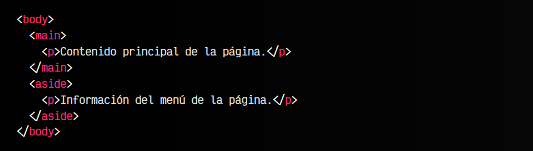
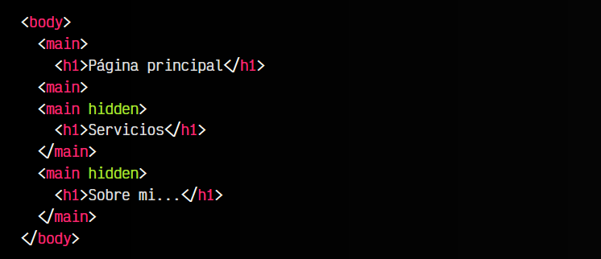
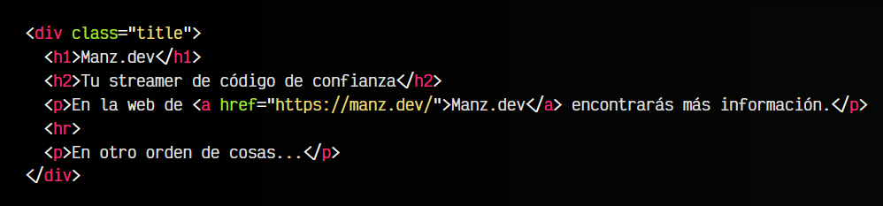

# Las etiquetas de agrupación.

Existen muchas etiquetas HTML dentro del lenguaje HTML5. Las etiquetas existentes se pueden desglosar en dos grupos principales:

   - Las etiquetas que contienen fragmentos de texto (dan significado o contexto a esos fragmentos)
   - Las etiquetas que agrupan otras etiquetas (contienen y agrupan información variada)

En esta ocasión, vamos a centrarnos en el segundo grupo, que son las etiquetas que se utilizan para agrupar y asociar información relacionada. Más adelante, profundizaremos en el resto de etiquetas.

Veamos un pequeño ejemplo de lo que es una etiqueta contenedora:

La etiqueta < div class="container" > es lo que se llama un contenedor, es decir, una etiqueta que contiene un grupo de etiquetas relacionadas de alguna forma. Aunque no tiene que tener una clase de forma obligatoria, a las etiquetas < div > se les suele añadir una clase por varios motivos:

   - Identificarla como una sección específica
   - Para darle estilo visual (CSS)
   - Para darle funcionalidad (Javascript)

En muchos casos, una buena práctica de nombrado es añadirle el sufijo -container a la clase, de modo que si tenemos una clase text, el < div > que la contiene se llamará text-container.

## Etiquetas HTML de agrupación.
Las siguientes etiquetas se utilizan para agrupar información, como es el caso de las etiquetas < div > o < p > que vimos en el ejemplo mostrado anteriormente:

Estas son algunas de las etiquetas HTML utilizadas para agrupar contenido con cierta relación. En cada página específica las explicamos, así como algunas de ellas a continuación.

## Párrafo de texto 
.
La etiqueta HTML 
 se utiliza para agrupar párrafos de texto. Es una etiqueta muy sencilla mediante la cuál puedes agrupar y separar los diferentes párrafos de un texto:

En principio, la etiqueta 
 se abre al empezar el párrafo en cuestión, y se cierra cuando acaba. Sin embargo, en algunas situaciones especiales puede no ser absolutamente necesario cerrarlo, como por ejemplo cuando es inmediamente seguido de un elemento contenedor como < div >, < header >, < footer >, < ol >, < ul > o tantos otros. Sin embargo, considero una buena práctica abrir y cerrar los párrafos para tener un estilo de código más coherente y fácil de mantener.

## Contenido principal <main> 
.
La etiqueta HTML < main > es una etiqueta que nos permite agrupar todo el contenido principal de una página. En principio, un documento HTML sólo debería tener una etiqueta < main >.

Sin embargo, hay situaciones donde pueden existir varios elementos < main >. Dichas situaciones implican que todas las etiquetas < main > del documento tengan definido el atributo hidden (se ocultarán visualmente), menos una de ellas, que es la que se considerará activa:

En este caso, sería correcto definir múltiples etiquetas < main > en un mismo documento.

## Separación temática < hr ><main> 
.
Por último, la etiqueta < hr > se utiliza para establecer una separación temática. Antes de continuar hay que hacer un alto aquí. En muchas ocasiones habrás leído (u observado) que realmente lo que hace la etiqueta < hr > es colocar una línea horizontal. Aunque pueda parecerlo, no es correcto afirmar esto.

El objetivo de la etiqueta < hr > es establecer una separación entre los contenidos que se encuentran antes de esta etiqueta y después, por lo que semánticamente sería más adecuado hablar de separación temática, en lugar de línea horizontal. Ten en cuenta que mediante CSS podemos cambiar el aspecto visual, para que no sea una línea sino un rectánngulo, un círculo, imágenes o eliminar completamente el aspecto visual, sin embargo, en todos estos casos, la separación temática seguirá existiendo.

Observa que la etiqueta < hr >, junto a otras como < br > o < img > son etiquetas que no tienen etiqueta de cierre, es decir, no hay que escribir un </>, ni un < /br >, ni un < /img >. En algunos casos nos las encontraremos como < hr / >, sin embargo, en HTML5 es correcto establecer solamente la etiqueta de apertura.

