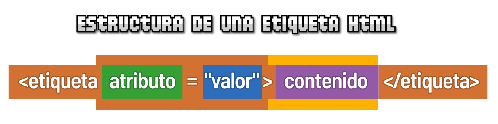

# 
Estructura de etiqueta HTML

Como habíamos mencionado, las páginas webs son realmente documentos de texto que contienen información y muchas etiquetas HTML que indican que tipo de contenido se va a mostrar en el navegador al cargar la página web.

La estructura de las etiquetas HTML tiene el siguiente formato:

Analicemos bien la estructura de una etiqueta HTML.

## Etiqueta HTML.
La parte esencial de una etiqueta HTML es lo que se denomina la etiqueta de apertura. Se trata de escribir el nombre de la etiqueta en cuestión, colocándola entre los carácteres < y >. Aunque el navegador lo permita si no es así, las etiquetas HTML se deberían escribir siempre en minúsculas.

En HTML5 no se puede colocar cualquier palabra como etiqueta, sino que existen una serie específica de etiquetas, cada una con una misión y objetivo diferente. Por ejemplo, la etiqueta <strong:

Como se puede ver, la mayoría de las etiquetas requieren que se especifique un cierre de etiqueta para saber donde termina de actuar. Se caracteriza en que se escribe igual que la etiqueta de apertura, pero con la barra / inmediatamente después del <.

## Atributos HTML.
En algunas etiquetas HTML, existen algunos atributos específicos (que pueden ser opcionales u obligatorios). Los atributos determinan cierta información sobre la etiqueta (o su modo de actuar) y generalmente van asociados a un valor determinado. Este par atributo-valor se escribe después del nombre de la etiqueta, separándola por espacio y antes del carácter > de la etiqueta de apertura:

En este caso, la etiqueta sería strong, el atributo id, el valor de id sería dato, mientras que el contenido de la etiqueta es Contenido. Por otro lado, y al igual que las etiquetas, cada atributo tiene una misión y comportamiento concreto. Aunque los valores pueden ir rodeados por comillas simples, se recomienda escribir el valor siempre entre comillas dobles.

Existen 3 tipos de atributos dependiendo de sus valores:

   - Conjunto de valores: Son aquellos atributos en los que sólo se permiten unos valores concretos. Cualquier otro valor diferente, no será válido.

   - Valores libres: Son los atributos en los que puedes especificar un valor libremente, como una dirección URL o un texto, y no existe una serie de valores específicos para escribir.

   - Valores booleanos: Son los atributos que deben tener un valor verdadero (true) o un valor falso (false). En HTML5 un atributo sin valor (solo el atributo) significa verdadero y si se omite el atributo se considera falso.

## Contenido de la etiqueta.
En el interior de la etiqueta HTML (después de la etiqueta de apertura y antes de la etiqueta de cierre) se debe colocar la información que queremos que sea afectada por dicha etiqueta. En el siguiente ejemplo se ve como contiene un fragmento de texto:

Ten en cuenta que una etiqueta puede tener varios pares atributo-valor, como se ve en el ejemplo anterior, pero nunca se debe repetir el mismo atributo en una misma etiqueta varias veces, ya que sobreescribiría al anterior. El orden de los atributos no importa. Más adelante explicaremos que tipos de atributos existen y para que sirven.

Sin embargo, una etiqueta puede contener desde un fragmento de texto hasta un grupo de etiquetas. Esto depende mucho de la etiqueta a utilizar, y se verá más adelante en el apartado de etiquetas. Un posible ejemplo sería el siguiente:

Nótese que dentro de la etiqueta "div" vemos que no sólo hay un fragmento de texto, sino que además incluye otra etiqueta, "strong" en este caso. Esto ocurre en las etiquetas de agrupación, que veremos más adelante.

## Comentario HTML.
Los comentarios son una práctica muy común y habitual en los desarrolladores o programadores. Se basa en introducir breves fragmentos de texto que el navegador ignora y no tendrá en cuenta a la hora de crear la página visualmente, pero que a nosotros nos sirven de ayuda para documentar algún detalle, explicar algo importante o simplemente introducir algún texto que consideramos relevante:

Como se puede ver, para introducir estos comentarios en el código HTML, basta con escribir los fragmentos de texto <!-- y --> entre el comentario en cuestión que queramos incluir.

