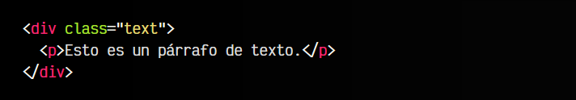
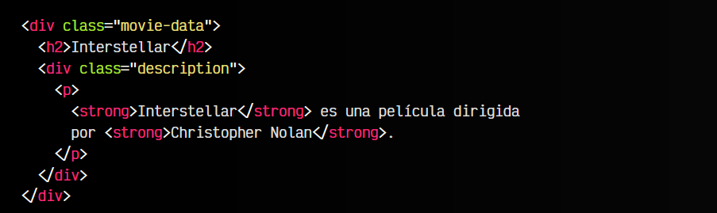
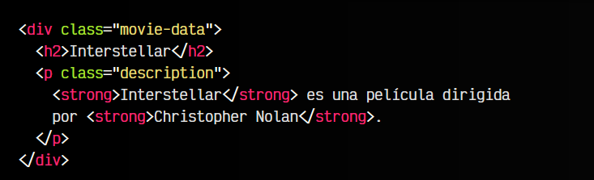
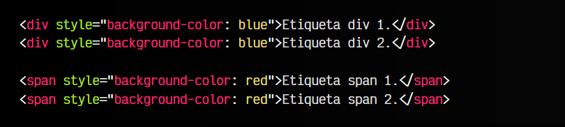
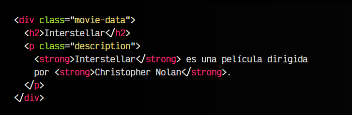
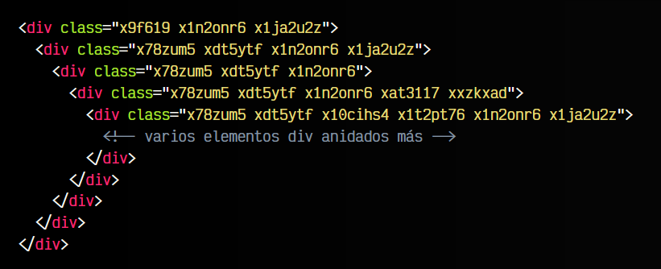

# La etiqueta HTML < div >.

Dentro de las etiquetas HTML existentes, quizás una de las más conocidas es la etiqueta < div >. Sin embargo, es una de las etiquetas menos especiales que existen, es más, es de las más genéricas, y ese es precisamente su característica estrella.

## Capas o divisores < div >.
La etiqueta < div > es una etiqueta muy simple que se suele utilizar para crear una agrupación de una o varias etiquetas y organizarlas en una división específica. De forma opcional, se le puede poner un atributo id o clase para referenciarla más facilmente:

De la misma forma, la etiqueta < div > se puede usar para agrupar elementos dentro de otros, y así crear nuevas agrupaciones. Se trata de un elemento que no tiene ningún significado especial más allá de ello. Lo ideal es mantener una cierta lógica a la hora de agrupar y no crear grupos adicionales que sean redundantes:

En este caso, utilizamos un elemento < div class="movie-data" > para agrupar toda la información relacionada con la película. En su interior, tenemos otro elemento < div class="description" > para agrupar la descripción de la película. Sin embargo, si nos fijamos detenidamente, en el interior de este último < div > solo hay un párrafo < p >, por lo que en este caso, quizás lo ideal sería pasar la clase al párrafo y no utilizar ese < div > adicional, ya que no es necesario:

Sin embargo, si nos planteamos la posibilidad de añadir más elementos a la descripción que no van a estar dentro del párrafo < p >, si sería necesario ese < div > de agrupación.

## Representación visual.
Aunque visualmente, los elementos < div > no tienen ningún aspecto por defecto, esto no es del todo cierto. Por defecto, una etiqueta HTML < div > se conoce como un elemento en bloque, lo que tiene ciertas implicaciones visuales.

En HTML existen algunas otras etiquetas diferentes para realizar agrupaciones. Por ejemplo, la etiqueta < span > tiene un objetivo muy similar al que tiene la etiqueta < div >. Sin embargo, todas las etiquetas tienen una representación visual específica, y en el caso de < div > y < span > tienen una diferencia que se observa muy bien si colocamos dos etiquetas de cada tipo una al lado de la otra:

Hay algunos detalles que no se consideran una buena práctica en este ejemplo, pero vamos a obviarlos ya que la finalidad es entender el ejemplo que se va a explicar. Observa que hemos utilizado el atributo style para darle color de fondo. Comprobarás que las etiquetas < div > se comportan de forma diferente a las etiquetas < span >.

Mientras que las etiquetas < div > se han colocado una debajo de la otra, las etiquetas < span > se han colocado una a continuación de la otra. Esto ocurre porque todas las etiquetas HTML tienen un tipo de representación visual y la de las etiquetas < div > es block, mientras que la de las etiquetas < span > es inline.

Puedes aprender más sobre esta diferencia, leyendo sobre la propiedad display de CSS:

► Aprender más sobre [la propiedad CSS display](https://lenguajecss.com/css/maquetacion-y-colocacion/propiedad-display/)

## Ubicación del elemento.
Ten presente que en HTML, las etiquetas no se pueden colocar libremente en cualquier lugar. Dependiendo de la etiqueta que estemos utilizando, será posible colocarla en un determinado sitio o no. Esto depende principalmente de la etiqueta sea en cuestión y de la etiqueta padre.

Por ejemplo, en el caso de una etiqueta < div >, por defecto, se trata de un elemento en bloque. Un elemento en bloque se utiliza para agrupar otros elementos menores, por lo tanto, lo podemos utilizar para esta propósito. Sin embargo, existen otras etiquetas que son elementos en línea. Esta otra categoría se utiliza para dar formato o agrupar fragmentos de texto que pertenecen a una agrupación en bloque.

En este caso, por ejemplo, < strong > es un elemento en linea, mientras que < div class="movie-data" > es un elemento en bloque. Es correcto utilizar un < div > para agrupar todo su contenido interior, incluyendo elementos en bloque como < h2 > y elementos en línea como < strong >. Sin embargo, sería incorrecto que dentro de un elemento en línea como < strong > escribieramos un elemento en bloque < div >.

La página Can I Include nos permite comprobar si una etiqueta se puede escribir dentro de otra de forma sencilla y ver información sobre esa relación.

## Excesivas etiquetas anidadas.
Cuando estamos desarrollando aplicaciones web, muchas veces utilizamos frameworks o librerías Javascript, donde frecuentemente por la forma en la que trabajan y están diseñadas, anidan elementos HTML < div > uno dentro de otro, de forma excesiva. Aunque esto es muy habitual en las aplicaciones web, no lo es tanto en las páginas web, las cuales deben tener más relación con la semántica, el posicionamiento SEO, la accesibilidad o el diseño web, y en estos contextos se debe cuidar la forma de escribir el HTML.

El siguiente fragmento de código HTML está extraído de una página real de Instagram (creada con React):

En la medida de lo posible, intenta siempre evitar anidar elementos HTML uno dentro de otros si no es estrictamente necesario. Una gran cantidad de elementos adicionales que no son estrictamente obligatorios, proporcionarán múltiples desventajas:

   - El código HTML ocupará más tamaño
   - Al ser más grande, tardará más en descargarse (sobre todo en conexiones lentas)
   - El navegador tardará más tiempo en renderizar la página (dibujarla)
   - Hay más probabilidades de que sea menos accesible

Las aplicaciones web y las páginas web son tipos de webs diferentes. Las primeras están enfocadas en proporcionar un panel, dashboard o aplicación que el usuario utilizará, mientras que las segundas suelen estar más enfocadas en proporcionar contenido e información navegable para el usuario.

## Agrupaciones semánticas.
Las etiquetas < div > son excelentes herramientas para crear divisiones o separaciones de elementos y categorizarlos en nuestro HTML. Sin embargo, también son un peligro ya que muchas veces abusamos de estos elementos, aprovechando que no tienen significado.

Aunque probablemente aún no las conozcamos, existen una serie de etiquetas HTML semánticas que funcionan exactamente igual que un < div >. Sin embargo, ofrecen algo más de información, ya que no sólo son una etiqueta contenedora y agrupadora como < div >, sino que etiquetas como < header >, < footer > o < section > dan a entender la naturaleza del contenido van a agrupar.

Aún es muy pronto para utilizar estas etiquetas HTML semánticas especializadas, pero más adelante hablaremos de ellas y veremos que ventajas tienen y por qué deben ser utilizadas en lugar de etiquetas como < div > siempre que sea posible.

► Aprender más sobre [etiquetas semánticas](https://lenguajehtml.com/html/semantica/que-son/)

