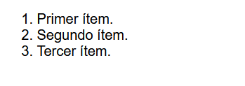

# Las etiquetas HTML < ul > y < ol >.

Si necesitamos crear una lista de elementos en HTML, debemos utilizar uno de los dos siguientes elementos contenedores: la etiqueta < ul > o la etiqueta < ol >. Además, independientemente de la etiqueta que utilices, en su interior, cada elemento utilizará la etiqueta < li >. Así pues, veamos un resumen con sus diferencias:

En primer lugar, debemos elegir la etiqueta HTML correcta para crear la lista. Antes de continuar, tenemos que preguntarnos si vamos a crear una lista donde importa el orden (lista con los pasos para hacer un postre), o por el contrario, una donde el orden no es importante (lista de objetos que tengo en una maleta).

## Lista no enumerada < ul >.
Empecemos con una lista donde no importa el orden. Las listas no enumeradas se crean mediante la etiqueta contenedora < ul > (unorderer list). Esta etiqueta contendrá una serie de elementos < li > donde cada uno de ellos contendrá la información de uno de los puntos de la lista:

Observa que este fragmento de código crearía una lista, donde en su interior se pueden añadir los ítems que aparecerían con un círculo o cuadrado de color negro. El aspecto visual no importa demasiado, ya que veremos más adelante que se puede modificar, o cambiará ligeramente dependiendo del sistema operativo que estemos utilizando.

## Elemento de la lista < li >.
Como habrás podido observar en el ejemplo anterior, la etiqueta < li > sirve para indicar los elementos internos de una lista HTML, ya sea no enumerada o lista enumerada (que veremos más adelante). Podemos añadir los ítems que deseemos:

html:

vista:

Simplemente abrimos la etiqueta, escribimos el contenido y la cerramos

## Omisión del cierre.
Una particularidad poco conocida de las listas HTML es que los elementos < li > pueden omitir sus etiquetas de cierre </> si van inmediatamente seguidas de determinadas etiquetas, como por ejemplo otra etiqueta de apertura < li >.

html:

vista:

Este fragmento de código sería equivalente al anterior. Aunque parezca incompleto, es correcto y los navegadores lo interpretarán sin problemas. No obstante, mi recomendación es que se cierren cada etiqueta HTML, de modo que el código sea más coherente y lógico, y por lo tanto, más fácil de mantener.

## Ponderar elementos.
En algunos casos en los que nos interese, se puede establecer una ponderación como metadato en los elementos de la lista mediante el atributo value. De esta forma, cada ítem de la lista tendrá asignado, por ejemplo, un valor numérico.

html:

vista:

Ten en cuenta que visiblemente esa cantidad no se verá reflejada a menos que se trate de una lista enumerada < ol >. En una lista < ul > se trata simplemente de metadatos que podríamos utilizar luego desde CSS o Javascript.

## Lista de menú < menu >.
La lista no enumerada < ul > y la lista de menú < menu >  son casi idénticas. Ambas se utilizan para elementos que no tienen un orden. La principal diferencia radica en que < ul > se utiliza para mostrar elementos sin un orden concreto, mientras que < menu > se utiliza para crear menús que contienen elementos interactivos que suelen formar parte de una barra de herramientas:

html:

css:

vista:

Obviamente, habría que implementar las funciones Javascript para que realicen la tarea, y/o dar estilo a los elementos para hacerlo visiblemente más similar a un menú.

## Lista enumerada < ol >.
Si en lugar de utilizar < ul >, utilizamos una etiqueta contentedora < ol > (orderer list) tendremos una lista enumerada, es decir, una lista donde el orden es importante. Cada elemento < li > de la etiqueta pasará a estar numerado, por lo que en lugar de encontrarnos puntos, pasaremos a observar que aparece un número (del 1 en adelante):

html:

vista:

Hasta aquí, todo es bastante sencillo. Sin embargo, las listas creadas con la etiqueta HTML < ol > tienen una serie de atributos HTML interesantes, que permiten cambiar como se interpreta y se muestra la lista por el navegador, y por lo tanto, como se muestra al usuario.

Los atributos que puedes utilizar con la etiqueta < ol > son los siguientes:

Veamos cada uno de estos atributos con algunos ejemplos.

## Número del primer ítem.
Por defecto, las listas comiezan empezando a contar desde el 1. Mediante el atributo start se puede indicar el número con el que vas a empezar la lista. En este ejemplo que verás a continuación, indicamos que se empiece desde el 5, en lugar del 1:

html:

vista:

Por lo tanto, nuestra lista tendría los elementos 5, 6 y 7. Esto puede resultar interesante si queremos hacer un alto en una lista, añadir algun fragmento de código HTML, y luego continuar la lista por donde nos encontrabamos.

## Tipo de numeración.
Mediante el atributo type podemos cambiar el sistema de numeración e indicar otro diferente. Por defecto, las listas numeradas se muestran con números decimales. Sin embargo, de forma alternativa podemos establecer otros valores con el atributo type, como por ejemplo i, que lo establece con números romanos (minúsculas):

html:

vista:

Los valores que podemos indicar en el atributo type son los siguientes:

   - 1: Usa números decimales (valor por defecto): 1, 2, 3, 4, 5...
   - a / A: Letras minúsculas o mayúsculas: a, b, c, d... ó A, B, C, D...
   - i / I: Números romanos en minúsculas o mayúsculas: i, ii, iii, iv, v... ó I, II, III, IV, V...

Observa que además, en el elemento < ol > hemos indicado el atributo start. Con esto, empezaremos a contar en el 5, pero como además tenemos establecido el atributo type a números romanos, pues empezará a contar con v, luego vi y luego vii.

## Invertir orden.
Por último, tenemos otro atributo interesante que es el reversed. Como te habrás podido imaginar, es un atributo booleano (no requiere valor), que permite «darle la vuelta a la lista», es decir, que empiece a contar desde el último número y vaya descendiendo.

El siguiente ejemplo muestra una lista numerada con números romanos en mayúsculas, que empiezan en V, pero irán descendiendo, por lo que terminarán en III:

html:

vista:

Si no indicamos el atributo start="5", los elementos empezarían en III e irían descendiendo hasta I.

