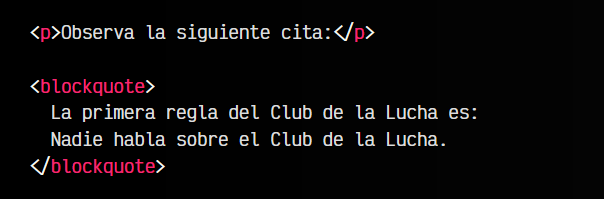
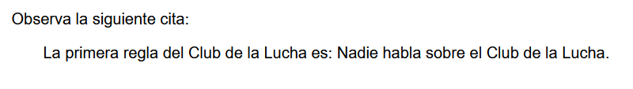
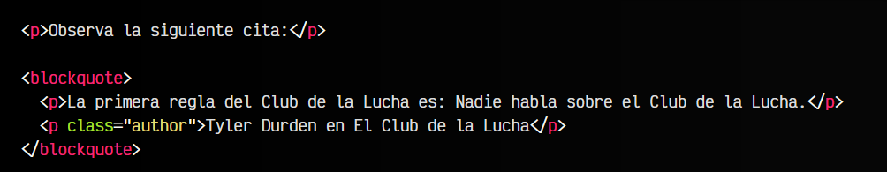
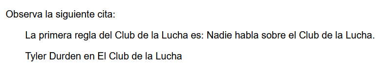
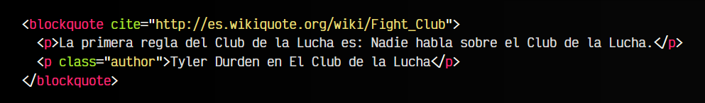
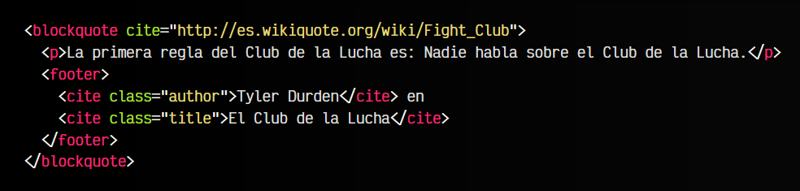
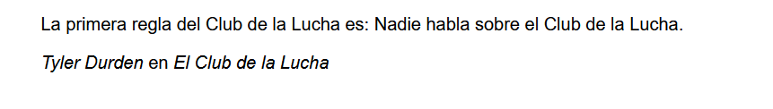
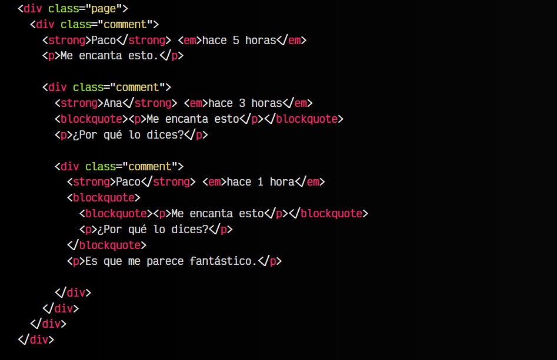
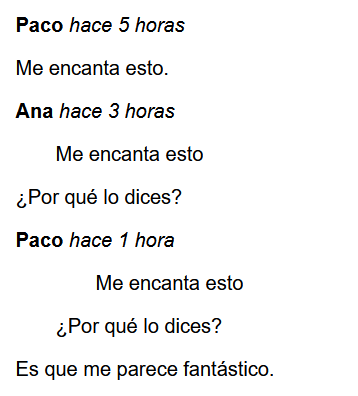

# La etiqueta HTML < blockquote >.

  -  Las etiquetas HTML < ul > y < ol >
  -  La etiqueta HTML < blockquote >
  -  La etiqueta HTML < pre >

Una etiqueta que no suele ser bien comprendida en el Lenguaje HTML es la etiqueta < blockquote >. Muchos desarrolladores utilizan las etiquetas de enlaces < a > o la de párrafos < p > para escribir un texto y enlazar la fuente, sin embargo, HTML tiene herramientas mucho más apropiadas para este objetivo.

La etiqueta < blockquote > se utiliza, como su propio nombre indica, para crear un bloque o sección donde aparezca un texto que es una cita o referencia a una obra o fuente de información. Dicha fuente de información puede ser un libro, una canción, un documento, una serie de televisión, etc...

En definitiva, una obra o documento de cualquier tipo. Veamos un ejemplo, con una cita de una película:

html:

vista:

Este ejemplo podría servirnos y es correcto. Sin embargo, no es muy específico y podría ser mucho mejor. Vamos a mejorarlo un poco, diferenciando sus partes y añadiendo información útil, utilizando < blockquote > como una etiqueta de agrupación.

Pondremos la cita en un párrafo < p >, y en otro párrafo  < p > diferente, añadiremos el nombre del autor de la cita, y el nombre de la película:

html:

vista:

## El atributo cite.
Otro detalle interesante de la etiqueta < blockquote > es que posee un atributo opcional cite, mediante el cuál se puede indicar una URL de referencia sobre la obra o fuente de información mencionada. No funciona como un link o enlace para acceder a esa información, sino como metadato de información disponible para máquinas que lean dicha información.

Sin embargo, el contenido de la etiqueta < blockquote > aún se puede mejorar un poco más. Como hemos visto, < blockquote > puede contener simplemente texto, o agrupar una serie de etiquetas que estén relacionadas con la obra a citar.

Aunque el ejemplo anterior ya está bastante bien, aún podríamos mejorarlo con varias etiquetas HTML que no hemos visto aún (y veremos más adelante), haciendo mucho más semántico nuestro ejemplo:

html:

vista:

Hemos modificado la parte inferior del bloque de cita donde indicabamos la información del autor de la cita. Ahora está contenido en una etiqueta semántica < footer >, que a su vez, posee dos etiquetas < cite > que amplían la información del autor y nombre de la obra.

## Citas encadenadas.
Otro detalle interesante acerca de < blockquote > es que se puede anidar dentro de otros elementos < blockquote >, formando un significado especial que tiene relación sobre su elemento padre < blockquote >.

Por ejemplo, imaginemos una serie de comentarios en una página. Observa el siguiente ejemplo donde tenemos varios comentarios < div class="comment" > que se encuentran anidados unos dentro de otros. Ten en cuenta que algunos comentarios tienen un < blockquote > e incluso pueden tener otros anidados:

html:

vista:

Por defecto, y sin añadir una línea de CSS, los < blockquote > añadirán un sangrado o indentación a la izquierda del texto por cada < blockquote >, colocando visualmente los comentarios como si fueran respuestas del anterior.