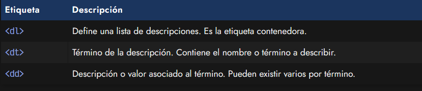
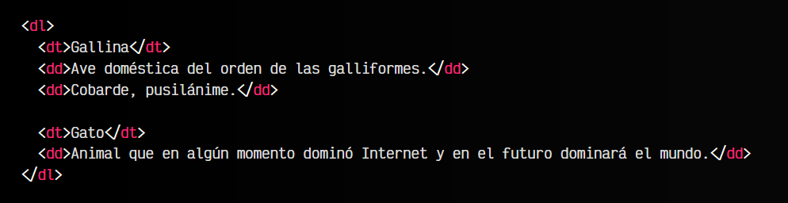
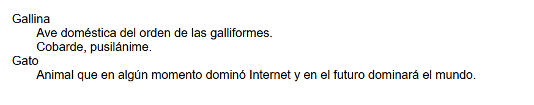

# La etiqueta HTML < dl >.

De la misma forma que podemos crear listas genéricas con las etiquetas < ol > o  < ul >, podemos crear listas de descripciones. La diferencia principal, es que este tipo de listas se suele utilizar cuando queremos asociar pares de nombre-valor, es decir, una lista de términos, donde cada término tiene una definición asociada.

Primero veamos las etiquetas que entran dentro de esta categoría:

## Listas de descripción.
Veamos un ejemplo práctico de como utilizar este tipo de listas:

html:

vista:

Observa que se trata de una lista de valores, pero no tiene porqué estar asociado a una sola definición. En el caso de la Gallina hay dos definiciones < dd > asociadas a la etiqueta del término < dt >. Sin embargo, en el segundo caso de la palabra Gato, hay sólo una definición.
