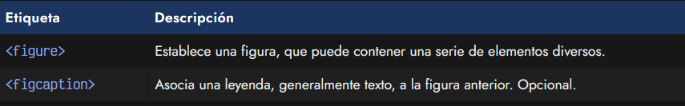
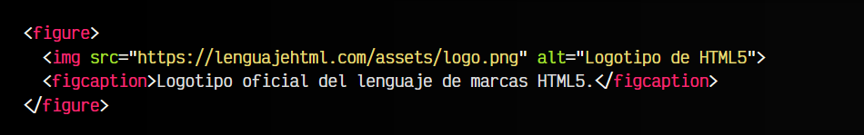

# La etiqueta HTML < figure >.

Unas etiquetas de agrupación muy interesantes son las etiquetas < figure > y < figcaption >. Dichas etiquetas se utilizan para agrupar conceptos formados por una ilustración (figura) y su leyenda. Con estos elementos se puede agrupar una imagen y su correspondiente pie de foto, aunque no tiene porque ser necesariamente un contenido de imagen, sino que también se podría utilizar video, un fragmento de audio, tablas con información, fragmento de código, etc... todos ellos con su respectivo texto a pie de contenido.

Las etiquetas en cuestión serían las siguientes:

Veamos exactamente como funcionan a continuación.

## Figuras: La etiqueta <figure>.
Observa que la etiqueta HTML < figure > es una etiqueta de agrupación que debe contener el elemento de contenido, en este ejemplo una imagen < img >, y la etiqueta < figcaption > que contendrá la leyenda o mensaje que acompaña al elemento anterior.

html:

vista:

A parte de los atributos comunes de cualquier etiqueta HTML, la etiqueta < figure > no tiene atributos especiales propios.

## La etiqueta <figcaption>.
Por otro lado, la etiqueta < figcaption > nos permite añadir un texto a pie de contenido, generalmente, bajo la imagen , video, audio, fragmento de código, tabla o información que contiene la ilustración < figure >.

El texto de este elemento generalmente es una aclaración o ampliación de la información que se ve en la figura o ilustración, añadiendo más detalles o aclarando algún contenido para que el lector se centre en él.

Recuerda que en la ilustración o figura, se pueden contener todo tipo de elementos, no solo imágenes. Ejemplos válidos podrían ser videos, audios, fragmentos de código o incluso contenido de otro tipo.

