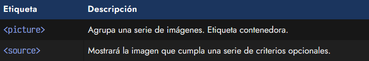
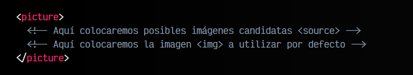
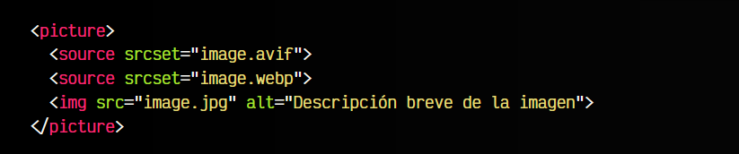
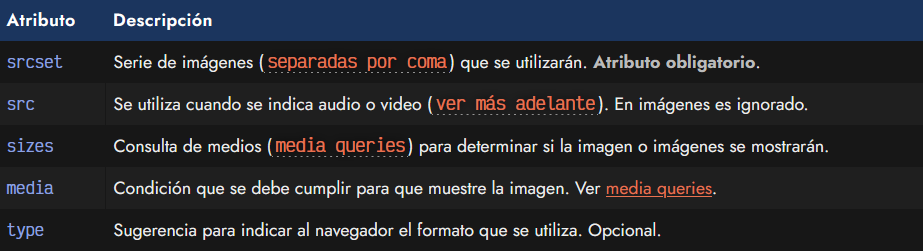
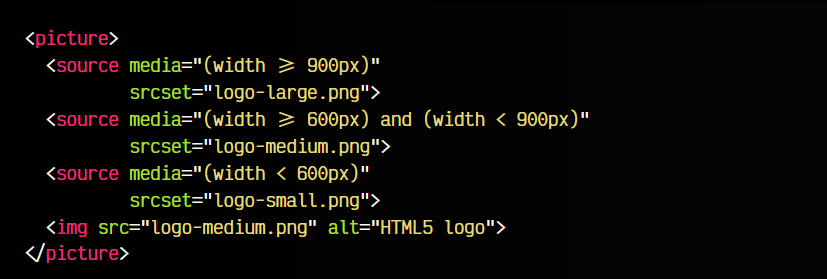
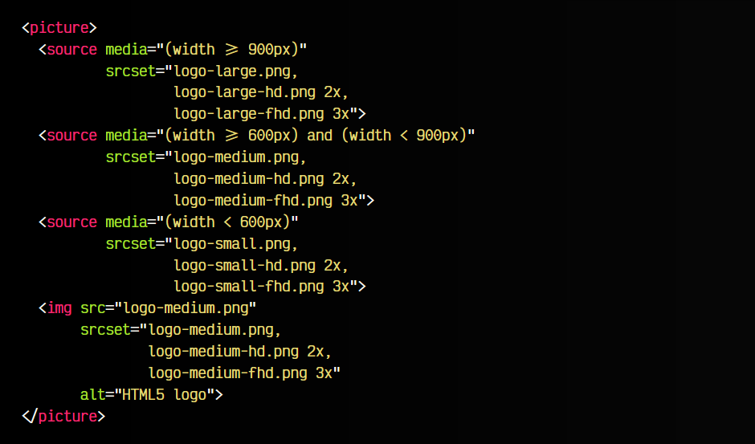

# La etiqueta HTML < picture >.

HTML 5.1 incorpora un nuevo sistema para utilizar imágenes en nuestros documentos HTML de forma mucho más flexible que la etiqueta < img > tradicional. Esta nueva etiqueta nos permitirá mostrar imágenes dependiendo de nuestras necesidades.

Las nuevas etiquetas para representar imágenes son las siguientes:

Vamos a profundizar en ellas en este artículo.

## La etiqueta < picture >.
Uno de los principales problemas que teníamos al utilizar la etiqueta < img > es que si utilizabamos un formato de imagen moderno, que puede no estar soportado en algunos navegadores, la imagen no se verá en dichos navegadores. Nos falta la posibilidad de establecer alternativas, para que en el caso de estar soportado pueda utilizarla, y en caso contrario utilice un formato alternativo más antiguo, y así poder aprovecharnos de las ventajas de formatos nuevos si hay soporte (menor peso, mayor calidad, etc...).

La etiqueta < picture > precisamente se centra en esto. Se utilizará como un contenedor donde vamos a indicar al navegador que queremos mostrar una imagen. Luego, en su interior, podemos establecer varias etiquetas source donde vamos a proporcionarle posibles opciones, de las cuáles tendrá que decidir cuál utilizar.

## La etiqueta < source >.
Como podemos ver, lo interesante está en el contenido de la etiqueta < picture >. En su interior, vamos a escribir varias etiquetas < source >, que indicarán al navegador que debe intentar leer esa imagen si tiene soporte para su formato:

Observa que hemos indicado dos etiquetas < source > y una etiqueta < img >. Observa que el atributo de las primeras es srcset y el de la última es src. Este comportamiento es similar al de una condición if de programación. El funcionamiento será el siguiente:

   - El navegador comprobará la primera etiqueta < source >  con una imagen en formato .avif.
   - Si el navegador la soporta, la insertará en el atributo src de la etiqueta < img > y la usará.
   - Si el navegador no la soporta, analizará la siguiente etiqueta < source > con formato .webp.
   - Si el navegador la soporta, la insertará en el atributo src de la etiqueta < img > y la usará.
   - Si el navegador no la soporta, utilizará la etiqueta < img > indicada al final.

Si un navegador muy antiguo no soporta estas etiquetas modernas, ignorará las etiquetas < picture > y < source > (las tratará como un contenedor < div >) y sólo hará caso a la etiqueta < img >, por lo que seguirá funcionando. La etiqueta < img > debe tener el formato más tradicional.

Las etiquetas source pueden tener varios atributos. Vamos a ver para que sirve cada uno:

## Imágenes responsive.
Otra ventaja interesante es que con < picture > podemos crear imágenes responsive que cambien dependiendo de características de las media queries (CSS). Por ejemplo, utilicemos min-width (tamaño mínimo de ancho de la pantalla) en el siguiente ejemplo:

De esta forma, estamos indicando que se muestren diferentes imágenes dependiendo de la resolución de pantalla (ancho) del dispositivo:

   - Dispositivos grandes (igual o más de 900px): Muestra la imagen logo-large.png
   - Dispositivos grandes (entre 600-899px): Muestra la imagen logo-medium.png
   - Dispositivos pequeños (menos de 600px): Muestra la imagen logo-small.png
   - Si no cumple las anteriores (o no soporta estas etiquetas): Muestra la imagen logo-medium.png
  
Nótese que esto sólo hará cambio de imagen efectivo justo en los cambios de los rangos indicados (600 y 900). Si se desea que la imagen se adapte proporcionalmente en cada punto, lo mejor es recurrir a tamaños [máximos y mínimos](https://lenguajecss.com/css/modelo-de-cajas/que-es/#rango-de-dimensiones) con CSS.

## Diferentes densidades.
Además, este sistema también permite especificar diferentes imágenes dependiendo de la densidad de pantalla del dispositivo (tamaño del píxel en las diferentes pantallas de dispositivos móviles, tablets o monitores). Para ello, tenemos que usar una palabra clave que se forma de un número (multiplicador de densidad) seguido de una x:

Observa que en cada etiqueta < source > se establece el atributo srcset para indicar una imagen para una determinada densidad de pantalla (*por ejemplo, 2x o 3x). Si se omite y no se indica ninguna, es lo mismo que indicar 1x.

Si quieres saber más sobre este tema, echa un vistazo al artículo de [la etiqueta < img >](https://lenguajehtml.com/html/multimedia/etiqueta-html-img/), donde explicamos los descriptores de srcset.

