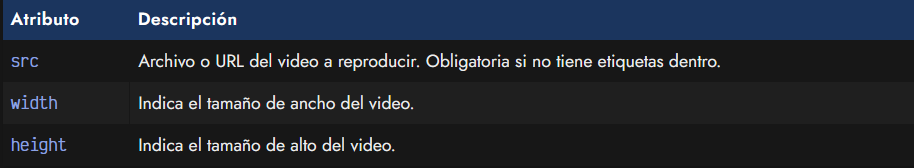
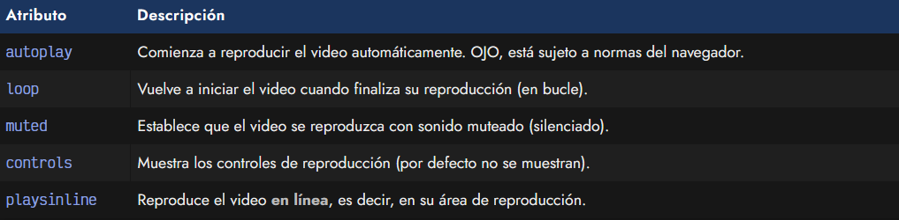
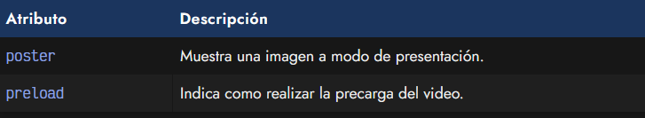
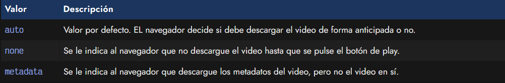
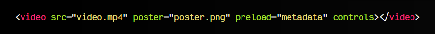
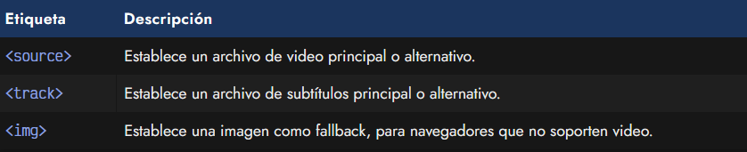
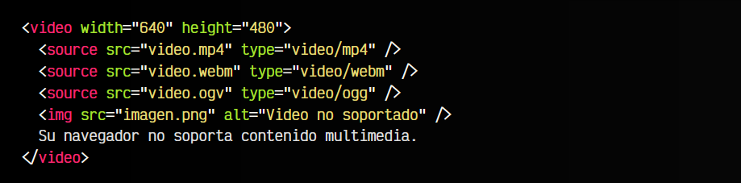

# La etiqueta HTML < picture >.

En HTML5 se introduce la interesante posibilidad de mostrar videos directamente desde nuestro navegador. De hecho, si arrastramos un video a la ventana del navegador, comprobaremos que comienza a reproducirse en él. Esto ocurre porque los navegadores son capaces de mostrar imágenes, reproducir video y audio.

Para mostrarlos en nuestras páginas, usaremos la etiqueta HTML < video >, la cuál tiene varios atributos que podemos utilizar:

Un primer ejemplo muy básico para colocar un video en nuestra página web podría ser el siguiente:

## Atributos src y dimensiones.
Al igual que vimos en el apartado de [etiqueta < img >](https://lenguajehtml.com/html/multimedia/etiqueta-html-img/), tenemos a nuestra disposición el atributo src para indicar la ruta o archivo de video, el cuál se encontrará en un formato concreto, como puede ser .mp4 o .webm.

► Más información: [Formatos multimedia (imagen, video y audio)](https://lenguajehtml.com/html/multimedia/formatos-multimedia/)

Por otro lado, el atributo width sirve para indicarle un tamaño de ancho y el atributo height para indicar un tamaño de alto. Indicar los valores de ancho y alto en el HTML es una buena práctica, porque reservamos el tamaño inicialmente aunque el video no se haya descargado, y así evitamos posibles saltos o cambios de tamaño que desembocan en comportamientos molestos e inesperados al cargar una web.

Ojo: Si lo que quieres es insertar videos desde Youtube, Vimeo u otro servicio alternativo, debes utilizar la etiqueta HTML iframe en lugar de la etiqueta < video >. Esta última sólo sirve para archivos en formato de video directamente.

## Atributos de control.
Pero las etiquetas < video >, al igual que las etiquetas < audio > que veremos más adelante, tienen una serie de atributos , es decir, atributos de verdadero o falso, para activar o desactivar características. Para activarlas, simplemente tenemos que indicar el atributo en la etiqueta, para desactivarlas, simplemente lo omitimos.

Estas características son las siguientes:

Una aclaración sobre el atributo playsinline: En algunos dispositivos móviles, al reproducir el video, este se muestra en pantalla completa, dejando la web en un segundo plano. Si establecemos el atributo playsinline, obligaremos a que el video se reproduzca en el lugar donde se encuentra.

Veamos un sencillo ejemplo aplicado:

html:

vista:

Este video se reproducirá automáticamente, silenciado y en modo bucle, es decir, cuando llegue al final, comenzará a reproducirse de nuevo. Ten en cuenta que un video .mp4 que no tenga el atributo controls, por norma general, el usuario lo interpretará como si fuera una imagen o .gif animado. Si no ve claramente que hay una barra de controles, no caerá en que se trata de un video.

Desde 2017, Chrome, Firefox y otros navegadores establecieron un cambio de políticas con el atributo de reproducción automática autoplay, por lo que lo más probable es que la autoreproducción no funcione salvo que el usuario haya interactuado antes en la página (click, scroll, etc...).

En algunos casos, especialmente en dispositivos móviles, puede que los videos no se reproduzcan automáticamente si tienen un canal de audio (incluso aunque se use el atributo muted). Si quieres establecer un video de fondo para el diseño de una web, es aconsejable retirar el canal de audio del video. Esto hará que el video ocupe menos y no de este tipo de problemas en móviles.

## Atributos de precarga.
Existen algunos atributos más para utilizar en la etiqueta < video >, que resultan muy interesantes ya que están relacionados con la precarga del video:

## El atributo poster.
Por defecto, las etiquetas < video > muestran el fotograma inicial del video enlazado, ya sea un fotograma del mismo o una pantalla negra inicial. Sin embargo, podemos mostrar una imagen personalizada a modo de «carátula» como lo hace, por ejemplo Youtube, de modo que el video no se llega a mostrar hasta que el usuario pulsa en el botón de play.

Para ello, utilizaremos el atributo poster, que funciona de forma similar al atributo src de una imagen < img >. En ella podremos indicar la dirección de la imagen que queremos utilizar como carátula.

## El atributo preload.
Mediante el atributo preload podemos indicar al navegador como queremos que se comporte respecto a los elementos de video. Por defecto, el navegador tiene el valor auto en este atributo, por lo que decidirá si es necesario descargarlo o no, pero podemos utilizar los valores none o metadata para cambiar este comportamiento:

Veamos otro ejemplo con lo que hemos aprendido:

html:

vista:

En este caso indicamos que el navegador debe mostrar un video, pero en lugar de mostrar el primer fotograma del mismo, utilizará una imagen de presentación mediante el atributo poster. El archivo de video no se descargará de forma anticipada inicialmente, puesto que se ha indicado que sólo se descarguen sus metadatos (título, duración, etc...). Además, se ha establecido que muestre los controles por defecto.

## Videos con fallbacks o extras.
Sin embargo, aún con toda esta información, no hemos visto ni la mitad de posibilidades multimedia que tenemos con HTML5. La etiqueta < video > también puede actuar como etiqueta contenedora e incluir varias etiquetas HTML para dotar de mayor compatibilidad, o capacidades adicionales, de forma muy similar a como lo hace la etiqueta < picture > de imágenes.

Las etiquetas que podemos incluir dentro de una etiqueta < video > son las siguientes:

Un poco más adelante veremos las etiquetas < track >, que sirven para indicar subtítulos.

## La etiqueta < source >.
Si utilizamos la etiqueta < video > como etiqueta contenedora, podemos incluir etiquetas < source > en su interior para proporcionar videos con formatos alternativos y tener mayor compatibilidad con navegadores antiguos. De esta forma, navegadores que soporten nuevos formatos, aprovecharán estos recursos, y los que no utilizarán los antiguos o las etiquetas de fallback.

Veamos una posible implementación de la etiqueta < video > como etiqueta contenedores con múltiples alternativas:

En este ejemplo, los navegadores no mostrarán todos los contenidos a la vez, sino que seguirán los siguientes pasos:

   - Intenta mostrar el primer formato: MP4. Si el navegador no lo soporta, salta al siguiente.
   - Intenta mostrar el segundo formato: WEBM. Si el navegador no lo soporta, salta al siguiente.
   - Intenta mostrar el tercer formato: OGV. Si el navegador no lo soporta, salta al siguiente.
   - Si se trata de un navegador que no soporta HTML5 ni sus etiquetas de video, intentará mostrar la imagen.
   - Si se trata de un navegador de terminal de texto (o sin capacidades gráficas), mostrará el texto del final.

De esta forma tenemos soporte completo para todo tipo de dispositivos.

## Acceso a segundos específicos <source>.
Utilizando los fragmentos multimedia se pueden conseguir algunas acciones interesantes, como por ejemplo especificar el momento concreto del video (o audio) en el que se quiere empezar a reproducir o terminar de reproducir.

Veamos algunos ejemplos:

html:

vista:

En este primer caso, reproducimos el video video.mp4 a partir del segundo 15 del mismo. Aparecerán los controles puesto que hemos definido el atributo controls.

html:

vista:

En este primer caso, reproducimos el video video.mp4 a partir del segundo 15 del mismo. Aparecerán los controles puesto que hemos definido el atributo controls.

html:

vista:

En este segundo caso, reproducimos el video video.mp4 a partir del segundo 10, hasta llegar al segundo 20. No aparecerán los controles puesto que hemos omitido el atributo controls, pero como hemos definido el atributo autoplay, si el clip de video no tiene canal de audio, el video se reproducirá automáticamente aunque el usuario no haya interactuado previamente en la página, como generalmente se requiere.
