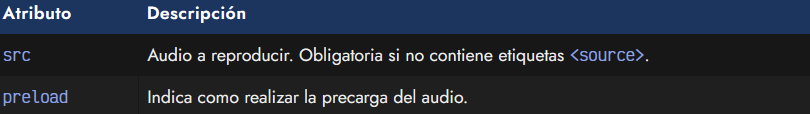

# La etiqueta HTML <audio>.

Al igual que existe una etiqueta para añadir archivos de video a una página web, también es posible añadir archivos de audio y colocar conversaciones de voz, podcasts, sonidos o simplemente usar música como ambientación.

En versiones anteriores de HTML se usaba una etiqueta HTML obsoleta denominada < bgsound > que realizaba algo similar. Actualmente, esta etiqueta ya no está soportada. Hoy en día, usaremos la etiqueta HTML < audio >, que funciona prácticamente igual que < video >, sólo que utilizando archivos de audio.

## La etiqueta < audio >.
a etiqueta HTML < audio > tiene varios atributos que podemos utilizar:

## La etiqueta < audio >.

Respecto al formato de audio, hemos indicado un archivo .mp3, que tiene muy buen soporte, pero existen otros formatos que también podrían ser apropiados, como .ogg o .opus.

► Más información: [Formatos multimedia](https://lenguajehtml.com/html/multimedia/formatos-multimedia/) (imagen, video y audio)

## ¿Por qué no suena?.
Sin embargo, es importante recalcar que este ejemplo no mostrará nada visualmente, ni reproducirá ningún sonido. Realmente, el audio está ahí, pero no le hemos indicado el atributo controls para que muestre los controles y que el usuario pueda ver que se trata de un archivo de audio para reproducirlo pulsando el botón «play». Al no haberle colocado tampoco el atributo autoplay, no empezará a reproducir el sonido de forma automática.

OJO: Los navegadores han cambiado la política de autoreproducción con autoplay. Para evitar el uso abusivo de audio en una página sin permiso del usuario, los navegadores exigen que el usuario haya interactuado con la página con anterioridad (y posterior a la carga inicial). Lo aconsejable sería utilizar botones o areas pulsables para activar el sonido mediante Javascript.

## Atributos de control.
De la misma forma que las etiquetas < video >, a las etiquetas < audio > se les puede indicar atributos BOOLEAN para activar o desactivar características. Simplemente añadiendo el atributo (sin valor asociado) activaremos la característica en cuestión.

Los atributos son los siguientes:

Veamos un ejemplo real aplicado con estos atributos:

Hemos cargado un audio en formato .mp3. Se mostrará con los controles de reproducción (play, duración, volumen, etc...) y reproducirá el sonido de forma automática. Una vez termine el audio, volverá a empezar, ya que está en modo bucle.

Aunque no es muy habitual en un audio, podemos utilizar el atributo muted para mutear el archivo de audio y que se encuentre silenciado. Esta característica puede tener más utilidad al hacerlo de forma dinámica desde Javascript bajo ciertas situaciones.

## Precarga de audiol.
Utilizando el atributo preload podemos indicar al navegador el comportamiento de descarga anticipada que queremos realizar con el archivo de audio. Por ejemplo, observa este fragmento de código:

El archivo audio.ogg empezará a descargarse sólo cuando el usuario pulse en el botón Play de los controles de reproducción, ya que hemos establecido none en el atributo preload, que indica que no precargue el archivo.

Los valores que puede tomar el atributo preload son los siguientes:

Este escenario puede ser interesante para evitar consumo de ancho de banda de archivos que puede ser probable que el usuario no escuche, o en dispositivos móviles donde las tarifas de datos son costosas y no queremos descargar hasta que el usuario lo haga explícitamente.

## Audios con fallbacks o extras.
La etiqueta < audio > también puede actuar como etiqueta contenedora e incluir varias etiquetas HTML para dotar de mayor compatibilidad, o capacidades adicionales.

Las etiquetas que podemos indicar en el interior de una etiqueta < audio > son las siguientes:

Las etiquetas de subtítulos < track > las veremos en el próximo artículo. Veamos ahora, un ejemplo donde utilizaríamos una etiqueta < audio > con varias alternativas establecidas con etiquetas < source > para proporcionar mayor compatibilidad con otros navegadores y navegadores antiguos que no soporten ciertos formatos:

En este ejemplo, observa que no hemos establecido el atributo src en el elemento < audio > contenedor, sino en cada una de las etiquetas < source > de su interior. Ocurrirá lo siguiente:

   - El navegador intentará reproducir el archivo de audio en formato .opus.
   - Si no lo soporta, intentará reproducir el formato .ogg vorbis.
   - Si no lo soporta, intentará reproducir el formato .mp3.
   - En caso de no soportar ninguno, no reproducirá nada.

De esta forma, podemos establecer varias opciones para aprovechar los formatos modernos, y en caso que no estén soportados, utilizar formatos más antiguos o tradicionales.

