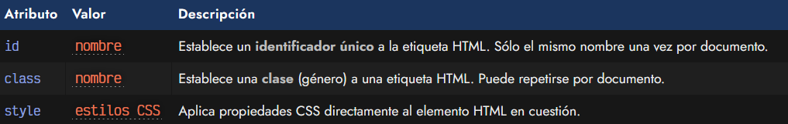
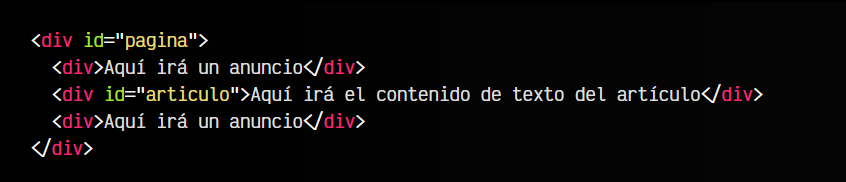
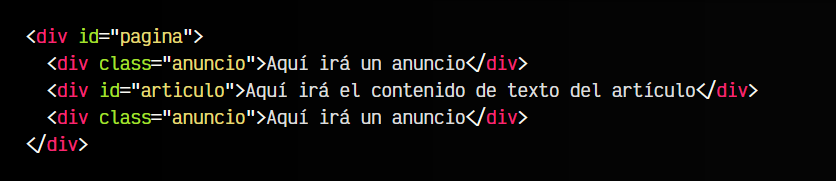
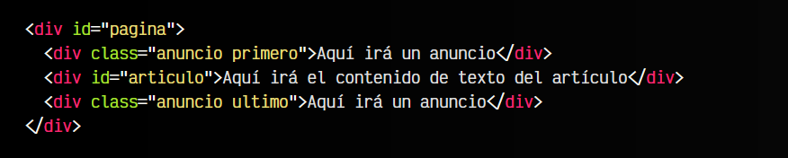
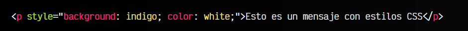

# 
Atributos comunes en HTML

Como hemos visto, el HTML está formado por etiquetas. Muchas etiquetas. Cada etiqueta tiene una misión y tarea y contendrá cierto contenido relacionado con su misión. Y además tenemos los atributos, que son palabras clave de texto que modifican ligeramente el comportamiento de la etiqueta que lo contiene.

En este apartado vamos a ver una lista de atributos comunes que tienen cierta relación con CSS y que pueden ser utilizados en prácticamente cualquier etiqueta HTML:

Veamos cada uno de ellos por separado para entenderlo bien.

## Identificador: El atributo id.
En HTML, podemos darle un identificador a una etiqueta HTML y de esta forma darle un nombre. Simplemente, añadimos el atributo id y colocamos el nombre como valor de ese atributo.

Ese identificador único tiene unas normas:

   - No debe empezar nunca por un número, pero puede contenerlos más adelante.
   - El texto debe estar en kebab-case, es decir, minúsculas y separados por un guión.
   - Es preferible que no contenga carácteres raros, acentuados o emojis.
   - En un documento HTML no pueden existir dos elementos con el mismo id.

Veamos un ejemplo de código:

El detalle principal más importante de los id, es que no pueden existir dos con el mismo nombre en un mismo documento. Ejemplos correctos de id serían:

   - ✅ «pagina» (contiene el fragmento de código HTML que incluye toda el contenido de la página)
   - ✅ «comentarios» (contiene toda la zona de comentarios de la página)
   - ✅< header > (contiene la parte con el logo y la cabecera de la página)

Lo importante que hay que saber de los id es que se suelen utilizar cuando queremos localizar zonas específicas que sabemos que no se van a repetir en esa misma página.

Mi consejo es que, salvo que se necesite identificar una zona única en la página, se evite usar id. El uso principal de un id es para crear enlaces de tipo ancla (que veremos más adelante, en el apartado de [enlaces o hipervínculos](https://lenguajehtml.com/html/texto/enlaces-o-hipervinculos/#anclas)), que no son más que enlaces de acceso rápido en la misma página.

## Clases: El atributo class.
Las clases funcionan de una forma muy similar a los id, pero son mucho más flexibles. Utilizaremos el atributo class, donde le asignaremos el nombre de clase deseado. En primer lugar, no tienen la limitación de los id, por lo que pueden existir elementos con la misma clase en un documento. De hecho, la idea de las clases es establecer géneros o tipos de etiquetas, a los que les asociemos características comunes.

Sigamos con el ejemplo anterior:

Obsérvese que, al tener la misma clase «anuncio», podemos realizar acciones para todas las etiquetas de ese tipo y no tener que hacerlo para cada una de ellas por separado. Un ejemplo clásico donde se ve bien su utilidad, es respecto a utilizar ids y clases para dar estilo CSS, donde aplicaremos unos estilos concretos a todas las etiquetas HTML con clase «anuncio».

Además, a diferencia de los id, una etiqueta puede tener múltiples clases diferentes, no necesariamente una sola. Esto nos da más flexibilidad a la hora de crear clases específicas, donde cada una se ocupa de un detalle diferente:

Nótese que en la primera etiqueta del anuncio hemos aplicado las clases anuncio y primero, mientras que en el último anuncio hemos aplicado las clases anuncio y último. Esto nos permitiría asignar atributos comunes al anuncio en la clase anuncio, y atributos que sólo dependan de la posición donde esta colocado en primero y/o ultimo.

Recuerda que para indicar múltiples clases se deben separar las clases por espacio, dentro del mismo atributo class. Si se indican múltiples atributos class en la misma etiqueta, el navegador ignorará los primeros y sólo utilizará el valor del último class.

## Estilos en línea: El atributo style.
El atributo style es un atributo que se utiliza en las etiquetas HTML para incrustar código CSS directamente en la propia etiqueta. Este tipo de CSS se denomina [Estilos CSS en línea](https://lenguajecss.com/css/introduccion/como-usar-css/#estilos-en-l%C3%ADnea).

Generalmente, la mejor forma de aplicar estilos CSS es colocar el código CSS en un documento .css independiente de nuestro documento HTML. Esto garantiza que nuestro código esté bien separado y modularizado. Sin embargo, hay situaciones donde puede ser conveniente (o incluso necesario) añadir el código CSS en la propia etiqueta. En ese caso, se haría de la siguiente forma:

html:

vista:

Sin embargo, en la mayoría de los casos, no se recomienda añadir los estilos de esta forma, y suele ser considerado una mala práctica, ya que estás acoplando el código CSS al documento HTML, cuando deberían estar separados. Una buena práctica, por ejemplo, sería utilizar el atributo style para definir [variables CSS](https://lenguajecss.com/css/cascada-css/css-custom-properties/) en nuestro elemento y elementos hijos.

► [Aprender más formas de aplicar CSS a una página](https://lenguajecss.com/css/introduccion/como-usar-css/)

