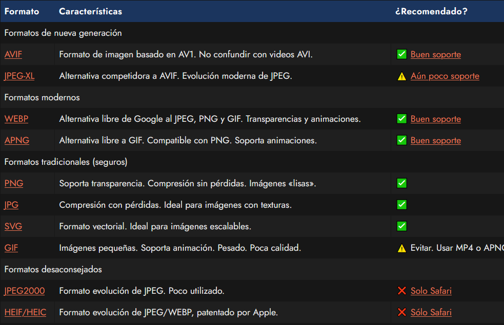
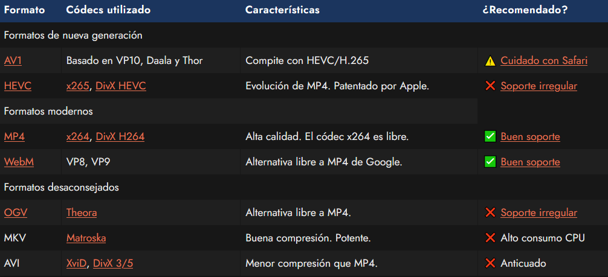
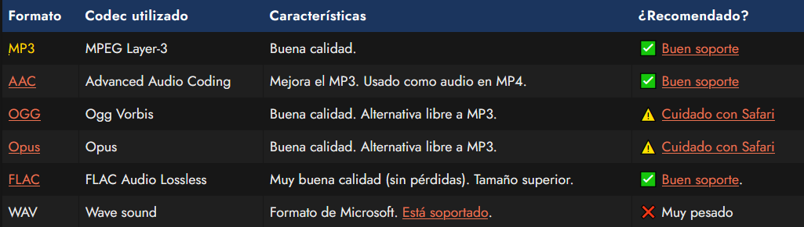

# Formatos multimedia < audio >.

Una parte importantísima de utilizar archivos multimedia (imagen, video o audio) en una web, es saber elegir el formato adecuado para cada caso. Puede parecerlo, pero no siempre es una tarea sencilla, hay muchas cosas que hay que tener en cuenta:

   - 1️⃣ Tipo de recurso: No es lo mismo una imagen con texturas, que una ilustración con colores sólidos.
   - 2️⃣ Peso: Cuanto más ligero sea el archivo, más rápido descargará.
   - 3️⃣ Calidad: La calidad mantiene una fidelidad con el archivo original, pero aumenta su peso.
   - 4️⃣ Compatibilidad: Soporte en la mayoría de navegadores, móviles incluido.

En las siguientes secciones vamos a analizar cuales son los formatos más apropiados para utilizar en nuestra web, ya sea respecto a imágenes, videos o archivos de audio.

## Formatos de imágenes.
En el ámbito informático existen múltiples formatos de imágenes (¡muchísimos!) pero no todos son aptos o adecuados para utilizar en web.

Demos un repaso a los formatos más utilizados y apropiados para sitios webs:

Cualquier otro formato no mostrado en esta lista no está recomendado para utilizar en web. Formatos como BMP, TIFF, RAW, NEF, PSD, CDR son formatos no orientados para su uso en la web, además de ser propietarios y muy pesados. Asegúrate utilizar uno de los recomendados de la tabla anterior.

Algunos formatos no recomendados en la tabla superior pueden utilizarse hoy mismo utilizando un enfoque progresivo con fallbacks. En el caso de las imágenes, se usaría [la etiqueta HTML](https://lenguajehtml.com/html/multimedia/etiqueta-html-picture/) < picture >: si el navegador no soporta un formato, intenta con el siguiente.

## Formatos de video.
En el ámbito de archivos multimedia de video, debemos conocer una serie de conceptos básicos y los diferentes formatos que existen actualmente. En primer lugar, debemos saber que un archivo de video se compone de dos partes principales:

   - 1️⃣ El formato contenedor, que es el formato del video en sí.
   - 2️⃣ Canales internos (audio, video...), codificados con diferentes codecs.

Formato contenedor de video

Un video simple, suele tener como mínimo, un canal de video y otro de audio, sin embargo puede tener muchos más (subtítulos, imágenes, canales de audio alternativos, etc...). Esto es un detalle muy importante, ya que dependiendo del formato y/o codec, puede que sea factible utilizarlo para web o no.

A continuación tenemos un listado de los formatos/codecs más conocidos y utilizados para web:

Otros formatos como MOV, FLV, 3GP, MPG, RMVB o ASF/WMV no se recomiendan para su utilización en web ya que son anticuados, propietarios o poco eficientes.

Recuerda que es posible utilizar una estrategia de fallbacks con la etiqueta < video >, de modo que si el navegador no soporta un formato, puede probar con el siguiente y así consecutivamente.

## Formatos de audio.
Por su parte, y de la misma forma, los archivos de audio estan codificados mediante un códec específico, y es importante conocer estos detalles para saber que formatos están soportados por los diferentes navegadores.

A continuación tenemos un listado de los formatos/codecs de audio más conocidos y utilizados:

Otros formatos como ASF/WMA, RA u otros no son apropiados para web.

Igual que en los casos anteriores, podemos utilizar la etiqueta < audio > para establecer alternativas, en el caso que el navegador no reconozca uno de los formatos. De esta forma promovemos, si es posible, descargar archivos más ligeros o eficientes.

