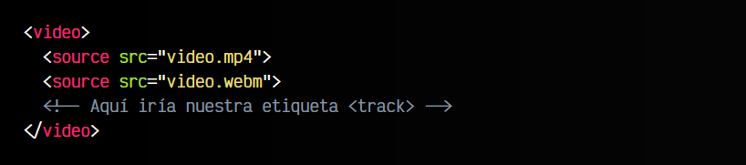
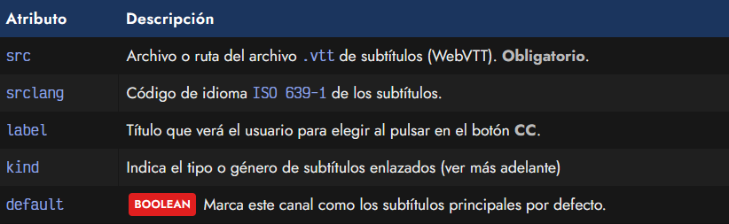
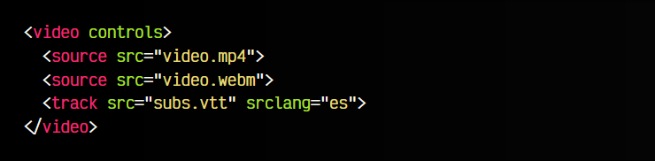
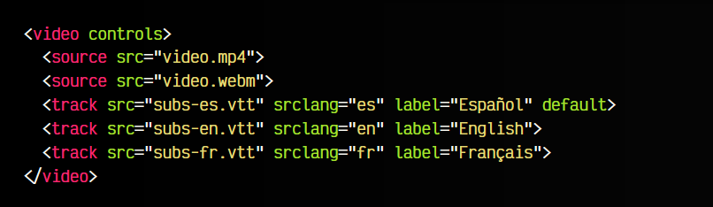
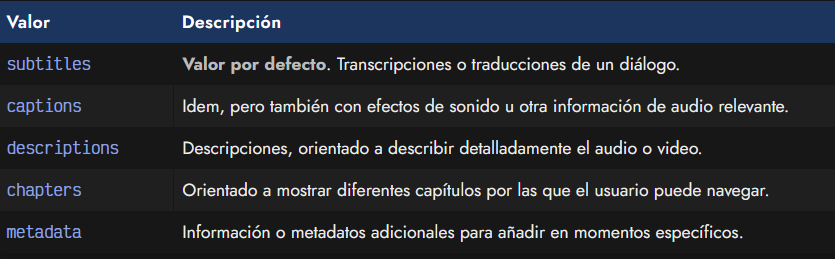
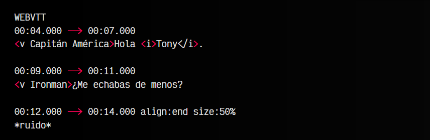

# La etiqueta HTML < track >.

Con la llegada de HTML5, se añade un estándar llamado WebVTT, que no es más que un formato abierto orientado a web para la creación de subtítulos en archivos de video o audio. Este formato proviene del popular y extendido formato de subtitulos .srt, ya que es muy similar, sin embargo, en este caso se trata de un formato propio que no depende de una entidad o compañía externa.

## La etiqueta < track >.
Este formato se puede utilizar mediante la etiqueta < track >, que puede establecerse dentro de una etiqueta contenedora < video > o < audio >, y después de las etiquetas < source > de su interior:

La etiqueta < track > soporta varios atributos:

## El atributo src y srclang.
En primer lugar, la etiqueta < track > debe de incluir un atributo src para indicar donde está nuestro fichero de subtítulos con extensión .vtt. Este atributo es obligatorio. Además, es conveniente establecer también el atributo srclang, mediante el cuál indicaremos el idioma en el que está dicho archivo de subtítulos.

Veamos un ejemplo:

En este caso, estamos descargando un archivo de subtítulos llamado subs.vtt e indicando que está en español, con el código ISO 639-1 es.

## El atributo label y default.
Si tenemos varias etiquetas < track > en un mismo archivo de video o audio, podemos darle la opción al usuario para que elija entre múltiples subtítulos. Para ello, el usuario debe ir al botón CC de los controles del video o audio y seleccionar el subtítulo que le interese.

Es posible indicar con un atributo label en la etiqueta < track > el texto que se mostrará en el menú de opciones del botón CC.

Observa el siguiente ejemplo con 3 subtítulos diferentes:

Por defecto, el < video > utilizará la primera etiqueta < track > que encuentre, o la que indique el atributo default.

## El atributo kind.
Además, de forma adicional, también podemos indicar el atributo kind para dotar de metadatos o semántica a la etiqueta < track >. Con este atributo podemos establecer la naturaleza de los subtítulos, indicando si se trata de subtitulos, información, capítulos, etc...

Recuerda que si se omiten, se asumirá que son subtitulos.

## Formato WebVTT.
Los archivos de subtítulo utilizados con la etiqueta < track > tienen el formato denominado WebVTT y utilizan la extensión .vtt. Se trata de un formato de texto bastante legible y fácil de entender.

Su sintaxis es similar al siguiente fragmento de código:

Como se puede ver, el archivo empieza con el texto WEBVTT que lo identifica. Continua con una línea que indica la marca de tiempo de inicio y final en el que permanecerá visible la frase de la siguiente línea.

En dicha frase, se puede indicar el personaje que está hablando (para posteriormente aplicarles estilos CSS) e incluso incluir etiquetas simples para dar formato al texto. De forma adicional, también se pueden alinear textos, modificar su tamaño o cambiar la posición, entre otras cosas.

Un excelente software para crear subtítulos es [AegiSub](https://aegisub.org/). Es una aplicación multiplataforma, open source e incorpora multitud de características. Puedes guardarlos en formato .srt y convertirlos a .vtt utilizando [srt2vtt](https://dthompson.us/projects/srt2vtt.html) o [srt2vtt en npm](https://github.com/deestan/srt2vtt).

