# La etiqueta HTML < a >.
La idea de enlazar recursos para que el usuario pueda navegar desde un punto a otro, es la base de las páginas webs y de Internet en sí, por lo que se podría decir que la etiqueta < a > es el pilar indiscutible de HTML.

## Enlaces o hipervínculos < a >.
La etiqueta < a > es una de las etiquetas más importantes de HTML (si no es la que más), ya que nos permite realizar referencias a otras páginas web o recursos como documentos, imágenes, videos, etc. Estas referencias se suelen denominar enlaces, vínculos o hipervínculos. Para ello, tenemos que indicar la URL de la dirección del recurso a enlazar y el texto o contenido que vamos a convertir en enlazable.

La etiqueta < a > tiene multiples atributos posibles, así que veamos un resumen de todos ellos:

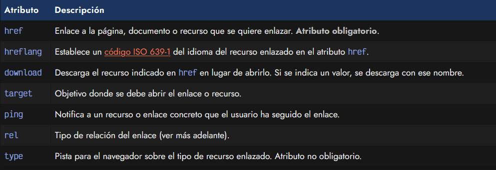

Vamos a detallar cada uno de ellos para profundizar en como funcionan.

Si no sabes bien que es una URL, o quieres descubrir las diferentes partes de la estructura de una URL o diferentes formas de crear un enlace, echa un vistazo a [enlaces o hipervínculos](../34-ENLACES-HIPERVINCULOS/enlaces-hipervinculos.md).

## El atributo href.
La etiqueta < a > debe tener, como mínimo, el atributo href, que es el atributo con el que se indica la dirección URL a la página, documento o recursos que se quiere enlazar. Por esta razón, siempre debería estar indicada.

Un ejemplo sencillo de enlace sería el siguiente:

html:
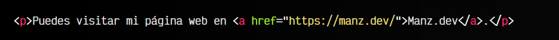

vista:
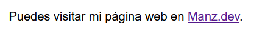

Observa que el valor del atributo href es el recurso al cuál vamos a dirigirnos, y el contenido de la etiqueta < a > es el texto que va a ser pulsable para acceder a ese enlace. Si en lugar de un texto, colocamos una imagen < img >, entonces estaremos creando un enlace en dicha imagen.

La forma de enlazar también es un tema importante. No es lo mismo enlazar con el texto manz.dev, que colocar el enlace sobre el texto Puedes visitar. Desde el punto de vista semántico, tiene más sentido enlazar el texto manz.dev porque es justo la página a donde vamos a dirigir, que enlazar el texto Puedes visitar, que es la acción del usuario, pero no tiene relación con el contenido.

Recuerda que dentro de una etiqueta < a >, al ser un recurso interactivo, nunca debería haber otro recurso interactivo, como por ejemplo un botón HTML < button >.

## El atributo hreflang.
En algunos casos, nos podría interesar indicar el idioma en el que se encuentra el recurso enlazado, generalmente porque está en un idioma diferente al documento que está leyendo el usuario. En ese caso, utilizaremos el atributo hreflang, indicando el idioma mediante un código ISO 639-1 del mismo.

Obviamente, un enlace < a > con atributo hreflang debe tener siempre un atributo href definido:

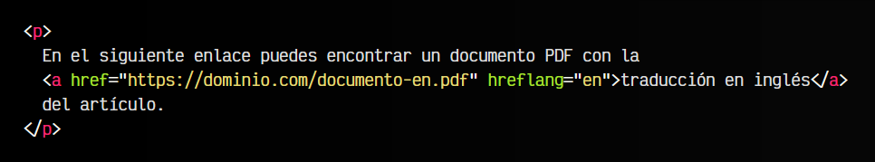

De esta forma, avisamos al navegador que el recurso enlazado está en el idioma especificado.

Recuerda que la etiqueta < a > es un enlace en línea, por lo que siempre se adaptará al elemento que lo contenga. Si queremos que respete unas ciertas dimensiones habría que cambiarle la representación a block u otro similar.

## El atributo download.
Por defecto, un navegador intentará abrir el recurso enlazado mediante el navegador. Esto es, si enlazamos una página o documento .html, lo intentará renderizar en el navegador visualmente, si enlazamos un archivo .pdf, lo intentará abrir con el propio navegador para mostrarlo sin abandonar el navegador, etc.

Si en una etiqueta < a > incluimos el atributo download, estaremos indicando al navegador que nuestra intención no es renderizarlo en el navegador, sino descargarlo como fichero en el sistema del usuario:

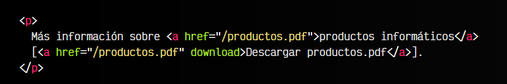

Además, también podemos indicar un valor en el atributo download, de modo que aunque el nombre del recurso sea productos.pdf (en este ejemplo), el navegador lo descargará con el nombre prices.pdf indicado como valor del atributo download:

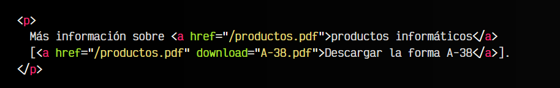

El soporte del atributo download podría no existir en ciertos navegadores, como versiones antiguas de Chrome o Firefox, sin embargo, actualmente tiene un buen soporte:

## El atributo target.
Mediante el atributo target podemos modificar el lugar donde se va a abrir el recurso del enlace. Por defecto, si no incluímos el atributo target, los enlaces se abren en la misma ventana/pestaña en la que estamos. Sin embargo, podemos alterar ese comportamiento con los valores del atributo target.

Por ejemplo, el valor _blank nos permite abrir en una nueva pestaña/ventana:

html:
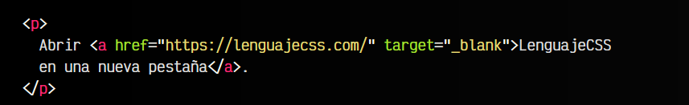

vista:
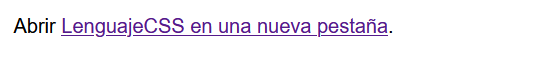

Sin embargo, podemos indicar varios valores:

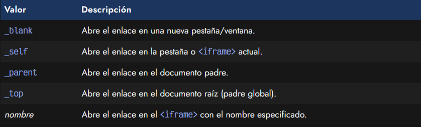

Hay que mencionar que, aunque muchas veces se suele indicar el atributo target="blank" con la idea de que el usuario abra un enlace en una nueva pestaña para que no abandone la web actual, desde mi punto de vista, esto suele ser un pensamiento erróneo.

El usuario o lector debe ser el que decida si abrir un enlace en una nueva pestaña o en la actual, dependiendo de su intención al leer la nueva página. Cualquier enlace indicado en una página, el usuario puede abrirlo en una nueva pestaña pulsando CTRL

y haciendo click o marcando la opción «Abrir en nueva pestaña» en el botón derecho sobre el enlace.

Si utilizamos el atributo target="_blank" estaremos obligando a que siempre abra en una nueva pestaña, por lo que si quiere hacerlo en la misma pestaña actual, no tendrá forma de hacerlo.

## El atributo rel.
Por otro lado, el atributo rel nos permite establecer en una etiqueta < a > el tipo de relación con el contenido que tiene el enlace. En determinado tipo de contenido enlazado, deberíamos utilizar el atributo rel para mejorar su semántica.

Los tipos de relaciones existentes son los siguientes:

Por ejemplo, el siguiente fragmento de texto indica que la página manz.dev tiene información sobre el autor del documento actual:

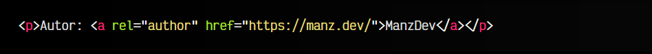

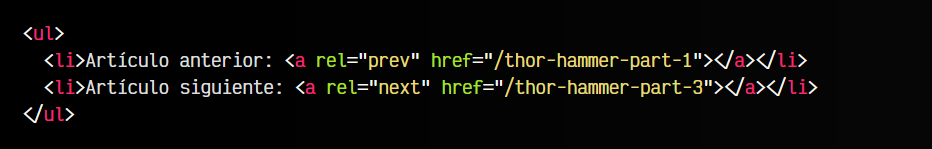

## El atributo type.
Antiguamente, en versiones anteriores de HTML, el atributo type tenía un peso mayor del que tiene hoy en día, ya que era importante a la hora de detallar tipo de documentos. Sin embargo, hoy en día es puramente un atributo para informar del tipo de recurso que estamos enlazando.

Por ejemplo, podemos establecer el atributo type de un enlace de la siguiente forma:

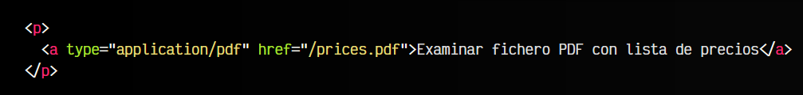

En este ejemplo estamos indicando que el tipo MIME del recurso enlazado es application/pdf que corresponde al tipo [MIME](https://en.wikipedia.org/wiki/Media_type) de los ficheros .pdf. Actualmente esta información se puede omitir, ya que los navegadores no la utilizan.

El tipo MIME de un recurso es un texto formado por dos partes, separado por /, que identifica la naturaleza del recurso utilizado: imágenes, sonidos, etc...

