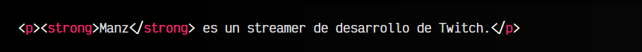
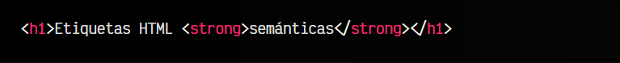
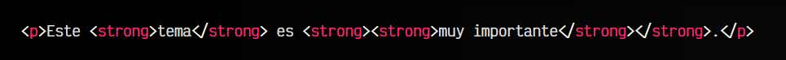
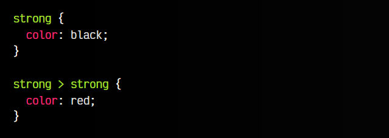

# La etiqueta HTML < strong >.

En algunas ocasiones podríamos querer representar un párrafo de texto donde ciertas palabras clave del discurso, son más importantes que el resto de palabras del mismo. Normalmente, esto es representado mediante textos en negrita, sin embargo, es importante que separemos la cuestión estética o gráfica, de la cuestión semántica:

   - Un texto puede estar en negrita y ser importante.
   - Un texto puede no estar en negrita y no ser importante.
   - Un texto puede estar en negrita y no ser importante.
   - Un texto puede no estar en negrita y ser importante.

De los anteriores cuatro puntos, los dos primeros son los más habituales y que todo el mundo entenderá de forma inmediata. Sin embargo, los dos últimos son algo menos habitual, pero en algún caso nos podría interesar representarlo así en una página.

En el punto 4, el fragmento de texto no está en negrita pero es importante. Es decir, el fragmento de texto es semánticamente importante, pero no visualmente. Justo eso es lo que pretende representar la etiqueta < strong >.

## La etiqueta < strong >.
Mediante la etiqueta < strong > podemos establecer una importancia a una palabra o fragmento de texto que consideremos importante. Se trata de una etiqueta en línea, por lo que se suele utilizar para agrupar texto y no otras etiquetas.

En este ejemplo, la palabra<strong>Manz</strong> ha sido remarcada con una importancia mayor que el resto del texto. Luego, con CSS podemos cambiar su estilo, colores, o incluso quitar la negrita y que se siga viendo como el resto de palabras del párrafo, sin embargo, semánticamente seguirá siendo importante.

Por ejemplo, para un buscador como Google o Bing, aunque visualmente el fragmento de texto no se encuentre en negrita (cuestión visual de CSS), se sabrá que esa palabra es importante porque tiene un marcado HTML que lo establece como tal.

## Partes importantes.
La etiqueta < strong > se puede utilizar dentro de otras etiquetas para enfatizar partes de la misma, como por ejemplo, en un titular < h1 >:

En este ejemplo, no es necesario utilizar una etiqueta < strong > que marcaría en negrita un fragmento de texto que ya está en un encabezado grande y destacado, sin embargo, semánticamente estamos dándole más importancia a la palabra semánticas del titular.

## Etiquetas anidadas.
La etiqueta < strong > se puede anidar sobre sí misma, aumentando la importancia de la etiqueta por cada anidación que corresponda:

En este caso, el fragmento de texto muy importante es más importante que la palabra tema, ya que no tienen el mismo grado de importancia. De hecho, visualmente, podríamos cambiar el estilo de las etiquetas < strong > que estén en el interior de otras etiquetas < strong >:

En este caso los fragmentos de texto muy importantes se verían en rojo, mientras que los importantes se verían en negro.

## La etiqueta < b >.
En versiones anteriores de HTML, existía una etiqueta < b > que se utilizaba para literalmente marcar fragmentos de texto en negrita. Era similar al botón B (Bold) que suelen tener los procesadores de texto como Word o Google Docs.

En HTML5 se reforzó el concepto de semántica, y se derivó el cambio estético de un fragmento de texto exclusivamente a CSS, por lo que la etiqueta HTML debía proveer un concepto semántico. Por esa razón se reemplazo el uso de < b > por < strong >. Sin embargo, en HTML5 sigue existiendo la etiqueta < b >, aunque su utilización es ligeramente diferente.

La etiqueta < b > se utiliza hoy en día para «fines utilitarios», es decir, para marcar como palabras clave pero sin darle ninguna importancia adicional ni ningún tono alternativo. La diferencia respecto a < strong > es que < b > no marca como importante el fragmento de texto.

