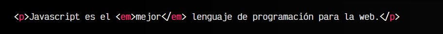
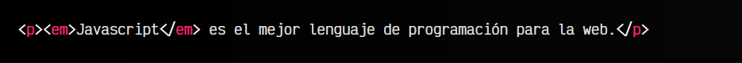
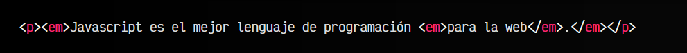
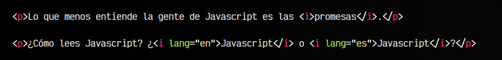

# La etiqueta HTML < em >.

En determinadas situaciones podríamos necesitar enfatizar un texto, sin que necesariamente sea la parte importante del párrafo de texto, ya que eso lo hace la etiqueta < strong >. Simplemente enfatizar una palabra, concepto o fragmento de texto sobre otro, para entender mejor la frase o párrafo.

## La etiqueta < em >.
Mediante la etiqueta < em > podemos darle énfasis a un fragmento de texto, de modo que tenga más relevancia. Por ejemplo, si observamos la siguiente frase y vemos la palabra que tenemos enfatizada comprobaremos como debemos interpretar la frase:

Como se ha hecho énfasis en la palabra mejor, es muy posible que se esté enfatizando porque se está respondiendo a una afirmación previa donde se dice, por ejemplo, que «Javascript es el peor lenguaje de programación para la web». Cambiemos la palabra enfatizada para comprobar como cambia el significado:

Ahora, la palabra enfatizada es Javascript, lo que podría implicar que estamos enfatizando esa palabra porque antes alguien ha insinuado que otro lenguaje era el mejor lenguaje de programación para la web.

Discutir para convencer a alguien de cuál es el mejor lenguaje de programación es algo de novatos. ¡No lo hagas! Al buen programador le gusta programar en cualquier lenguaje.

## Etiquetas anidadas.
Es posible anidar elementos < em > unos dentro de otro. Por ejemplo, enfantizar de forma anidada múltiples fragmentos diferentes. Por ejemplo, observa el siguiente código:

En este caso, no sólo se está enfatizando toda la oración, lo que podría implicar que se insiste en transmitir el mensaje íntegro, sino que además enfatizamos el fragmento para la web, lo que podría implicar que estamos refiriéndonos a que Javascript es el mejor lenguaje de programación exclusivamente de los lenguajes orientados para la web.

## La etiqueta < i >.
Antiguamente, en versiones anteriores de HTML, la etiqueta < i > era utilizada para establecer en cursiva los textos de un documento web. Su uso era similar al botón I de los procesadores de textos como Word o Google Docs.

Como era un simple detalle de apariencia o visual, en HTML5 eso se desplazó a CSS y se buscó una forma alternativa de tener un concepto que no estuviera ligado a una custión visual. Así pues, la etiqueta < i > fue desplazada por la etiqueta < em >, utilizada para enfatizar textos como lo hacíamos con las cursivas.

La etiqueta < i > sigue presente en HTML5, sin embargo, ha cambiado ligeramente su uso. Actualmente, la etiqueta < i > se utiliza para representar un fragmento de texto con un tono de voz alternativo, un término técnico, un texto en otro idioma, un pensamiento, etc...

Observa que en el caso de utilizar la etiqueta < i > para representar un texto en otro idioma, lo ideal sería aplicarle el atributo lang para determinar el código del idioma específico.

