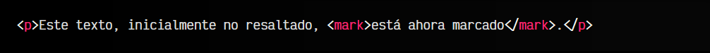

# La etiqueta HTML < mark >.

En ciertos casos nos puede interesar utilizar una etiqueta HTML para destacar ciertos fragmentos de textos y dirigir la atención del lector a dichos textos. Es el caso de las etiquetas que vamos a detallar a continuación.

## La etiqueta < mark >.
La etiqueta < mark > permite destacar un texto sobre el resto, de forma intencionada, de modo que el lector observe que se está intentando dirigir la atención a este fragmento de texto. Es exactamente el caso de los rotuladores de colores que utilizamos para resaltar un fragmento de texto en un libro de texto para destacarlo.

Habitualmente, este fragmento de texto se resalta visualmente con un color amarillo de fondo, similar a cuando resaltas con un rotulador amarillo, sin embargo, mediante CSS podríamos cambiar sus colores e incluso eliminarlos, de modo que el fragmento de texto siga semánticamente resaltado, pero visualmente sin resaltado aparente.

html:

css:

vista:

De esta forma podemos cambiar el color del rotulador de modo que encaje más con el diseño de la página en cuestión.

En definitiva, la etiqueta < mark > permite resaltar un texto, teniendo en cuenta que inicialmente no se encontraba destacado, pero actualmente lo está porque es relevante para el usuario.

## La etiqueta < u >.
En versiones anteriores de HTML, la etiqueta < mark > no existía, y su etiqueta equivalente más similar era < u >. La etiqueta < u > permitía subrayar fragmentos de texto para recalcarlos, similar a como lo hace el botón U de un procesador de textos como Word o Google Docs.

Sin embargo, los fragmentos de texto subrayados en páginas webs suelen confundir, ya que evocan a un enlace, que generalmente se representan con un subrayado azul.

Por esa razón, y porque el subrayado es sólo un detalle visual, en HTML5 se desplazó su uso por el de la etiqueta < mark >. Actualmente, la etiqueta < u > sigue existiendo en las versiones actuales de HTML5, pero su utilización se ha desplazado a destacar textos mal escritos o en un contexto que no es el actual (por ejemplo, un nombre en otro idioma diferentes al actual).

