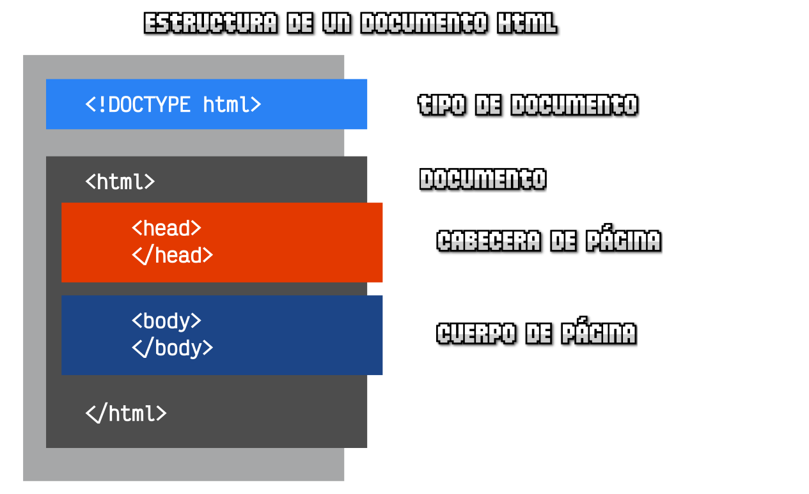
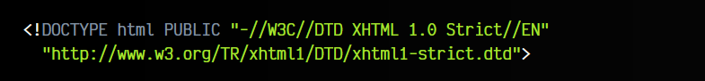
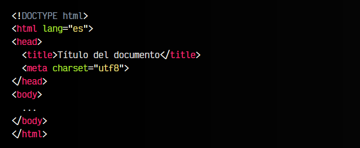

# 
Estructura del documento HTML5

Un documento HTML debe estar bien formado para que el navegador pueda leerlo correctamente. Para ello, debe tener una estructura inicial bien definida, con ciertas etiquetas HTML obligatorias y algunas características recomendables. En principio, necesitaremos diferenciar la estructura del documento en tres partes.

## Estructura de la página.
Observa que tenemos una zona superior (en azul claro) que es el tipo de documento. Luego, abrimos la etiqueta < html > que contendrá dos partes principales: la cabecera del documento (en naranja) y el cuerpo del documento (en azul oscuro):

Analicemos cada una de estas partes.

## El DOCTYPE (tipo de documento).
El !DOCTYPE o tipo de documento es una etiqueta especial que se escribe en la primera línea del documento HTML. Debe ir especificado siempre para que el navegador sepa de que tipo de documento HTML se trata. Es una etiqueta obligatoria, pero de no indicarla, la página web probablemente continuaría visualizándose de forma correcta, pero traería algunas pequeñas consecuencias de las que hablaremos más adelante.

Antes de comenzar un documento HTML, en su primera línea, es siempre conveniente indicar el tipo de documento a utilizar. Para indicar que se trata de un documento HTML5 colocaremos la siguiente linea:

En versiones anteriores, como HTML4 o XHTML, el tipo de documento se especificaba en la primera línea de una forma más compleja. Hoy en día estos DOCTYPE no tiene sentido indicarlos:

Los navegadores, antes de comenzar a dibujar una página web, lo primero que hacen es leer la línea donde se indica el tipo de documento del que se trata. De esta forma, el navegador ya está preparado para actuar adaptándose perfectamente a cada tipo de documento.

En el caso de no indicar el tipo de documento en una página HTML, el navegador entra en lo que se llama Quirk mode (modo peculiar o modo no estándar), donde se activa un modo de retrocompatibilidad con páginas antiguas, que procesará de forma diferente muchas etiquetas HTML o propiedades CSS.

## La etiqueta head (metadatos).
Cuando hablamos de la etiqueta < head > de un documento HTML, muchas veces la denominamos cabecera HTML. Sin embargo, esta cabecera no es una parte visual de la página web, sino una parte de nuestro código HTML donde se incluyen ciertas etiquetas de metadatos, es decir, unas etiquetas que establecen ciertos datos que no tienen que verse necesariamente de forma visual.

Algunos ejemplos de metadatos de un documento HTML podrían ser los siguientes:

   - Título de la página web (aparece en la pestaña del navegador). Esta etiqueta es obligatoria.
   - Descripción de la página (aparece en los resultados de Google)
   - Miniatura/preview de la página (aparece al poner enlace en redes sociales)
   - Icono de la página (aparece en la pestaña del navegador)

También es el lugar indicado para incluir etiquetas que relacionen el documento actual con otros documentos externos (por ejemplo, para cargar los estilos .css o ficheros javascript .js).

► [Más información sobre metadatos HTML](https://lenguajehtml.com/html/cabecera/etiqueta-html-meta/)

## La etiqueta body (cuerpo).
La otra parte principal de un documento HTML es la etiqueta < body >. Todos los elementos visuales de una página se encuentran en el interior de la etiqueta < body >, por lo que es una de las partes más importantes de una página web. Esta sección va inmediatamente después del cierre de la etiqueta </ head >.

En definitiva, la estructura principal de un documento HTML debe ser, como minimo de algo similar a lo siguiente:

En muchos editores, que disponen de una extensión llamada EMMET, basta con guardar el fichero con extensión .html y escribir ! y pulsar la tecla TAB para que se nos autocomplete este fragmento de código base. Más adelante veremos algunas de las etiquetas anteriores que aún no se han mencionado.

