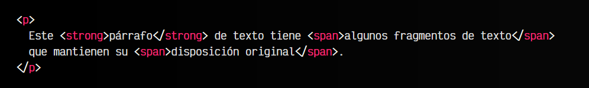

# La etiqueta HTML < span >.

Hasta ahora, probablemente hayas utilizado la etiqueta < div > en tus documentos HTML. Se trata de una etiqueta que sirve para agrupar otras etiquetas y organizar la información de tu código HTML. Las etiquetas < div > son una de las etiquetas HTML más populares y se trata de una etiqueta de bloque.

## La etiqueta < span >.
La etiqueta < span > es la versión en línea de una etiqueta < div >. Mientras que esta última se utiliza para agrupar otras etiquetas variadas, agruparlas y organizarlas de forma semántica o con cierto sentido, la etiqueta < span > permite hacer lo mismo con fragmentos de texto, sin cambiar el flujo del mismo.

Habrás observado que si en un párrafo de texto utilizas < div > para delimitar ciertas palabras o frases, los párrafos se interrumpen y separan del resto, lo que arruinaría la experiencia de leer un párrafo. Las etiquetas < span >, al ser elementos en línea, no modifican la disposición de los elementos y mantienen la fidelidad original del párrafo.

Por su parte, la etiqueta  < span > es una versión en linea de la etiqueta < div >, ya que su misión es agrupar contenido de texto, mientras que la misión del < div > es agrupar otras etiquetas HTML que a su vez pueden agrupar otras y otras etiquetas HTML.

## Significado de < span >.
Al igual que la etiqueta < div >, las etiquetas < span > no tienen un significado concreto, más allá de separar un fragmento de texto para un motivo específico, entre los que cabe destacar los siguientes:

   - Aplicar una clase y darle estilo visual.
   - Aplicar un atributo lang e indicar un idioma diferente para este fragmento.
   - Aplicar un atributo dir e indicar una direccionalidad de texto diferente para este fragmento.

Como ves, son ejemplos donde realizamos una separación del texto para dotarle de un contexto diferente al resto del texto.

## Etiquetas anidadas.
Es posible anidar etiquetas < span > unas dentro de otras, pero no olvides que se trata de una etiqueta en línea. Esto significa que puedes anidar otras etiquetas en línea dentro de ellas, pero nunca una etiqueta en bloque.

Por ejemplo, el siguiente fragmento de código sería válido:

También sería válido si el < strong > interior fuera una etiqueta < span >. Sin embargo, aunque el siguiente fragmento de código es sintácticamente correcto, no sería válido porque contiene un elemento de bloque (la etiqueta < div >) en el interior de un elemento en línea:

