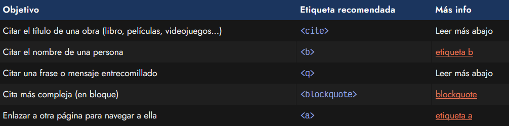
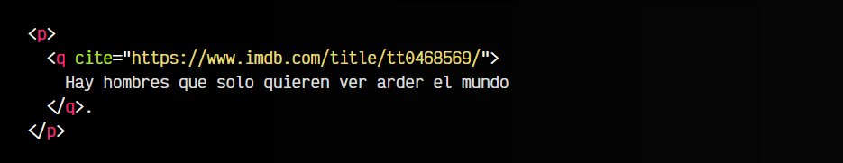
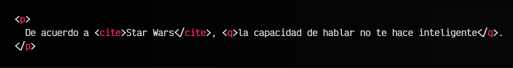

# La etiqueta HTML < q > y .

Si al redactar un texto en un documento web necesitamos hacer referencia a otra cosa, probablemente tengamos dudas de que elemento HTML utilizar para hacer la referencia. Existen varias etiquetas HTML que podrían ser apropiadas, vamos a explicar como funcionan y en que casos debemos utilizarlas:

## La etiqueta < q >.
La etiqueta HTML < q > se utilizar para hacer referencia a una frase o mensaje desde otra fuente o contexto. Casos de uso típicos son citar una frase, un mensaje entrecomillado de otra persona, etc. Sin embargo, algunos casos no son los más apropiados para esta etiqueta < q >:

   - ✅ Citar frases, mensajes entrecomillados, etc...
   - ❌ Título de una obra
   - ❌ Nombre de una persona
   - ❌ Enlace de navegación a otra página

Así pues, un uso correcto de la etiqueta < q > podría ser el siguiente:

## El atributo cite.
Obsérvese que en esta etiqueta disponemos de un atributo opcional cite, mediante el cuál podemos hacer referencia a una URL donde aparece la fuente a la que hacemos referencia (en el siguiente ejemplo, a la ficha de la película de Batman), que es de donde procede la frase:

En algunos casos, estas frases se pueden simplemente citar entre comillas sin necesidad de utilizar la etiqueta < q >. Sin embargo, en el caso de que utilicemos la etiqueta < q >, no debemos añadir el entrecomillado, ya que el propio navegador lo hará por nosotros.

Es importante tener en cuenta que no hemos creado un enlace para que el usuario navegue y acceda a esa página. Esos enlaces se crean mediante una etiqueta < a > que veremos más adelante. El atributo cite sólo añade la información como metadatos para obtenerla a través de Javascript.

## La etiqueta < cite >.
La etiqueta HTML < cite > nos permite hacer referencia para mencionar y destacar el título de una obra. Algunos usos correctos e incorrectos de la etiqueta < cite > serían los siguientes:

   - ✅ Título de una obra
   - ❌ Nombre de una persona
   - ❌ Citar frases, mensajes entrecomillados, etc.
   - ❌ Enlace de navegación a otra página

Cuando hablamos del título de una obra, nos referimos a múltiples opciones, entre las que se podrían encontrar las siguientes (entre otras):

   - Título de un libro
   - Artículo de un blog, revista o prensa
   - Ensayo o poema
   - Partitura o canción
   - Escultura o cuadro
   - Película o serie de televisión
   - Exhibición u obra de teatro
   - Programa (software) o videojuego

Veamos un ejemplo donde la etiqueta < cite > estaría bien usada:

En este caso hacemos referencia a una frase de Qui-Gon Jinn, en la película de Star Wars: Episodio I.

Recuerda que si lo que quieres hacer es referenciar otra página para que el usuario pueda navegar a ella, lo que necesitas es un enlace < a >.

