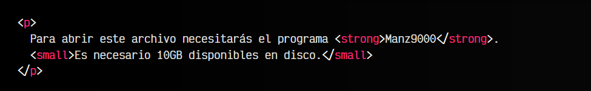
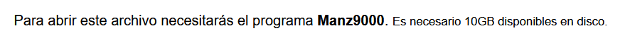

# La etiqueta HTML < small >.

En algunas ocasiones, en un documento, necesitamos hacer pequeñas aclaraciones de ciertas partes del texto. Habitualmente, estas aclaraciones se hacen en una letra de tamaño más pequeño, que el lector puede leer si quiere profundizar o aclarar la información referenciada.

## La etiqueta < sup >.
La etiqueta < small > nos permite realizar justo eso: aclaraciones, advertencias o avisos que generalmente se establecen en letra pequeña en un documento, que no forman parte del discurso general del documento, sino de una aclaración o detalle en profundidad sobre uno de los temas tratados.

Un ejemplo podría ser el siguiente:

html:

vista:

Nuevamente, el significado de la etiqueta < small > es semántico, y a pesar de que la etiqueta se llame small, el aspecto visual lo decide el autor de la página, por lo que sería cuestión de establecer el tamaño en CSS si queremos cambiarlo, hacerlo más grande o dejarlo del tamaño del resto del texto.

También recuerda que el texto incluido en la etiqueta < small > no tiene ninguna importancia o enfatización diferente del resto del texto, salvo que incluya etiquetas como < strong >, < em > o similares.

## La etiqueta < big > .
Antiguamente, en versiones anteriores de HTML, las etiquetas < small > y < big > se utilizaban simplemente para aumentar o reducir el tamaño del texto. Hoy en día, como esto no es un concepto semático, sino visual, se realiza desde CSS mediante la propiedad font-size. La etiqueta < big > ha desaparecido de HTML y la etiqueta < small >, aunque sigue existiendo, ya no se utiliza para reducir el tamaño del texto.

