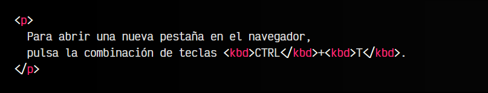
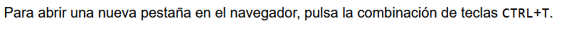
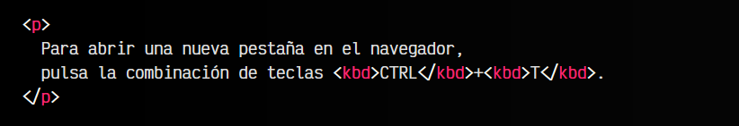
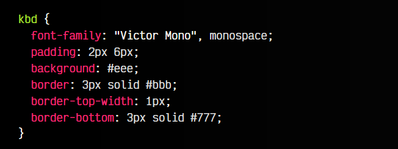
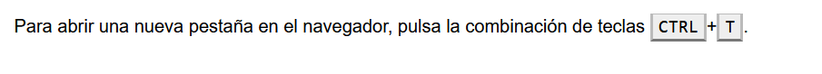
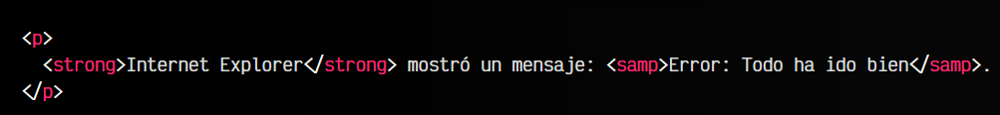
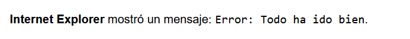

# 
La etiqueta HTML < kbd > y < samp >.

En un documento HTML podríamos querer representar la entrada de datos o información por parte del usuario. Por ejemplo, en un documento debemos representar lo que debe indicar el usuario para realizar una acción.

Esta entrada de datos, generalmente, se hace por medio de un teclado, aunque también podrían utilizarse otras vías como comandos de voz o similares.

## La etiqueta < kbd >.
La etiqueta < kbd > se utiliza precisamente para representar la entrada de datos por parte del usuario. El nombre de la etiqueta proviene de keyboard, ya que tradicionalmente siempre se ha utilizado el teclado para proporcionar información por parte del usuario.

El ejemplo más común y fácil de entender es la entrada de datos mediante combinaciones de teclado para realizar una acción determinada.

## Combinaciones de teclas.
Veamos un ejemplo práctico de la etiqueta < kbd >. Necesitamos indicar al lector que al pulsar una cierta combinación de teclas, podrá abrir una nueva pestaña en el navegador.

Para ello, haremos lo siguiente:

html:

vista:

Ahora, podemos aprovechar CSS para dar estilo a estas etiquetas y que simulen ser teclas del teclado:

html:

css:

vista:

## La etiqueta < samp >.
La etiqueta < samp > es la opuesta a la etiqueta < kbd >. Si la última representa la entrada de datos por parte del usuario a la máquina, la etiqueta < samp > nos permite representar la salida de la información que proviene de una máquina, hacia el usuario.

Mediante esta etiqueta podemos mostrar la salida de un programa o sistema a un usuario:

html:

vista:

De esta forma, podemos indicar tanto entrada como salida de datos desde una máquina.

