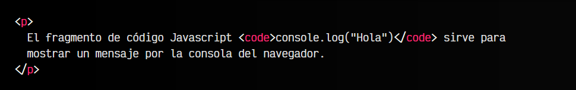

# 
La etiqueta HTML < time > y < data >.

Hay que tener en cuenta que nuestro documento web está formado por código. ¿Cómo podemos hacer si queremos mostrar visualmente código? Ya que si escribimos un fragmento de código, el navegador lo interpretará y mostrará el resultado. Para esto, existe la etiqueta < code >.

## La etiqueta < code >.
Mediante la etiqueta < code > indicamos al navegador que el texto que incluyamos en su interior, debe ser interpretado visualmente como un fragmento de código. Esto lo hace muy interesante para mostrar fragmentos de código en nuestra página.

Veamos un ejemplo:

html:

vista:

En este caso, el fragmento de código console.log("Hola") se mostrará con una tipografía monoespaciada, como las utilizadas en terminal, y el navegador lo interpretará semánticamente como un fragmento de código. De hecho, podríamos utilizar CSS para modificar su aspecto y que se vea más acorde con su naturaleza:

html:

css:

vista:

En este caso, hemos indicado al navegador que los fragmentos de código deben mostrarse en color azul, con un peso de tipografía más gruesa. Nótese también que la etiqueta < code > se utiliza para fragmentos de código fuente cortos en línea. Es decir, esta etiqueta por si solo se debe utilizar para indicar un fragmento de código en mitad de un párrafo o en una conversación o diálogo, como por ejemplo un párrafo.

Si lo que quieres es crear bloques de código extensos, se suele utilizar la etiqueta de texto preformateado < pre > junto a la etiqueta < code >. De esta forma, el fragmento de código mantendrá sus espacios en blanco y formato, por lo que es mejor para mostrarlos:

Tienes más información sobre esto en el siguiente artículo: [bloques de código con la etiqueta < pre >.](https://lenguajehtml.com/html/agrupacion/etiqueta-html-pre/)

## Código HTML dentro de < code >.
Quizás te habrás dado cuenta de un pequeño problema, relacionado con las etiquetas < code >. Si quisieramos indicar código HTML literalmente en nuestro documento, este se interpretaría por el navegador, renderizando la etiqueta en lugar de mostrando el código.

Para evitar esto, hay una forma muy sencilla que es reemplazar los carácteres < por "&"lt; (less than) y > por "&"gt; (great than). Al realizar ese cambio, observarás que las etiquetas se muestran literalmente: