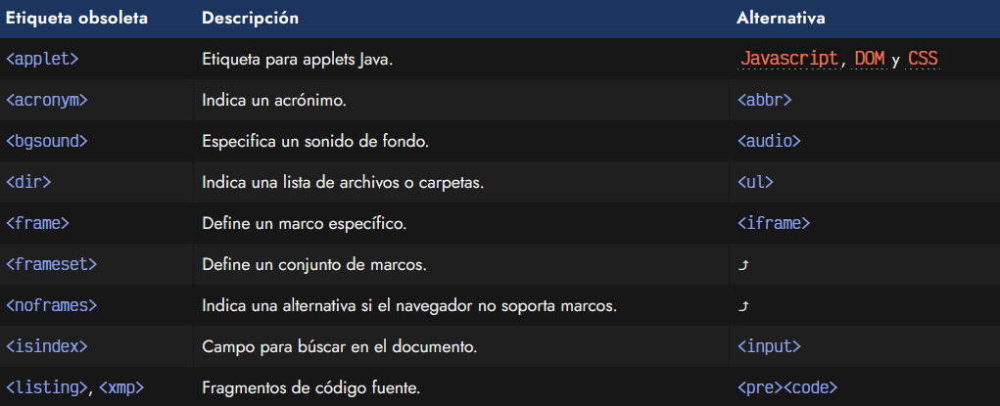
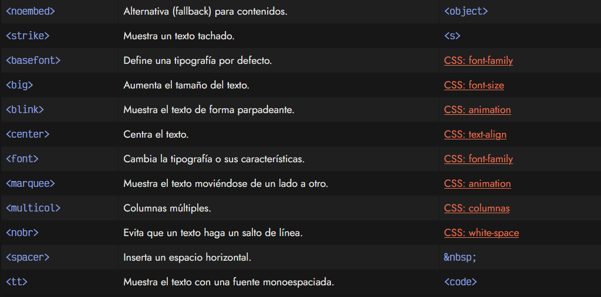
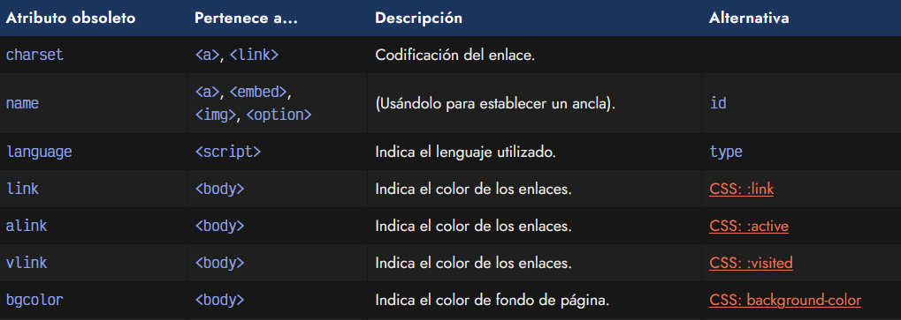
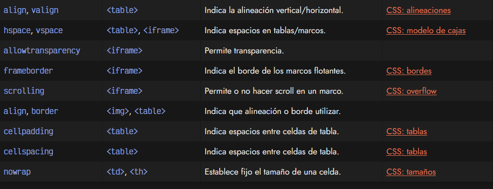

# 
Etiquetas HTML obsoletas

Con el paso del tiempo y la transición desde versiones anteriores a HTML5 (por ejemplo, desde HTML4 o XHTML), hay muchas etiquetas HTML que han sido marcadas como obsoletas y se recomienda dejar de utilizarlas cuanto antes. Es muy posible que algunas incluso funcionen aún en navegadores actuales, pero esto ocurre por retrocompatibilidad y llegará un momento que dejarán de ser soportadas por el navegador.

A continuación presento una lista de las etiquetas HTML consideradas obsoletas que no deberían utilizarse actualmente, junto a una alternativa actual para hacer algo similar a lo que ofrecían.

## Etiquetas obsoletas.
Las siguientes etiquetas ya no se utilizan en HTML5 y han sido marcadas como obsoletas. Se recomienda no utilizarlas o utilizar una de las alternativas propuestas:

## Atributos obsoletos.
De la misma forma que ocurre con las etiquetas, existen una serie de atributos que estaban presentes en ciertas etiquetas que han pasado a dejar de utilizarse. A continuación muestro la lista de algunos de estos atributos:

Recuerda que si encuentras alguna de estas etiquetas o atributos HTML, aunque funcionen en un navegador actual, están marcadas como obsoletas y deberían ser evitadas a favor de su propuesta alternativa.
