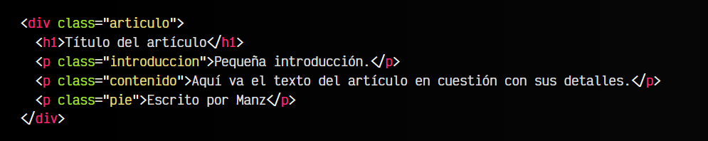
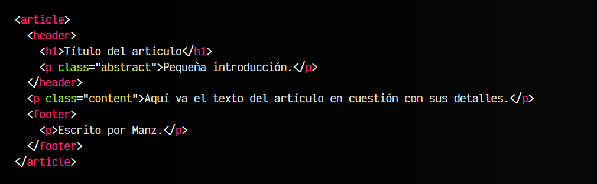
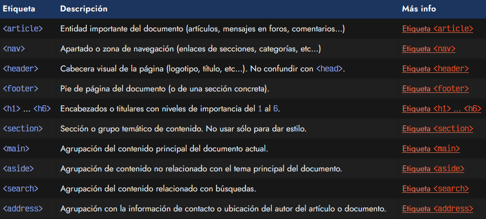

# 
Etiquetas semánticas de sección.

En versiones anteriores a HTML5, al crear la estructura de una página, normalmente utilizabamos etiquetas < div > para ir agrupando secciones diferentes. Unido a esto, ibamos añadiendo los atributos id o class dependiendo de nuestro interés, para que quedase más claro.

De hecho, hoy en día aún es muy habitual crear una estructura de etiquetas basada en simplemente etiquetas HTML < div > que no proporcionan ninguna información adicional, aunque existan etiquetas alternativas mucho más apropiadas.

## Estructura HTML no semántica.
Una estructura como la que menciono podría ser la siguiente:

Observemos esta estructura donde tenemos una agrupación que contiene todos los elementos de un artículo. La estructura podría ser más sencilla o más complicada, pero nos viene bien como ejemplo de introducción para este tema:

   - El primer elemento es un encabezado o titular < h1 >
   - Luego tenemos un párrafo < p > de introducción
   - A continuación, un párrafo < p > de contenido
   - Por último, un párrafo < p > a pie de artículo
   - Todo ello, en el interior de un < div > para agrupar

Nótese que los elementos utilizados < div > y < p > no tienen una semántica específica, salvo que son etiquetas de agrupación. En HTML5 se introducen una serie de etiquetas semánticas de agrupación que aunque funcionan exactamente como un < div >, añaden significado semántico porque indican la naturaleza de la información que contendrán y no tenemos que leerlo previamente o fijarnos en la clase (que además puede estar en múltiples idiomas).

## Estructura HTML semántica.
Ahora, veamos el ejemplo anterior, que carece de semántica HTML, utilizando las etiquetas semánticas de sección que proporciona HTML5:

Repasemos los cambios que hemos hecho:

   - Hemos introducido el título e introducción en una cabecera < header >
   - Hemos cambiado el nombre de clase de la intro a inglés: abstract
   - Lo mismo con el párrafo de contenido con clase .content
   - Hemos introducido el pie de página en un elemento < footer >
   - Todo ello, en el interior de un elemento < article > para agrupar

De esta forma, preparamos nuestro documento HTML para que cualquier navegador, robot de buscador o aplicación o sistema informático sea capaz de leer el documento HTML y conocer perfectamente la naturaleza del contenido de dicha sección.

## Estructura HTML semántica.
Veamos un listado de las etiquetas semánticas que se introducen en HTML5 (los encabezados ya existían de versiones anteriores):

