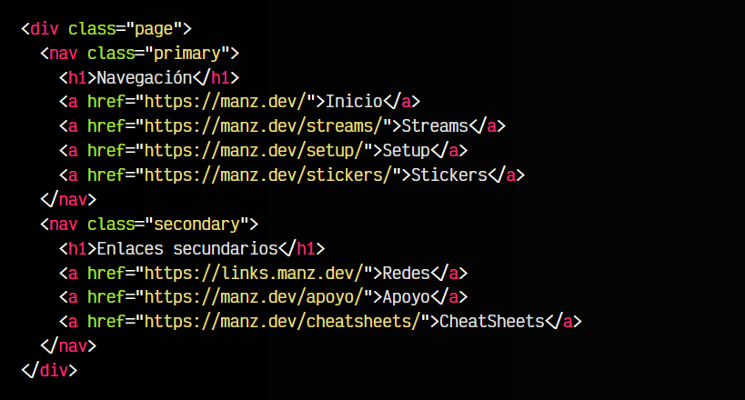

# 
La etiqueta HTML < nav >.

Entre todos los elementos HTML que conforman la web, es muy probable que haya una sección de enlaces que aglutine los enlaces que utilizamos para navegar por las diferentes páginas principales de la web. Aquí es donde nace la utilidad de la etiqueta < nav >.

## La etiqueta < nav >.
La etiqueta < nav > nos permite crear una sección que agrupe los enlaces de navegación por la página, es decir, una especie de < div > contenedor orientado a desplazarse por los diferentes lugares del sitio web.

Por ejemplo, este fragmento de código sería el de una agrupación de enlaces de navegación por la página, sin utilizar la semántica de la etiqueta de sección < nav >: 

Por el contrario, si en lugar de utilizar el < div > utilizamos la etiqueta < nav >, se sobreentiende que los enlaces del interior son para desplazarse a las diferentes secciones del sitio web:

## Múltiples elementos < nav >.
Es posible tener varios elementos < nav > en nuestro sitio, ya que por ejemplo, quizás necesitemos una segunda o tercera agrupación de enlaces de navegación porque visualmente están separados de los demás bloques. En ese caso, se pueden utilizar nuevos elementos < nav > para agrupar enlaces de navegación.

No todos los grupos de enlaces de navegación deben estar en el interior de un elemento < nav >. Por ejemplo, si un grupo de elementos de navegación ya está contenido por otro bloque semántico como < footer> o < header >, puede no ser necesario. 