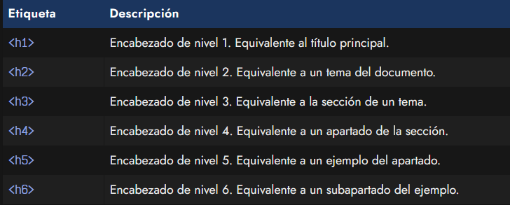
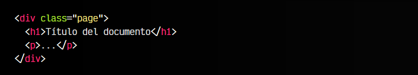
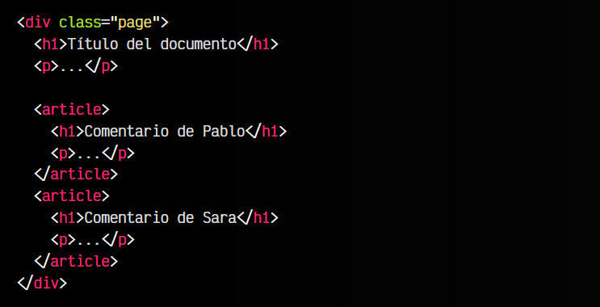
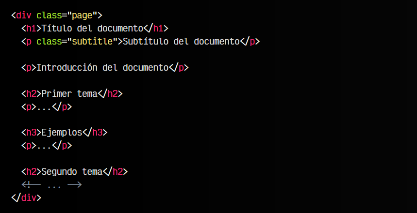
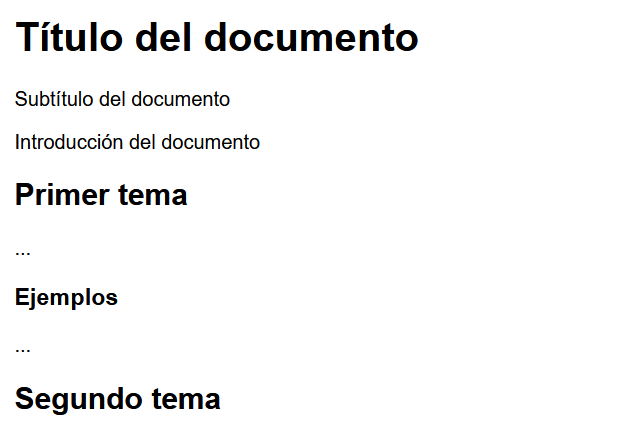
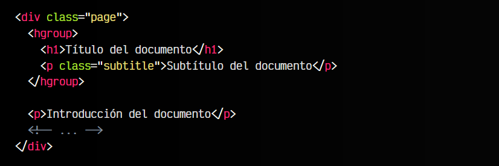

# 
La etiqueta HTML < h1 > ... < h6 >.

En un documento web muchas veces necesitaremos escribir un títular o encabezado que destaque del resto del texto. Necesitaremos que sea un texto grande y llamativo, y también necesitaremos en varios puntos del documento escribir diferentes titulares con diferente grado de importancia, similar a un resumen o esquema.

Para ello, tenemos las etiquetas de titulares o encabezados desde < h1 > hasta < h6 >

Como ves, cada uno de ellos tiene una importancia menor, y está directamente asociado al elemento de nivel anterior.

## La etiqueta < h1 >.
a etiqueta < h1 > es el titular con más importancia del documento. Esta cabecera es casi equivalente al título del documento, salvo que esté agrupada por un elemento semántico, en cuyo caso sería el título de ese elemento semántico.

Existe un mito que indica que una página solo debería tener un solo elemento < h1 >. Aunque esto muchas veces es conveniente, no tiene porque ser así estrictamente por página. Como vimos en el tema de semántica de secciones < header > y < footer >, un elemento < h1 > puede aparecer varias veces por página, porque depende de su contenedor semántico padre.

Es posible que existan múltiples < h1 > por documento o página, pero normalmente sólo habrá uno por entidad importante:

Como ves, en este caso, hay varios elementos < h1 > por página, ya que cada < h1 > es un elemento título de cada entidad < article > o documento general, en el caso de la primera. En titular hace referencia a su padre semántico más cercano.

Es importante que recuerdes que los titulares no son elementos meramente visuales. Nosotros podríamos cambiar el CSS para que los titulares < h1 > sean visualmente más pequeños que los < h2 >, pero semánticamente seguirán teniendo más importancia.

## Las etiquetas < h2 > ... < h6 >.
Las etiquetas < h2 >, < h3 >, < h4 >, < h5 > y < h6 > son titulares de importancia menor a < h1 > que van reduciendo su importancia a medida que avanza el número o nivel. Pueden repetirse, es decir, una página puede tener múltiples etiquetas < h2 > (de hecho, suele tenerlas) y no existe un < h7 > o elementos de nivel superior a < h6 >.

html:

vista:

En principio, los elementos < h2 > y sucesivos no deberían existir si no existe un titular previo. Es decir, si tenemos un elemento < h3 > en nuestro documento, debería existir un elemento < h2 > y un elemento < h1 > previamente.

## La etiqueta < hgroup >.
Aunque la historia del etiqueta < hgroup > ha sido accidentada, y durante un tiempo estuvo marcada como obsoleta, hace poco ha vuelto al estándar HTML5. La etiqueta < hgroup > es una etiqueta que podemos utilizar para agrupar titulares con contenido relacionado.

Por ejemplo, podríamos utilizar < hgroup > para agrupar varias etiquetas < h1 > ... < h6 > y elementos de párrafo < p > que representen cosas relacionadas. Veamos el ejemplo anterior:

html:

vista:

En este caso, el subtítulo del párrafo en cuestión es un elemento que depende del título < h1 >, por lo que tiene sentido agruparlo con la etiqueta < hgroup >. Ya sería tarea de CSS darle estilo para que visualmente quede a nuestro gusto, pero semánticamente estaría correcto.