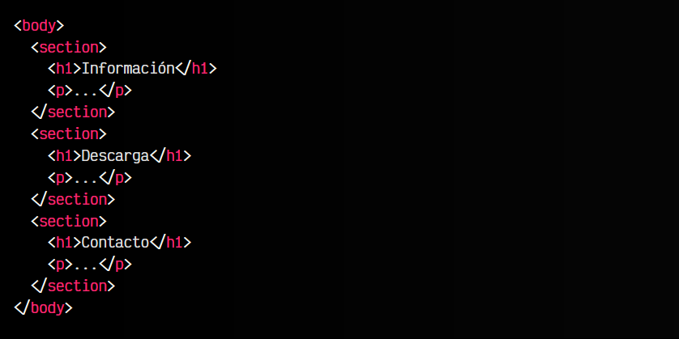
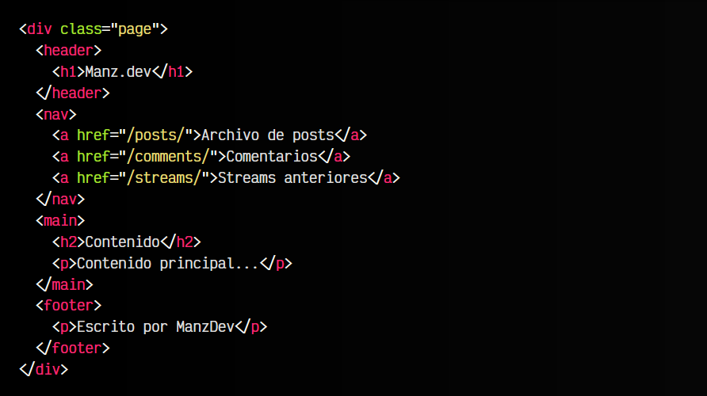
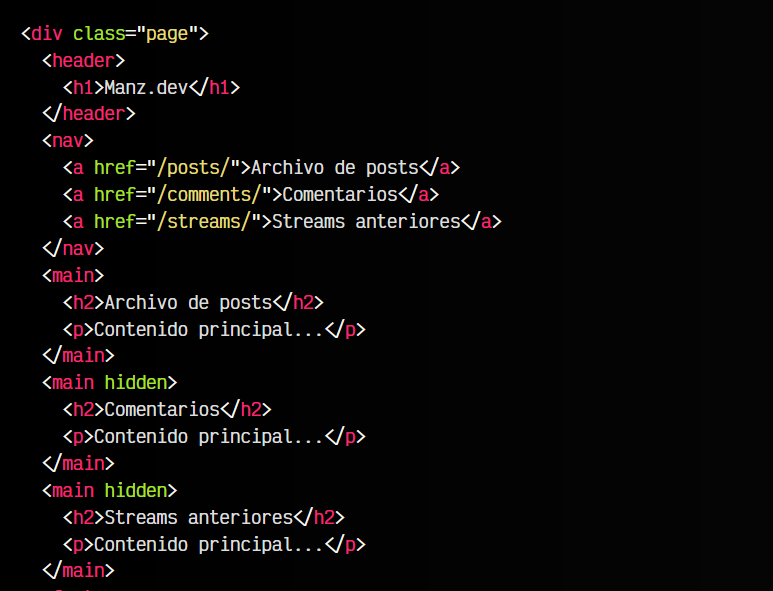
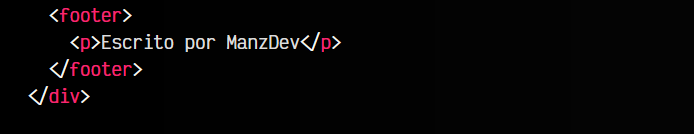
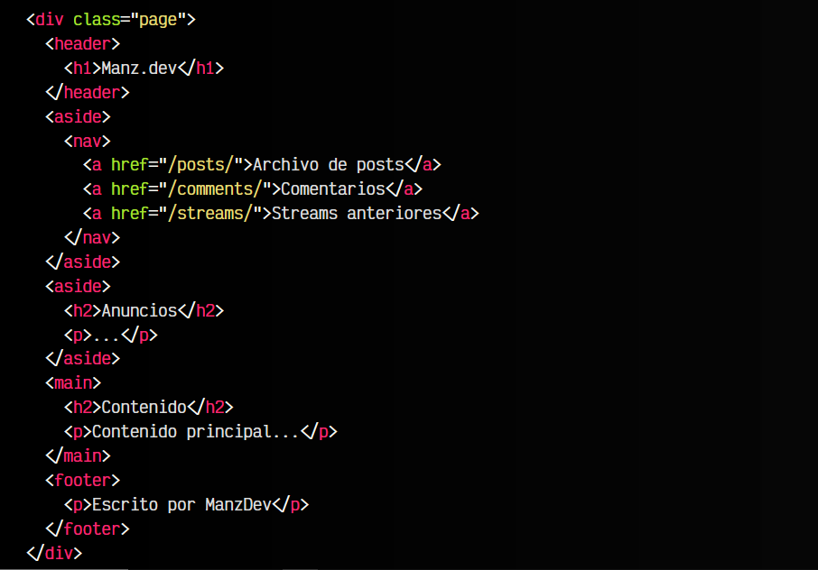

# 
La etiqueta HTML < section >.

Cuando estamos diseñando la estructura de nuestra página, sería conveniente determinar las secciones principales de nuestra web para así delimitarlas bien. Muchas veces, es muy útil disponer de las siguientes etiquetas.

## La etiqueta < section >.
Mediante la etiqueta < section > es posible crear apartados para una web, de modo que las mantenemos separadas. Muchas veces no suele estar clara que etiqueta utilizar, así que vamos a simplificar y generalizar los pasos:

   - 1️⃣ Si sólo queremos dar estilo o separar una sección genérica, usaremos un < div >.
   - 2️⃣ Si tenemos algo dividido en varios apartados, usaremos < section > para cada uno de ellos.
   - 3️⃣ Si dicha sección es una parte muy importante de esa URL, usa < article > en lugar de < section >.
 
Veamos un ejemplo utilizando las etiquetas semánticas < section> :

Varios ejemplos que podrían encajar en la definición de una sección:

   - ✅ Cada una de las secciones de una página web.
   - ✅ Cada capítulo de un documento.
   - ✅ Cada una de las pestañas o tabs de un cuadro de diálogo.
   - ✅ Cada una de las secciones numeradas de un documento.

Es importante tener claro que hay situaciones en las que podríamos tener un < article > que contiene varios < section >, así como se puede tener una página con múltiples < section > que contienen < article >. Ambas opciones podrían ser válidas, dependiendo del caso.

## La etiqueta < main >.
La etiqueta < main > es una etiqueta de agrupación general que debe utilizarse para representar el contenido dominante y principal del documento. De forma habitual, esta etiqueta suele ser elemento hijo de etiquetas como < body >, < div >, < form > o webcomponents.

Veamos un ejemplo de uso:

Observa que la etiqueta < div > con clase page tiene 4 hijos: la cabecera < header >, la zona de navegación < nav >, la etiqueta < main > con el contenido principal y la etiqueta < footer > con la información de pie de página.

## El atributo hidden.
En principio, la etiqueta < main > sólo debería aparecer una vez por página, sin embargo, puede darse la posibilidad de que aparezca varias veces en un mismo documento si todas contienen el atributo hidden, salvo una. El atributo hidden es un atributo global que se puede utilizar en cualquier etiqueta, sin embargo, en esta etiqueta es bastante frecuente usarlo si tenemos la necesidad de incluir múltiples etiquetas < main >.

Ampliemos el ejemplo anterior, en este caso incluyendo las 3 secciones bajo la etiqueta < main >, donde la primera de ellas está «visible» y el resto tienen el atributo hidden:

De esta forma, podemos simular un documento donde cada etiqueta < main > es una sección principal, donde todas estarán ocultas porque no tienen el foco principal, y que podremos ir accediendo a cada una de ellas, si las vamos gestionando desde Javascript.

## La etiqueta < aside >.
Se podría decir que la etiqueta < aside > es el opuesto a la etiqueta < main >. Mientras la última es una etiqueta que engloba y agrupa el contenido principal de un documento, la etiqueta < aside> permite agrupar contenido que no es considerado el principal de  un documento, es decir, el contenido secundario o que no tiene relación directa con el tema principal del documento.

Ampliemos el ejemplo anterior:

Ejemplos que podrían entrar en esta categoría serían:

   - Menús o sidebars
   - Publicidad
   - Zonas de navegación
   - Enlaces relacionados

Como puedes ver, una documento puede tener tanto una única etiqueta < aside > como múltiples etiquetas < aside >.