# 
Tablas con celdas irregulares.

Como hemos visto en el artículo anterior, es muy sencillo crear tablas HTML básicas. Sin embargo, HTML nos permite crear tablas un poco más complejas, donde queremos crear celdas irregulares que ocupan más o menos espacio en la tabla.

## La etiqueta < th >.
Hemos mencionado que la etiqueta < th > sirve para crear celdas que funcionan como cabeceras de la columna de la tabla. Por defecto, esta celda es una celda normal, algo más destacada visualmente sobre el resto, para que el usuario entienda la naturaleza de los datos que encontrará en esa columna.

Sin embargo, es posible añadirle ciertos atributos para modificar su comportamiento:

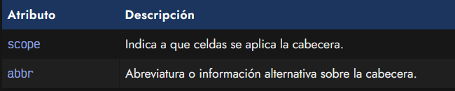

Los valores del atributo scope pueden ser los siguientes:

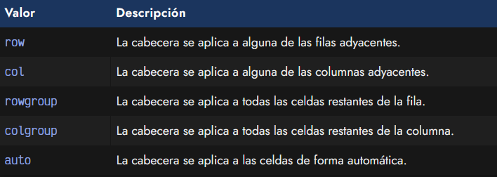

En el caso de no indicar explícitamente ningún valor, el navegador establecerá el valor auto.

Veamos el siguiente fragmento de código donde utilizamos el atributo scope para ejemplificar:

html:
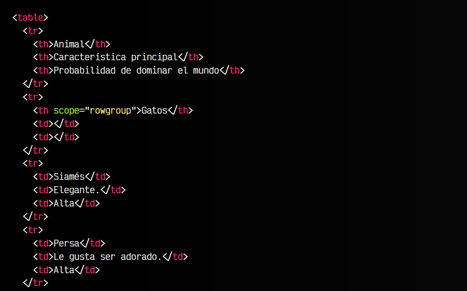
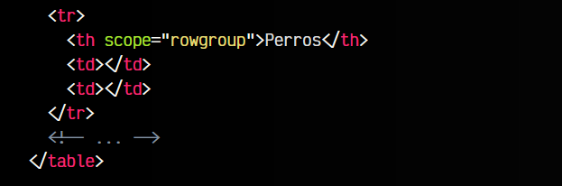

css:
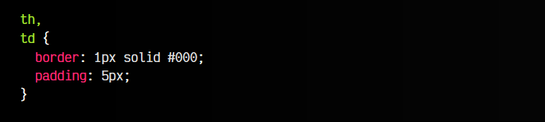

vista:
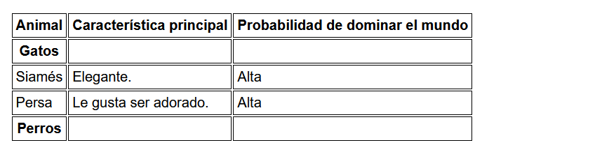

Podemos ver como, al indicar una celda de cabecera con la intención de separar todos los gatos (donde hay varias filas de gatos) de otros animales como los perros, hemos indicado el atributo scope para que tenga en cuenta que desde ese punto hasta la próxima cabecera, las filas pertenecen a esa categoría.

No obstante, observarás que visualmente no cambia nada. Ten en cuenta que esto se hace para dotar de semántica a la tabla, pero no realiza ningún cambio visual. Si quieres que refleje los cambios visuales, mejor echa un vistazo al siguiente apartado.

## La etiqueta < th > y < td >.
Cada etiqueta < td > y < th > puede incluir una serie de atributos para modificar su comportamiento visual y combinar o unir celdas. Probablemente, las más interesantes sean colspan y rowspan:

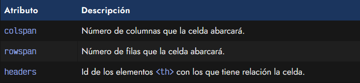

Con estos atributos podemos indicar que ciertas celdas abarquen más espacio y se combinen con el espacio que ocuparía otra celda adyacente y así crear estructuras de tabla más flexibles.

## El atributo colspan.
Vamos a modificar el código HTML de la tabla anterior, haciendo algunos cambios:

   - A las cabeceras con el atributo scope, le añadimos el atributo colspan con valor de 3.
   - Eliminamos las dos etiquetas < td > restantes de esa fila < tr >.

Esto significa que esa etiqueta < th > ahora va a abarcar 3 columnas, por lo que no necesitamos tener un < th > y dos < td > vacíos, sino que le indicamos que nuestro < th > va a ocupar el espacio de 3 celdas:

html:
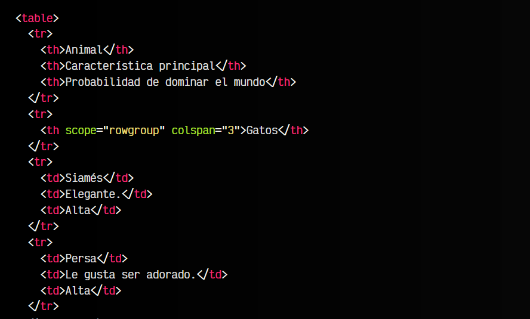
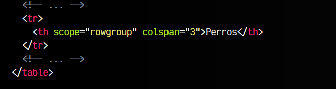

css:
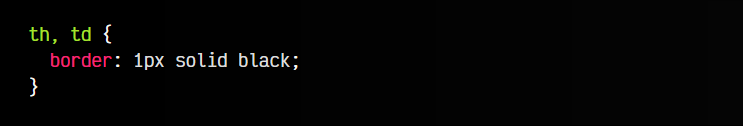

vista:
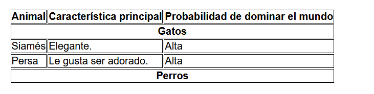

## El atributo rowspan.
El atributo rowspan actuaría exactamente igual que colspan, pero en lugar de afectar a columnas, afectaría a filas. Abarcaríamos las filas en vertical, en lugar de las columnas en horizontal.

Si lo deseamos, también se puede combinar y aplicar el atributo rowspan junto a un atributo colspan, combinando en ambas direcciones. Los atributos colspan y rowspan podrán tener como máximo el número de columnas o filas de la tabla, en el caso de tener un número mayor, simplemente se utilizará el máximo de la tabla.

## El atributo headers.
Por su parte, el atributo headers se le puede aplicar tanto a etiquetas < th > como a etiquetas < td >. En él, se indica el atributo id de otro elemento th para hacer referencia e indicar que la cabecera que actúa con este elemento es la referenciada por el id.

