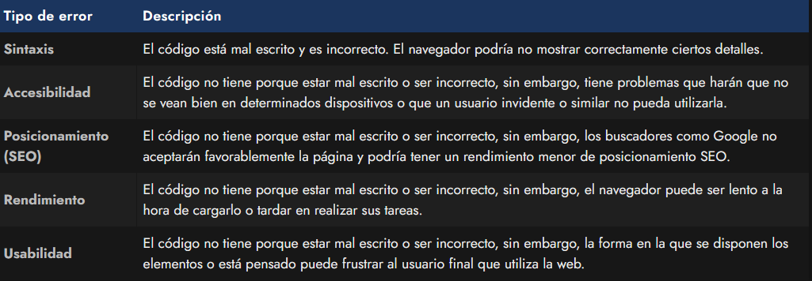
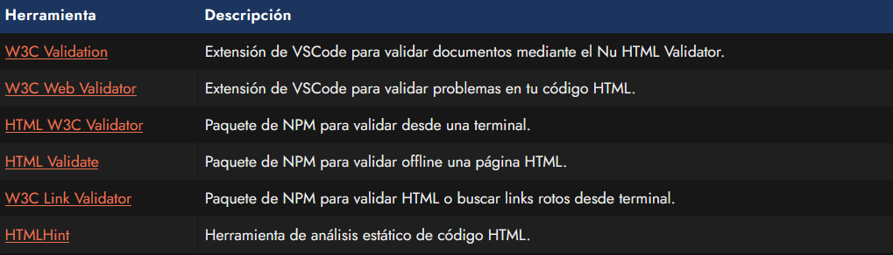

# 
Validación de errores HTML

Si estás empezando con tu primer documento HTML y quieres comprobar si hay errores o existe algún error en el código HTML, te interesará lo que vamos a mencionar a continuación. Los programadores suelen estar acostumbrados a los lenguajes de programación, donde si tenemos un error en nuestro código, debemos corregirlo antes de continuar, ya que en caso contrario no podremos utilizar ese programa.

En los lenguajes de marcas como HTML, los navegadores son más permisivos, ya que en el caso de encontrar un error, intentan «deducir» lo que realmente se quería indicar y continuan con la carga del documento. De esta forma tenemos un método más flexible a errores, pero también es un arma de doble filo donde podemos experimentar problemas derivados.

## Tipos de problemas.
En nuestro código HTML podemos tener varios tipos de problemas. Vamos a desglosarlos en una tabla de categorías:

Los errores de los que vamos a hablar en este artículo, pertenecen al primer apartado. Es importante tener en cuenta que no tener errores del primer tipo no implica que no los haya de los siguientes apartados, aún teniendo nuestro código HTML 100% correcto.

## Validar errores de sintaxis HTML.
Para asegurarnos de que nuestro código está correctamente escrito, podemos utilizar un Validador HTML, que no es más que un sistema que analiza nuestro código y nos dice el número de errores que tenemos, junto a una breve descripción del mismo para facilitar su corrección.

Este proceso de validación se puede realizar mediante la herramienta oficial HTML Validator de W3C, un validador de código HTML5, donde podemos validar nuestra página de tres formas diferentes:

   - By URI: Indicando la URL de la página que se quiere validar. Obviamente, la página debe estar publicada en Internet.
   - By File upload: Seleccionando el archivo .html a analizar y subiéndolo al validador.
   - By Direct Input: Pegando directamente el código HTML que se quiere analizar en una casilla de texto.

Además, si nos fijamos en la parte superior de la herramienta de validación, veremos que hay tres casillas disponibles para marcar, con las que podemos agregar nuevas características que se mostrarán tras la validación. Dichas características son las siguientes:

   - Source: Nos muestra el código fuente, numerado por líneas. Útil para corregir problemas sobre la marcha o comprobar los errores en las líneas especificadas.
   - Outline: Nos muestra una especie de árbol o esquema de la página.
   - Image report: Genera un informe de las imágenes del sitio web, con una miniatura y sus características asociadas.

Es una muy buena práctica acostumbrarse a utilizar el validador para crear código HTML de calidad y sin errores, ya que si tenemos documentos sin errores de validación, es mucho más probable que se vean correctamente en cualquier tipo de dispositivo.

## Otras vías de validación.
Existen otros mecanismos de validación al margen de esta herramienta oficial de W3C. Con ellos encontrarás formas alternativas para validar tus documentos desde Visual Studio Code, desde una terminal de texto o desde scripts de NodeJS:

