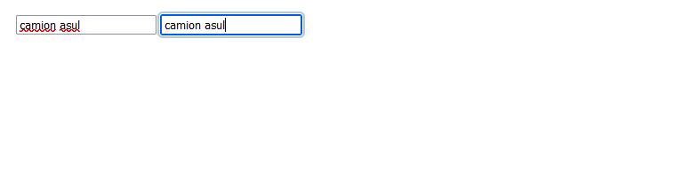

# 
La etiqueta HTML < input >.

Como hemos visto en el tema anterior, la etiqueta < input > es principalmente, la etiqueta HTML más utilizada en formularios para obtener datos a través del usuario. No es la única, pero si es la que permite obtener información en multitud de formas diferentes, según la naturaleza del dato a obtener.

html:

vista:

Recuerda que la etiqueta < input > es una etiqueta HTML sin etiqueta de cierre.

## La etiqueta < input >.
La etiqueta < input > tiene una gran cantidad de atributos (algunos dependen del valor del atributo type).

Veamos los atributos que podemos utilizar de forma general para prácticamente cualquier campo de entrada de datos:

Por ejemplo, el primero de ellos, el atributo name, permite dar un nombre al campo de texto. De esta forma, cuando enviemos la información del formulario, podremos manejarla desde javascript o desde el backend haciendo referencia a dicho nombre. Iremos viendo más atributos en cada sección y artículo específico que iremos tratando.

## El atributo value.
El atributo value se utiliza para dar un valor por defecto a un campo < input >. Tanto en este tipo de campos de entrada como en otros que veremos más adelante, podemos utilizar el atributo value para establecer un valor por defecto:

html:

vista:

Esto puede ser realmente útil cuando un campo, probablemente, vaya a tener un valor específico. Podemos indicárselo para ahorrar tiempo al usuario, ya que en el caso de querer otra opción, sólo tiene que borrar y corregirla.

OJO: No confundir el atributo value con el atributo placeholder. El primero establece un valor para el campo, un contenido. El atributo placeholder establece una sugerencia visual, pero al enviar o pulsar sobre el campo para escribir, su valor estará en blanco, no hay contenido.

## El atributo type.
Para determinar la naturaleza de la información que se pretende obtener en cada campo de entrada de datos, se aconseja utilizar el atributo type, donde podremos indicar si los datos que esperamos por parte del usuario serán datos de texto, datos numéricos, fechas, etc. Si se omite el atributo type, se asume que es type="text".

Aunque podríamos obtener cualquier tipo de información con el atributo type="text", la idea es forzar al usuario a que introduzca la información en un formato o forma para que sea más sencillo para nosotros luego procesar esa información.

Según nuestras necesidades sobre la naturaleza del dato a obtener, tenemos las siguientes opciones:

Como puedes ver, son múltiples tipos de campos de datos y muy variados, y aunque en principio no parecen tener diferencias, hay algunos matices que iremos explicando poco a poco. La etiqueta < textarea > también la explicaremos más adelante.

Observa el siguiente fragmento de código:

En este ejemplo, las dos primeras etiquetas dentro del < form > son equivalentes. La primera, al no tener atributo type, su atributo por omisión es type="text".

## Texto corto.
En primer lugar, si lo que queremos es guardar información de texto libremente, la opción más habitual es optar por utilizar el campo de entrada de datos < input type="text" >. Este atributo es el que se utiliza en las etiquetas < input > por defecto si no indicamos ningún atributo type. Es un campo de texto ideal para fragmentos cortos de información: nombres, apellidos, información corta, etc...

En resumen, pequeños fragmentos de texto menores de una frase, aproximadamente. Un sencillo ejemplo:

html:

vista:

## El atributo autocomplete.
Por defecto, los navegadores tienen en los campos < input > el autocompletado activado. Tenemos dos formas de desactivarlo:

   - Indicar el atributo autocomplete="off" en el < form >. Lo desactivará para todos los campos.
   - Indicar el atributo autocomplete="off" en los campos específicos a desactivar.

El autocompletado aparece cuando no está establecido el atributo autocomplete o cuando tiene el valor on. Te mostrará otros valores introducidos en formularios con el mismo atributo name.

## El atributo placeholder.
Placeholder: Es el texto que aparecerá a modo de sugerencia/ayuda para el usuario (en gris, ligeramente menos visible que el texto del campo). En cuanto el usuario escriba en el mismo, el mensaje desaparecerá. Sólo volvería a aparecer si el usuario decide borrar nuevamente la información que ha escrito en ese campo.

Es importante no escribir sugerencias de usuario en el atributo value, sino en placeholder. Utiliza el atributo value sólo si quieres indicar valores por defecto del campo.

## Textos cortos específicos.
Por otro lado, en HTML5 se añaden nuevos tipos para etiquetas < input > como type="search", type="tel", type="url" o type="email". Aunque la idea es la misma que un campo de texto y en principio no notaremos ningún cambio, estos campos específicos tienen como objetivo hacer más semántico y sencillo el proceso de introducción de datos por parte del usuario.

html:

vista:

Si utilizamos tel, al hacer clic en el campo del formulario desde un smartphone o tablet, se nos desplegará el teclado numérico en lugar del teclado habitual, lo que nos facilitará en gran medida escribir el dispositivo móvil, ya que la intención es utilizar sólo caracteres para números. Lo mismo ocurre con los campos de tipo email o url, ya que nos mostrará un teclado con botones especiales con @, / u otros atajos rápidos:

El atributo type también permite el valor search, que es muy similar a los anteriores. Se utiliza para campos orientados a la búsqueda de palabras o textos en un sitio web, mostrando desde dispositivos móviles una X para borrar la palabra escrita con una sola pulsación, evitando el tener que borrar repetidamente varios carácteres y esperar a que termine.

## Campos para contraseñas.
La etiqueta < input > permite indicar en su atributo type el valor password para crear campos de texto orientados a almacenar información sensible como podrían ser contraseñas, claves o pins numéricos. Esto no lo convertiría en un campo más seguro técnicamente, sino que simplemente muestra puntos o asteriscos en lugar del texto visualmente, para protegerlo "visualmente" de ojos ajenos.

html:

vista:

Por otro lado también tenemos el tipo hidden, que se puede utilizar cuando queremos enviar información en el formulario, pero no queremos que el navegador lo muestre visualmente en el formulario, como por ejemplo un código numérico o una id informativa.

## Comprobación de ortografía.
En todos estos campos, tanto etiquetas < input > como las etiquetas < textarea > que veremos más adelante, podemos utilizar un atributo denominado spellcheck mediante el cuál indicamos al navegador si debe revisar o no la ortografía del texto escrito en dicho elemento (en el cuál aparece una línea roja inferior cuando la palabra no se encuentra en el diccionario):

html:

vista:

Si el atributo spellcheck está a true, el navegador comprobará la ortografía en cuanto pulses un espacio, pero si se encuentra a false no la comprobará. Si no se especifica el atributo, el navegador busca el atributo spellcheck en los elementos contenedores padres para saber como actuar, y si aún así tampoco lo encuentra, toma el valor por defecto true.

En el ejemplo anterior, hemos desactivado la comprobación de ortografía en el segundo campo (etiqueta < input > con valor objeto-2), por lo que al pulsar sobre él no aparece ninguna línea roja, a pesar de estar mal escrita. En el campo anterior si ocurrirá.

## Personalizar apariencia.
Estilar los campos < input > de texto es una tarea bastante sencilla que puede hacerse utilizando propiedades habituales de CSS como width, height, border, background, font-family u otras. La única excepción en este tipo de campos de texto, es el caso de < input type="search" >, donde observarás que cuando escribes en el campo de datos, aparece un botón para limpiar el texto. También se puede personalizar.

Los selectores implicados serían los siguientes:

Apliquemos estos selectores en un ejemplo utilizando <  input type="search" >:

html:

css:

vista:

