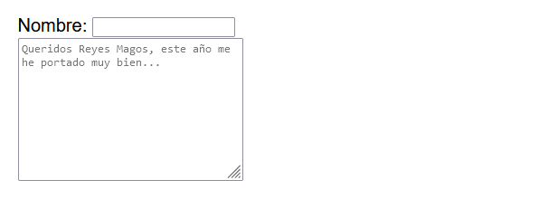

# 
La etiqueta HTML < textarea >.

Si queremos indicar un campo para escribir textos extensos, probablemente la etiqueta HTML < input > se nos quede corta o sea incómoda. Lo más apropiado sería utilizar la etiqueta HTML < textarea >, que nos permite escribir párrafos y líneas de contenido de texto sin restricciones.

## La etiqueta < textarea >.
Esta etiqueta tiene algunos atributos que podría ser interesante destacar:

Esta etiqueta nos permite añadir gran cantidad de texto, ya que las etiquetas < input type="text" > sólo nos permiten escribir una línea de texto y es muy incómodo si nuestra intención es escribir grandes cantidades de texto:

html:

vista:

Observa que en este caso, la etiqueta < textarea > tiene un valor por defecto, pero no lo hemos indicado en el atributo value como hacíamos en la etiqueta < input>, sino que aquí lo incluímos en el interior de la etiqueta < textarea >, ya que esta etiqueta si tiene etiqueta de cierre.

Ten en cuenta que el aspecto visual y la colocación se puede modificar con CSS. En estos ejemplos estoy intentando mantener el código HTML lo más puro posible para entender como funciona de serie.

## Tamaño del < textarea >.
Si queremos modificar las dimensiones del elemento < textarea > utilizando única y exclusivamente HTML, podemos utilizar los atributos cols y rows. Estos atributos nos permiten aumentar el tamaño de ancho y alto del área de texto. Los valores numéricos de estos atributos equivalen al tamaño aproximado de un carácter en este campo, de modo que si indicamos cols="20" significa que habrá un espacio de ancho de aproximadamente 20 carácteres.

Veamos un ejemplo básico con una etiqueta HTML < textarea >:

html:

vista:

Además, recuerda que también puedes cambiar el tamaño de este área de texto utilizando CSS, por ejemplo, con las propiedades width y height. A veces interesa más hacerlo desde CSS, y otras veces desde HTML, incluso podría ser necesario utilizar las dos formas.

## Sugerencia visual.
En el ejemplo anterior, el < textarea > se encuentra vacío. Si añadimos contenido de texto al interior de la etiqueta, este texto aparecerá por defecto dentro del área de texto. Sin embargo, muchas veces nos interesa que aparezca un texto a modo de sugerencia, pero al pulsar sobre él se elimine y nos deje escribir desde cero.

html:

vista:

Hay que tener muy claro que ese comportamiento es una sugerencia y no es lo mismo que el valor del elemento. Por ejemplo, si un área de texto tiene una frase establecida como valor (en el interior de la etiqueta), al enviar el formulario se enviará esa información. Sin embargo, si esa frase se establece como una sugerencia en un atributo placeholder, esa información no se enviará, sino que se mostrará hasta que el usuario haga click y comience a escribir.

Ten en cuenta que a veces puedes tener el contenido de la etiqueta < textarea > vacía, pero tienes espacios, por lo que cuentan como texto y no se ve la sugerencia visual. Para ver el placeholder no debes tener absolutamente ningún contenido.

## El atributo wrap.
Mediante el atributo wrap podemos modificar la apariencia visual del párrafo al enviar el formulario a un servidor. Con el valor soft (valor por defecto) el texto se enviará literalmente, mientras que con el valor hard se añadirán nuevas líneas (\n) para ajustar el texto enviado exactamente como se ve en el < textarea > del navegador.

## Área de texto ajustable.
Por defecto, si escribes texto en un campo < textarea > hasta el punto que no cabe el texto, aparecerán unas barras de desplazamiento, de modo que el contenido hace scroll hacia dentro.

Sin embargo, podemos utilizar la nueva propiedad CSS field-sizing con el valor content, lo que hará que en lugar de lo anterior, el campo < textarea > crezca y se adapte al contenido:

html:

css:

vista:

Dicho de otra forma, al aplicar la propiedad field-sizing a un <textarea> se puede indicar los siguientes valores (fixed es el valor por defecto):

   - 1️⃣ fixed: El tamaño del <textarea> es fijo, si no cabe, aparecen barras de desplazamiento.
   - 2️⃣ content: El tamaño del <textarea> crece a medida que escribes, se adapta al contenido.

## Personalizar apariencia.
Observa en el siguiente ejemplo, como hemos personalizado el área de texto, aplicandole tipografías, colores, paddings y tamaños mediante CSS:

html:

css:

vista:

Entre otras cosas, destacamos los siguientes cambios:

   - 1️⃣ La propiedad field-sizing permite adaptar el área de texto al contenido escrito.
   - 2️⃣ La propiedad resize: none evita que el usuario pueda redimensionar el campo.
   - 3️⃣ El pseudoelemento ::placeholder permite personalizar los colores del texto de sugerencia.

## Librerías para mejorar un <textarea>.
Existen algunas librerías de Javascript que permiten mejorar, «enriquecer» y ampliar la funcionalidad de estas áreas de texto, permitiendo realizar ciertas tareas visuales como si fueran pequeños editores de texto: fragmentos en negrita, cursiva, imágenes, tablas, etc...

Este tipo de librerías se suelen denominar editores WYSIWYG (lo que ves es lo que obtienes) y existen muchos y muy variados. Algunos de ellos son los siguientes:

