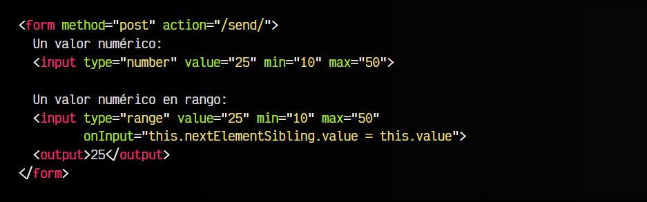

# 
La etiqueta < input > con números.

Aunque con la etiqueta < input type="text" > podríamos permitir al usuario que inserte números, no tenemos ningún tipo de control de como los introduce. Por ejemplo, el usuario podría escribir el número con texto, o añadir carácteres que no son números, lo que complicaría su posterior revisión o manipulación de datos al no estar en el mismo formato.

## Campos de contenido numérico.
Para permitir al usuario introducir números, lo podemos hacer de dos formas, utilizando la etiqueta < input > con diferentes valores en el atributo type. Son las dos siguientes:

Vamos a analizarlas detenidamente.

## El atributo type="number".
La primera de ellas es < input type="number" >, una etiqueta mediante la cuál el usuario puede indicar la cifra numérica que quiere enviar en el formulario. La diferencia principal respecto a los campos de texto es que:

   - Al escribir la cifra, nos aparecen flechitas de aumentar y disminuir la cantidad.
   - Sólo se permite escribir números y carácteres permitidos.

Así pues, con estos datos, los siguientes ejemplos son válidos para el navegador:

html:

vista:

En el primero de ellos tenemos un número decimal, en el segundo un número positivo y en el tercero un número negativo. Todos válidos. Observa que en el atributo value no puedes indicar e o + porque, a pesar de ser carácteres permitidos, el navegador los permite para computarlos y traducirlos a número, pero no los permite usar en value.

## El atributo type="range".
Por otro lado, tenemos la etiqueta < input type="range" >, que en lugar de mostrarnos un campo de texto donde podemos insertar los números directamente, podemos hacerlo mediante un «slider» o barra de desplazamiento que representa un número entre un rango numérico específico. Funciona exactamente igual que < input type="number" >, sólo que se muestra mediante un slider.

html:

vista:

Sin embargo, este método tiene dos inconvenientes:

   - Por defecto, no se muestra el valor elegido.
   - Por defecto, los valores mínimo y máximo son 0 y 100.

El primer inconveniente lo podríamos solucionar, de forma accesible, adaptando el < input > al siguiente fragmento de código. Observa que lo que hemos hecho es añadir un < output > para añadir el valor del < input >, y actualizarlo mediante Javascript con el evento onInput. Eso sí, recuerda que el campo < output > debería estar siempre después del elemento:

html:

vista:

El segundo inconveniente se puede solucionar con los atributos min y max que explicamos en el siguiente apartado.

## Mínimos y máximos.
En ambas etiquetas < input > numéricas se pueden indicar los atributos min y max para restringir el valor mínimo y máximo que puedes escribir en el campo de entrada de datos:

Esto no significa que el usuario no pueda introducir un número menor que el indicado en el atributo min, por ejemplo, sino que si el usuario introduce ese número, los datos del campo no serán válidos, y si tenemos validaciones, no se podrá enviar el formulario hasta que se cumplan esas restricciones. Estos detalles lo veremos más adelante, en el apartado de [Validaciones HTML5](https://lenguajehtml.com/html/validaciones/validaciones-html5/).

Observemos este fragmento de código:

html:

vista:

Las diferencias son las siguientes:

   - En el campo con type a number es posible introducir manualmente números no permitidos.
   - En el campo con type a range no es posible salirse del rango indicado.
   - Tanto en uno como en otro, no es posible enviar el formulario si no se cumplen las restricciones.

## Saltos.
Mediante el atributo step puedes marcar la cantidad numérica que se incrementará o decrementará al pulsar en las flechas de un campo type="number" o al mover el slider de un campo type="range". Si este atributo se omite, por defecto será 1, pero indicándolo expresamente, podemos cambiar su valor.

De la misma forma que antes, siempre se puede establecer uno de estos valores, pero no cumpliría la restricción de step:

html:

vista:

En este ejemplo, indicando min=10 y max=50, pongamos tres ejemplos:

   - Con step=5, los valores permitidos serían: 10, 15, 20, 25, 30, 35, 40, 45 y 50.
   - Con step=10, los valores permitidos serían: 10, 20, 30, 40 y 50.
   - Con step=15, los valores permitidos serían: 10, 25 y 40.

Ten en cuenta que también se podrían indicar valores decimales en el atributo step.

## Personalizar apariencia.
Los campos numéricos < input type="number" > se personalizan como cualquier otro elemento de texto (con algunos añadidos), sin embargo, los elementos < input type="range" > tienen mayor capacidad de personalización mediante CSS. Veamos sus características.

## Contenido numérico.
A continuación, veamos una lista de selectores que puedes utilizar para personalizar el diseño de los campos numéricos:

Observa que hay unos botones para cambiar el valor numérico cuando mueves el ratón sobre el campo de texto. Estos botones, en realidad son uno sólo, que suma o resta dependiendo de la región del botón en la que pulses. Veamos un ejemplo de personalización:

css:

html:

vista:

En los navegadores, observa que alrededor del campo numérico, al pulsar en él, aparece un borde negro adicional. Es el que podemos modificar mediante la propiedad outline o contorno. Aunque el primer reflejo es eliminarlo porque visualmente no coincide con el diseño, recuerda que se trata de una ayuda visual que es ideal en contextos de accesibilidad.

## Slider numérico.
Por otro lado, el campo < input type="range" > muestra por defecto un slider horizontal con un tope para marcar la posición. Los selectores especial para este tipo de elemento son los siguientes:

Como mejor se entienden estos detalles es con un ejemplo, así que vamos a examinar un ejemplo aplicado donde modificar el estilo de un campo numérico de tipo slider.

css:

html:

vista:

Observa que en algunas partes debemos utilizar la propiedad appearance para eliminar la apariencia del sistema operativo y crear una personalidad y propia.